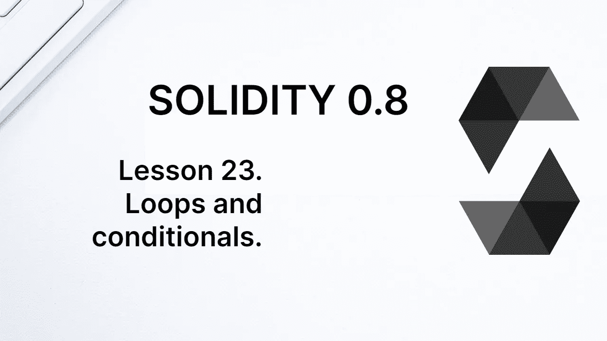

# 学习第 23 课坚固性。循环和条件句。

> 原文：<https://medium.com/coinmonks/learn-solidity-lesson-23-loops-and-conditionals-2e90489cd865?source=collection_archive---------3----------------------->



Solidity 有类似于其他编程语言的循环和条件。它的语法与 C、Java 和 JavaScript 非常相似，所以这一章对于习惯用上述语言编程的人来说应该很简单。

# 如果/否则/否则如果

当程序在它的流程中找到某种分支时，如果满足某个条件，它必须遵循某个路径，我们就有了一个条件。对于这种情况，我们使用关键字 **if/else** 。

```
if (condition) {
   ... 
   code to be executed if the condition is satisfied.
   ...
} else {
   ...     
   code to be executed if the condition is not satisfied.
   ...
}
```

条件必须是返回 true 或 false 的表达式，如 *x > 3* 或*(y<1&z = = 4)*。请注意，Solidity 不会将值 *1* 转换为*真*，也不会将空字符串转换为*假*。

通常，与其使用 *if/else* ，不如使用 *require* 来检查一个条件。它们没有相同的效果，应该根据代码的目的来使用。

让我们假设，只有当事务的发送者是先前在变量`owner`中注册的地址时，我们才希望函数被正确执行。我们可以有下面的。

```
function onlyOwner() public {
   if (msg.sender === owner) {
      ... some code
   }
}
```

如果发送方不是`owner`的地址，上面的函数没有作用，但是交易有效，不会抛出错误。这通常不是我们想要的。我们可以改进这个函数来抛出一个错误，如下所示。

```
function onlyOwner() public {
   if (msg.sender == owner) {
      ... some code
   } else 
      revert("Sender not owner"); 
   }
}
```

如果所有者不是事务的发送者，事务将通过 *revert* 方法回滚。上述条件在其他编程语言中很常见，但是在这种情况下，使用 *require* 方法更可靠。

```
function onlyOwner() public {
   require(msg.sender == owner, "Sender not owner");
   ... some code
}
```

如果 *require* 内的条件为假，事务将回滚。作为第二个参数，我们可以向事务的发送方发送一条错误消息。

Solidity 还接受 **else if** 表达式，这允许您链接条件，如下所示。

```
if (condition) {... code ...}
else if (condition) {... code ...}
...
else {... code ...}
```

在其他编程语言中，可以使用*开关*替换上述链式条件，但 Solidity 中不存在这个关键字。在上面的场景中，我们必须使用多个 *if 的*。

# while、do while 和 for 循环

当我们希望一个代码块运行多次时，我们使用某种形式的循环。我们先来看一下 **while** 的用法，它在某个条件为真的情况下执行一段代码。

```
while (condition) {
   // code to be executed
}
```

在一个循环中，我们可以使用两个关键字: *break* 和 *continue* 。如果 EVM 在循环中遇到*中断*，它将退出循环并继续循环后的代码流。如果它发现一个 *continue* ，它将跳过剩余的代码块，并返回到 conditional，再进行一次循环迭代。我们来看例子。

```
uint8 last;
uint8 i;
while(i < 10) {
   last = i;
   i++;
   if (i==5) break;
} // last => 4
```

首先我们定义一个变量`i`作为计数器。变量`last`将在条件中存储计数器的最后一个值。对于每次迭代，我们递增计数器。

当变量`i`的值达到 4 时，在循环块中它递增到 5(通过表达式 i++，相当于 i=i+1)。然后条件`*(*i==5)`将为真，*中断*将被执行，循环终止。

使用**继续**关键字的示例如下所示。

```
uint8 total;
uint8 i;
while(i < 10) {
   i++;
   if (i==5) continue;
   total++;
} // total => 9
```

上述循环将被执行 10 次，因为变量`i`将从 0 运行到 9。然而，变量`total`的最终值是 9，而不是 10。这是因为当`i`为 5 时，条件`(i==5)`将为真，并且*继续*将被执行。这样，循环将回到起点，变量`total`的增量将不会在特定的迭代中执行。

**do while** 循环类似于 *while* 循环，不同的是在代码块执行后检查条件，而不是在开始时。

在下面的示例中，即使条件显式为假，也至少会执行第一次迭代。

```
uint8 value;
do {
   value = 10;
} while(false); // value => 10
```

在上面的例子中，需要三个基本要素:计数器、条件和递增计数器的方法。使用循环的**很容易实现这三个要素。**

```
for (initialize the counter; conditional; increment) {
   // code to be executed
}
```

让我们写一个例子来迭代一个数组并改变它的所有条目。

```
uint[] memory array = new uint[](5);for(uint i=0; i < array.length; i++) {
   array[i] = i;
} // array => [0,1,2,3,4]
```

在 Solidity 中使用循环时，你必须小心一点，尤其是在添加/改变状态变量时。管理状态变量是以太坊上最消耗气体的操作之一，因此对状态变量进行多次更改的循环会消耗大量气体。

**感谢阅读！**

欢迎对本文提出意见和建议。

欢迎任何投稿。[www.buymeacoffee.com/jpmorais](http://www.buymeacoffee.com/jpmorais)

> 加入 Coinmonks [电报频道](https://t.me/coincodecap)和 [Youtube 频道](https://www.youtube.com/c/coinmonks/videos)了解加密交易和投资

# 另外，阅读

*   最好的[加密税务软件](/coinmonks/best-crypto-tax-tool-for-my-money-72d4b430816b) | [硬币追踪评论](/coinmonks/cointracking-review-a-reliable-cryptocurrency-tax-software-5114e3eb5737)
*   [Stackedinvest 评论](https://coincodecap.com/stackedinvest-review) | [北海巨妖评论](/coinmonks/kraken-review-6165fc1056ac) | [bitFlyer 评论](https://coincodecap.com/bitflyer-review)
*   最佳[加密借贷平台](/coinmonks/top-5-crypto-lending-platforms-in-2020-that-you-need-to-know-a1b675cec3fa) | [杠杆代币](/coinmonks/leveraged-token-3f5257808b22)
*   最佳[加密制图工具](/coinmonks/what-are-the-best-charting-platforms-for-cryptocurrency-trading-85aade584d80) | [最佳加密交易所](/coinmonks/crypto-exchange-dd2f9d6f3769)
*   [比斯勒评论](https://coincodecap.com/bitsler-review)|[WazirX vs coin switch vs coin dcx](https://coincodecap.com/wazirx-vs-coinswitch-vs-coindcx)