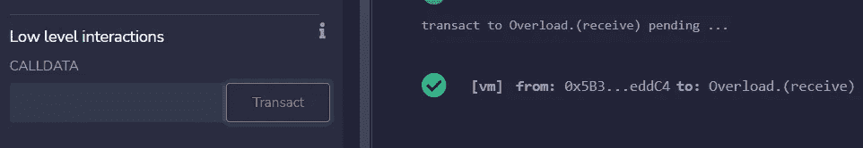

# 学习第 24 课固体。函数重载、回退和接收。

> 原文：<https://medium.com/coinmonks/learn-solidity-lesson-24-function-overloading-fallback-and-receive-5de5b39851b6?source=collection_archive---------5----------------------->


在 Solidity 中，可以创建同名的多个函数，只要参数不同。这叫做*功能重载*。例如，我们可以创建一个名为`foo`的函数，它有 1 个参数，另一个名为`foo`的函数有 2 个参数，如下所示。

```
function foo(uint256 x) public {...}
function foo(uint256 x, uint8 y) public {...}
```

当在事务或调用中被调用时，函数由它们的签名来表示，签名由它们的名字和参数的散列的前 4 个字节组成。由于参数不同，上述两个函数的哈希也会不同，因此签名也会不同。

第一个函数的签名是 *0x2fbebd38* ，而第二个函数的签名是 *0xafe2f480* 。这样，在调用函数时就不会有歧义。甚至有可能用相同数量的参数声明两个函数，只要参数是不同的类型。

```
function bar(uint256 x) public {...}
function bar(address x) public {...}
```

上面的两个函数`bar`将有不同的签名，因此在外部调用时不会有歧义，但是在契约内部调用时必须小心。如果函数参数之间的隐式转换是可能的，当试图在内部调用函数时，编译器将指示一个错误。因此，最好避免用相同数量的参数声明两个函数。

函数重载在 ERC-721 标准中用于不可替换的令牌。它的接口需要声明两个同名的函数，如下所示。

```
function safeTransferFrom(address _from, address _to, uint256 _tokenId, bytes data) external payable;function safeTransferFrom(address _from, address _to, uint256 _tokenId) external payable;
```

两个函数以相同的名称`safeTransferFrom`声明，但是参数数量不同。这解决了任何不明确的问题。

# 撤退

我们在事务(或调用)中发送给契约的数据称为**有效负载**。有效载荷通常包含我们想要调用的函数的签名，以及要传递给函数的参数，以 EVM ABI 标准进行编码。我们已经在前面的课程中看到了这种编码是如何完成的。

如果有效载荷中包含的函数签名不适合合同的任何函数，则调用**回退**函数。这可能是由于失误或故意造成的。

回退函数是在没有*函数*关键字的情况下声明的。它必须是外部的，可以接收和返回一个字节类型的参数，并且可以标记为 payable。下面的语法定义了最常用的回退函数。

```
fallback (bytes calldata input) external [payable] returns (bytes memory output)
```

让我们使用 Remix 测试回退功能。首先，让我们学习如何使用任意有效负载执行事务。为此，我们使用输入*低级交互*。在 *CALLDATA* 字段中输入有效载荷，点击 *Transact* 。

在下图中，我使用了以下有效负载:

```
0x2fbebd380000000000000000000000000000000000000000000000000000000000000001
```

前 4 个字节是函数`foo(uint256)`的签名，而接下来的 32 个字节代表参数值 1，用 32 个字节的十六进制写成。


To send a transaction with a specific payload, use the Remix area named Low-Level interaction.

在右侧，我们找到了事务数据，我们清楚地看到，事务是由名为 Overload 的契约的函数`foo(uint256)`接收的，正如所预期的那样。

现在让我们发送另一个事务，但是这次使用任意的有效负载，这不适合任何现有的函数。您可以输入任何有效负载，只要它是十六进制的。在下图中，我正在发送任意有效载荷 *0x112233445566* 。


When the function signature does not fit any existing function, the fallback function is executed.

# 接收和回退

如果有效载荷是空的，会发生什么？当事务伴随以太网传输时，发送空有效负载是有意义的。在这种情况下，会调用另一个函数(如果存在的话)。函数**接收**。

与 fallback 函数不同，receive 函数不包含输入或输出参数，它的声明非常简单。

```
receive() external payable {}
```

receive 函数必须是可支付的，因为它的目的是接收以太。在下图的右侧，请注意，当发送带有空有效负载的事务时，receive 函数被调用。



When we send a transaction to a contract, without defining the payload, the receive function is invoked.

如果没有定义接收函数，那么在有效载荷为空的情况下将调用回退函数。需要注意的是，为了接收以太网，后退功能必须是可支付的。

如果协定没有接收函数，并且其回退函数是不可支付的，则尝试向协定发送以太网将会生成错误。当然，除非交易被发送到另一个可支付函数。

**感谢阅读！**

欢迎对本文提出意见和建议。

欢迎任何投稿。www.buymeacoffee.com/jpmorais。

> 交易新手？尝试[加密交易机器人](/coinmonks/crypto-trading-bot-c2ffce8acb2a)或[复制交易](/coinmonks/top-10-crypto-copy-trading-platforms-for-beginners-d0c37c7d698c)