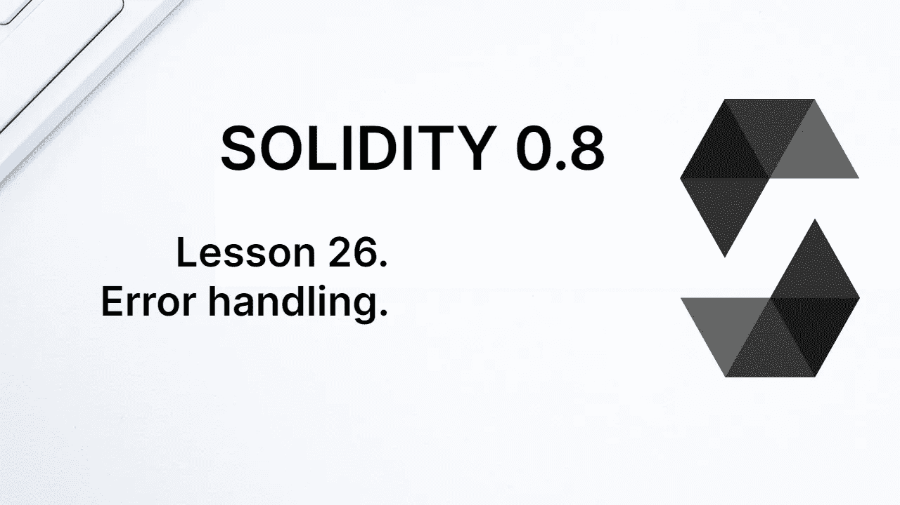
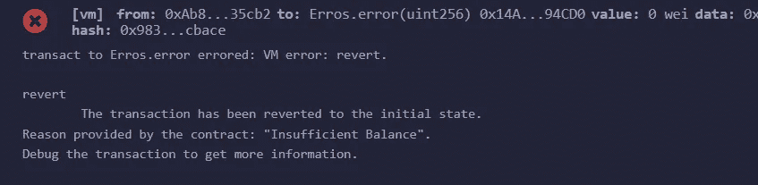
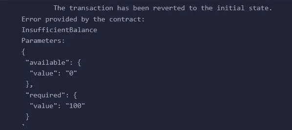
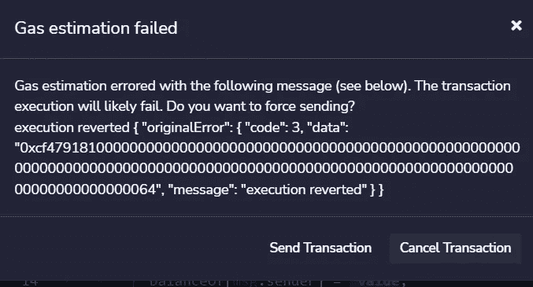
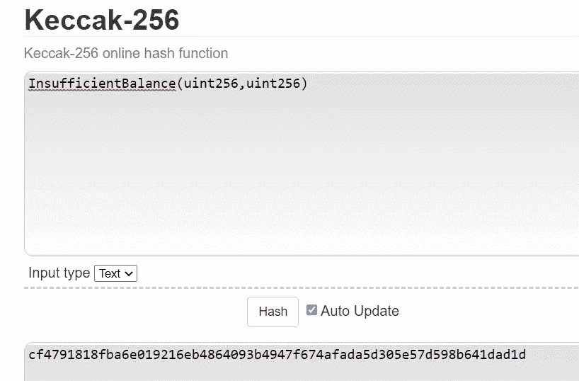
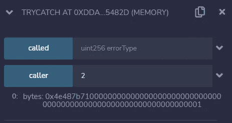

# 学习第 26 课固体。错误处理。

> 原文：<https://medium.com/coinmonks/learn-solidity-lesson-26-error-handling-ccf350bc9374?source=collection_archive---------3----------------------->



我们已经看到了如何使用`require`函数检查坚固性条件。例如，如果我们想检查一个帐户的余额是否大于某个金额，我们可以编写以下语句。

```
require(balanceOf[account] > 100);
```

因此，如果括号内的表达式为 false，事务将回滚。在上面的例子中，一个一般性的错误将被发送回发送者。但是，有可能返回一个指示发生了哪个错误的字符串。为此，只需向 require 函数传递第二个参数，如下所示。

```
require(balanceOf[account] > 100, "Insufficient Balance");
```

您可以在 Remix 中看到错误，以及事务回滚的信息。在下图中，请注意合同提供的句子“*原因:余额不足“*”。



When reverting, the return data will indicate the error sent by the contract.

有一种更高效的方式将错误发送回发送方。在 Solidity 中，有可能定义错误对象。不幸的是，它们不能与`require` 功能一起使用。

使用 **error** 关键字创建错误，后跟标识符和可能的参数。自定义错误的示例如下。

```
error InsufficientBalance(uint available, uint required);
```

正如我们将看到的，自定义错误必须与恢复功能结合使用。

# 归还

`revert`函数用于在交易执行期间随时撤销交易。它最好与自定义错误一起使用，但是为了与早期版本的 EVM 兼容，`revert`函数也可以与类型为*字符串*的参数一起使用，其目的是指示返回的原因。

Revert 常用于条件表达式中。上一节的同一个例子，使用`revert`进行了重构，如下所示。

```
if (balanceOf[msg.sender] <= 100) revert("Insufficient Balance");
```

一般来说，使用`if (!condition) revert(…)`和`require(condition,…)`效果是一样的。但是，我们可以使用带有自定义错误的`revert`函数。

让我们再来看看上一节中声明的自定义错误:

```
error InsufficientBalance(uint available, uint required);
```

这种自定义错误可以由 revert 函数实例化，如下所示。

```
if (balanceOf[msg.sender] <= 100)
   revert InsufficientBalance(balanceOf[msg.sender], 100);
```

发回的自定义错误可以被解析为一个对象。我们可以在下图中看到结果，其中显示了发送的错误及其参数值。



Sending a custom error using the `revert` function. It can be parsed by the client.

与函数一样，错误以 ABI 编码返回给发送方。让我们通过使用 Remix 将一个交易发送到真实区块链上的一个合同来看看这一点。它将警告事务很可能会回滚。这一点可以从下图中看出。



Remix indicates that the transaction is likely to roll back.

Remix 像许多钱包一样，可以模拟交易，并验证它(很可能)会反转。请注意返回的*数据*字段:它是 ABI 编码的，指示契约抛出了哪个错误。若要反序列化该错误，您必须拥有协定的 ABI。

在上面的例子中，错误的数据如下:

```
0xcf479181
0000000000000000000000000000000000000000000000000000000000000000
0000000000000000000000000000000000000000000000000000000000000064
```

第一行是错误签名。与函数签名一样，错误签名是指示错误的字符串的 Keccak-256 哈希的前 4 个字节。在这种情况下，字符串`InsufficientBalance(uint256,uint256)`。这可以使用在线加密工具进行验证，如下图所示。



Calculating the hash of the error function.

在函数签名之后，我们有两个类型为 *uint256* 的十六进制参数:0 作为第一个参数，64 作为第二个参数，它对应于十进制的 100。使用自定义错误的优点之一是能够在客户端反序列化参数。

自定义错误只有一个属性，*选择器*，它返回 4 个字节的错误签名。

# 维护

检查坚固性条件的第二种方法是使用`assert`功能。它的用法类似于`require`，但它主要用于确保一个应该为真的条件实际上为真。

换句话说，`require`用于检查一个条件，该条件可能为真，也可能不为真，这取决于例如函数的参数。`Assert`用于确保合同逻辑中没有任何错误，如果`assert`发现一个真条件，这表明合同中可能存在必须修复的 bug。

当`revert`发送类型为*错误(字符串)*的错误时，`assert`发送类型为 *Panic(uint256)* 的错误。与`require,`不同的是`assert`无法接收指示错误原因的文本。

在一些书或者旧的文章中，你会发现`assert`函数消耗了所有可用于事务的 gas 的信息。在编译器 0.8.0 版本之前都是如此，当时`assert`函数使用了一个操作码而不是 *revert* 。目前，两个函数使用相同的操作码，剩余的 gas 返回给发送器，供`revert`和`assert`使用。

# 尝试/抓住

在 Solidity 中使用 *try/catch* 比在其他编程语言中更受限制。 *Try/catch* 只在两种情况下使用:调用外部调用时和创建新契约时。

让我们用一个例子来演示它的用法。名为`TryCatch`的合同将有两个功能:`called`和`caller`。`called`函数将被`caller`函数从外部调用，所以我们可以使用 *try/catch* 。一般来说, *try/catch* 主要用于调用其他契约中的函数，但是我们希望这个例子简单一些。

```
pragma solidity ^0.8.7;contract TryCatch {function called(uint errorType) external pure returns(bool) {
   if (errorType==0) {
      return true;
   } else if (errorType==1) {
      revert("Error!");
   } else if (errorType==2) {
      assert(false);
   } 
}function caller(uint errorType) public view returns(string memory){
   try this.called(errorType) {
      return "Ok";
   }
   catch Error(string memory) {
      return "Error!";
   }
   catch Panic(uint256) {
      return "Panic!";
   }
}
}
```

当调用`called`函数时，`caller`函数传递一个类型为 *uint* 的参数。如果参数是值`0`，就不会有错误。如果参数值为 1，`called` 执行`revert`语句，错误被第一个`catch`捕获，其类型为`Error`。如果参数是值`2`，则`called`执行条件为假的`assert`。这种错误被类型`Panic`的最后一个`catch`捕获。

如果您对错误的类型不感兴趣，您可以使用`catch {…}`，或者，如果您想要对错误进行 ABI 编码，您可以使用`catch (bytes memory data)`。

要查看最后一个功能，请将`caller`函数更改为以下代码。

```
function caller(uint errorType) public view returns(bytes memory) {
   try this.called(errorType) {}
   catch (bytes memory data) {
      return data;
   }
}
```

当将值`2`作为参数传递时，`assert(false)`将被执行，这将抛出类型为 *Panic* 的错误。我们可以在下图中看到这一点。字符串`Panic(uint256)`的 Keccak-256 hash 的前 4 个字节是`4e487b71`，与返回错误的签名相同。



The error signature indicates that it is of type Panic.

在错误签名之后，是一个 ABI 编码的 32 字节数字。这个数字表示错误的原因；上例中，对于`1`的值，表示`assert`内部的表达式返回 false。还有其他可能会产生恐慌类型的错误，比如被零除或者试图在空数组上使用`.pop()`方法。每个错误都有自己的数字代码。

可以在[https://docs . solidi tylang . org/en/v 0 . 8 . 15/control-structures . html \ # Panic-via-assert-and-error-via-require](https://docs.soliditylang.org/en/v0.8.15/control-structures.html\#panic-via-assert-and-error-via-require)中找到能够生成紧急类型错误的所有错误的完整列表以及错误代码。

**感谢阅读！**

欢迎对本文提出意见和建议。

欢迎任何投稿。[www.buymeacoffee.com/jpmorais](http://www.buymeacoffee.com/jpmorais)。

> 交易新手？尝试[加密交易机器人](/coinmonks/crypto-trading-bot-c2ffce8acb2a)或[复制交易](/coinmonks/top-10-crypto-copy-trading-platforms-for-beginners-d0c37c7d698c)