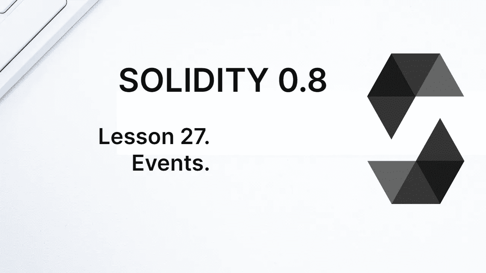
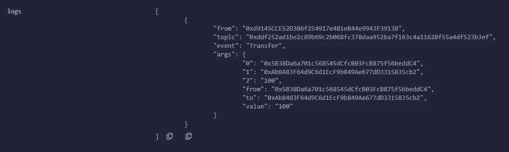
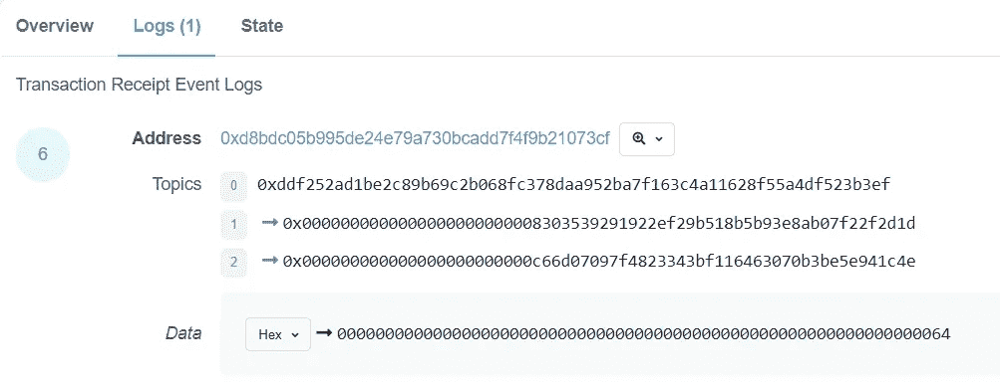

# 学习第 27 课固体。事件。

> 原文：<https://medium.com/coinmonks/learn-solidity-lesson-27-events-f47070b55851?source=collection_archive---------4----------------------->



不可能从智能合约中访问外部服务器。因此，EVM 不可能直接向外部应用程序通知某个事件的发生。

这就是为什么在坚固中有事件。它是在合同中发布的信息，有两个目的:以日志形式记录此类数据，并间接警告区块链事件的发生。这是因为外部应用程序可以监控事件的发出，从而对区块链的状态变化做出反应。

开发人员应该清楚，事件的目的是生成信息，供区块链之外的应用程序读取。事件中记录的数据不记录在存储器中，而是记录在交易收据中。它们可以被分散的应用程序访问和监控，但是不能被契约访问，甚至不能被发出事件的契约访问。

事件的声明类似于函数和错误，使用**事件**关键字、一个标识符和一系列参数。可以使用关键字 **indexed** 来指示某些参数必须被索引。对于以这种方式声明的事件，最多可以索引 3 个参数。

也可以声明匿名事件，从而使用 4 个索引参数。在我们更好地理解事件是什么之后，我们很快就会看到这种可能性。

事件是在函数外部声明的，就像状态变量一样。一个事件的例子发生在 ERC-20 令牌上。我们很快会看到更多关于这个令牌的内容，但是它定义的事件之一如下。

```
event Transfer(address indexed _from, address indexed _to, uint256 value)
```

索引参数与非索引参数的处理方式不同。除了通过这些参数的值监控事件的发射之外，还可以搜索索引参数。另一方面，非索引参数不能被过滤或监控，并且被记录到区块链 ABI 编码中。

事件也可以作为存储区块链信息的一种更廉价的方式。记录一个事件比在存储器中记录一个值需要更少的气体。

# 发射事件

一旦声明，事件就可以在函数中发出。它们是使用 **emit** 关键字发出的，后跟事件名称及其参数。例如，`Transfer`事件的发射如下。假设`_to`和`_amount`是函数中的两个变量。

```
emit Transfer(msg.sender, _to, _amount);
```

事件改变了区块链的世界状态(尽管它们没有改变存储)，因此需要事务。这意味着包含事件发射的函数不能有*视图*或*纯*可变性。

事件的发射可以在 Remix 中看到，在交易收据中，如下图所示。因为 Remix 拥有契约的 ABI，所以它能够反序列化事件并显示其精确信息。对于一般的应用程序来说，这是不正确的。



Remix shows the emission of an event, in the form of a log.

让我们发送同样的事务，但是现在发送到一个真实的区块链。在我的例子中，我将把契约部署到 Rinkeby，并发送一个发出事件的事务。

您可以使用块资源管理器查看发出的事件。在下图中，我们看到使用网站[rinkeby.etherscan.io/](http://rinkeby.etherscan.io/)的事件日志，寻找交易散列并点击*日志*标签。



You can view the event log in the block explorer.

在块资源管理器中，我们看到原始信息，而不是像在 Remix 中那样被反序列化。请注意，没有关于事件名称的明确信息，但是可以通过主题识别事件。事件的标识总是出现在第一个主题中，除非事件是匿名的。

事件主题是可以过滤和监控的索引参数。我们已经看到，在一个事件中可以声明多达 3 个索引参数，因为 EVM 可以存储多达 4 个主题的信息。由于第一个主题是事件标识符(如果不是匿名的)，在这种情况下，开发人员只能再选择 3 个主题。

上述事件的第一个主题如下:

```
0xddf252ad1be2c89b69c2b068fc378daa952ba7f163c4a11628f55a4df523b3ef
```

毫不奇怪，上面的值是字符串`Transfer(address,address,uint256)`的 Keccak-256 哈希。由于主题是 32 字节的值，这次签名是完整的散列，而不仅仅是前 4 个字节。

以下两个主题是:

```
0x0000000000000000000000008303539291922ef29b518b5b93e8ab07f22f2d1d
0x000000000000000000000000c66d07097f4823343bf116463070b3be5e941c4e
```

这是事件发射中记录的两个地址。虽然地址是 20 字节长，但是主题**总是**写到 32 字节。可以将占用超过 32 个字节的类型声明为索引类型，但是记录为主题的将是它的 Keccak-256 散列，而不是它的值。

例如，如果类型为 *string* 的参数被声明为 indexed，则该字符串的散列将被记录为日志，而不是该字符串本身的值。

块浏览器中的最后一个字段名为*数据*，它存储所有非索引参数的信息，ABI 编码。在上面的例子中，只有一个参数，类型为 *uint256* 。然后，100 的值被编码为 32 个十六进制字节。

```
0000000000000000000000000000000000000000000000000000000000000064
```

# 匿名事件

事件可以被声明为匿名的。因此，第一个主题不再涉及事件签名，可以自由使用。这样，匿名事件最多可以有 4 个索引参数。

匿名事件是用**匿名**修饰符声明的，该修饰符必须放在参数声明之后。用 4 个索引参数声明匿名事件的示例如下:

```
event NotMe(address indexed _to, address indexed _from, address indexed _spender, string indexed _message) anonymous;
```

如果没有插入*匿名*修饰符，编译器将抛出一个错误，指出最多允许 3 个索引参数。

开发人员必须理解，事务日志并不保留事件是否匿名的信息。记录的都是作为主题的索引值和作为*数据*的非索引值。为了正确解释题目的含义，有必要了解合同代码，或其 ABI。

# 天然气事件的成本

事件的用途之一是将数据记录到区块链中，这比使用存储的成本低得多。

以太坊的黄皮书列出了每次 EVM 手术的费用，单位是天然气。从天然气到乙醚的转换是动态的，因为天然气的价格由服务供给和需求决定，并随时间变化(包括全天)。

目前，将存储中的变量从零变为非零的价格是 20，000 单位的天然气。作为比较，每个记录的日志花费 375 单位 gas，加上每个索引主题的 375 单位，加上非索引参数的较低值(每字节 8 单位)。

匿名事件除了允许使用 4 个索引参数之外，还允许记录没有任何索引参数的日志。这是在区块链上记录信息以供外部访问的最便宜的方式。

**感谢阅读！**

欢迎对本文提出意见和建议。

欢迎任何投稿。[www.buymeacoffee.com/jpmorais](http://www.buymeacoffee.com/jpmorais)。

> 交易新手？尝试[加密交易机器人](/coinmonks/crypto-trading-bot-c2ffce8acb2a)或[复制交易](/coinmonks/top-10-crypto-copy-trading-platforms-for-beginners-d0c37c7d698c)