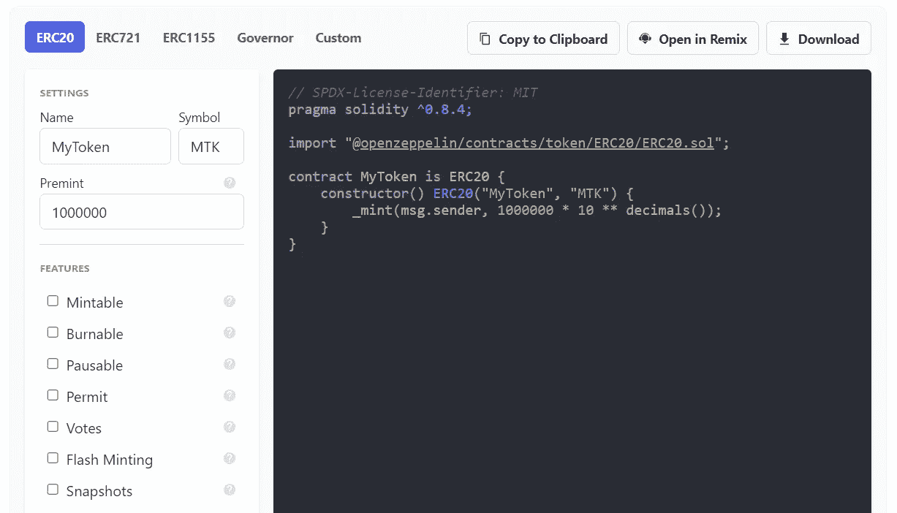

# 学习第 29 课固体。OpenZeppelin 对 ERC20 令牌的实现。

> 原文：<https://medium.com/coinmonks/learn-solidity-lesson-29-openzeppelins-implementation-of-the-erc20-token-9739f7ff015a?source=collection_archive---------2----------------------->


OpenZeppelin 是一家专门从事加密和安全的公司。它提供了一个智能合约的开源库，其可替换和不可替换的令牌实现是当今使用最广泛的。

使用 OpenZeppelin 库实现 ERC20 令牌非常简单。在他们的网站上有一个名为*向导*的用户界面，它根据用户提供的信息编写合同代码。



You can easily create an ERC20 token using OpenZeppelin libraries.

用户界面如上图所示。目前，*向导*可以在地址[https://docs.openzeppelin.com/contracts/4.x/wizard](https://docs.openzeppelin.com/contracts/4.x/wizard)访问

在这一课中，我们将更详细地了解 OpenZeppelin 的实现，以及一些基本的扩展。它以模块化方式实现了 ERC20 令牌的所有功能。因此，有可能只包含我们想要的扩展。

我们先从理解上图所示的合同开始，下面我来复制一下。

```
pragma solidity ^0.8.4;import "[@openzeppelin/contracts](http://twitter.com/openzeppelin/contracts)/token/ERC20/ERC20.sol";contract MyToken is ERC20 {
   constructor() ERC20("MyToken", "MTK") {
      _mint(msg.sender, 1000000 * 10 ** decimals());
   }
}
```

首先，我们从 OpenZepellin 库导入契约`ERC20.sol`，使用关键字`import`，后跟契约地址。Remix 可以通过这个地址导入合同。我们将更详细地了解这个实现。

在合同声明中，我们使用关键字`is`。这意味着契约`MyToken`是契约`ERC20`的子契约，它继承了它的一些变量和功能。我们将在以后的课程中进一步研究继承的问题。

在子契约`MyToken` 的构造函数中，我们也运行父契约`ERC20`的构造函数，并传递两个参数:`MyToken`，令牌的名称，和`MTK`，令牌符号。在构造函数中，我们调用函数`_mint`，它负责生成新的令牌。该功能在母合同`ERC20`中定义。我们来看看是怎么定义的。

```
function _mint(address account, uint256 amount) internal virtual { require(account != address(0), "ERC20: mint to the zero address");
   _beforeTokenTransfer(address(0), account, amount);

   _totalSupply += amount;
   unchecked {
      _balances[account] += amount;
   }
   emit Transfer(address(0), account, amount); _afterTokenTransfer(address(0), account, amount);
}
```

函数`_mint` 被声明为`virtual`。我们还没有看到这意味着什么，但它与继承有关，并且对令牌构造没有太大影响。

在`_mint`函数中，调用了两个函数:`_beforeTokenTransfer`和`_afterTokenTransfer`。OpenZeppelin 调用这些函数*钩子*,因为它们可以被改变以在令牌传输之前和之后提供功能。原则上，这样的函数被声明为空，我们不会在本课中更改它们。

`_mint`函数铸造令牌并将它们发送到给定的帐户。由于这些代币是凭空创造出来的，因此必须考虑到这一点，增加总供给。

关键字`unchecked`用于使某个账户不被检查溢出和下溢。它被 OpenZeppelin 用来减少气体的使用。

根据 ERC20 标准，每个令牌传输都必须发出一个`Transfer`事件。由于令牌是凭空创建的，即没有发送方，因此发送方必须声明为地址零。

# 私有状态变量

在 OpenZeppelin 库中，状态变量被声明为私有的，这与我们在上一课中所做的不同。合同的第一行可以在下面看到。

```
mapping(address => uint256) private _balances;
mapping(address => mapping(address => uint256)) private _allowances;
uint256 private _totalSupply;
string private _name;
string private _symbol;
```

所以我们不需要命名保存账户余额`balanceOf`的状态变量。在 OpenZeppelin 的 ERC20 合约中，它被命名为`_balances`。但是，返回这些信息的函数必须命名为`balanceOf`。下面我们可以看到它的实现。

```
function balanceOf(address account) public view virtual override returns (uint256) {
   return _balances[account];
}
```

关键字`override` 到目前为止还没有被研究过，但是它也与继承有关，我们现在可以忽略它。

同样，除了返回变量`_allowance`的`allowance`函数之外，还需要声明外部(或公共)函数来返回合同的名称、符号和总供应量。这些函数的主体非常简单。例如，`allowance`函数的构造如下。

```
function allowance(address owner, address spender) public view virtual override returns (uint256) {
   return _allowances[owner][spender];
}
```

我们应该注意的一个问题是定义令牌中小数位数的函数。OpenZeppelin 契约内置了这个函数(毕竟它是强制的)。

```
function decimals() public view virtual override returns (uint8) {
   return 18;
}
```

如果你想改变小数位数，你必须声明你自己的`decimals`函数，覆盖上述函数。你不应该直接改变上面的函数。

重写函数是在子契约中声明一个同名的函数。在下图中，我们使用 OpenZeppelin 库在 Remix 中编写了一个令牌契约，覆盖了`decimals`函数。


To change the number of decimal places, we must declare our own decimals function.

关于 OpenZeppelin 的 ERC20 令牌，我应该注意的另一个问题是，它没有给`_totalSupply`变量赋值。如果我们想以初始供应开始合同，我们必须使用`_mint` 函数，正如我们在示例中所做的那样。

# 转移和转移自

`transfer` 和`transferFrom`函数都是传递函数，部分实现相同的逻辑:减少发送方余额和增加接收方余额。因此，OpenZeppelin 库定义了一个名为`_transfer`的通用内置函数。

```
function _transfer(address from, address to, uint256 amount) internal virtual {

   require(from != address(0), "ERC20: transfer from the zero address");
   require(to != address(0), "ERC20: transfer to the zero address"); _beforeTokenTransfer(from, to, amount); uint256 fromBalance = _balances[from]; require(fromBalance >= amount, "ERC20: transfer amount exceeds balance");
   unchecked {
      _balances[from] = fromBalance - amount;
      _balances[to] += amount;
   } emit Transfer(from, to, amount);
   _afterTokenTransfer(from, to, amount);
}
```

和`_mint` 函数一样，`_transfer`函数也实现了*钩子*。基本上，它将令牌从`from`帐户转移到`to`帐户，而不检查权限。此类权限必须在调用`_transfer`函数的函数中进行验证。

例如，公共函数`transfer`明确地定义了参数`from`就是`msg.sender`，正如我们在前一课中看到的。OpenZeppelin 的实现如下。

```
function transfer(address to, uint256 amount) public virtual override returns (bool) {
   address owner = _msgSender();
   _transfer(owner, to, amount);
   return true;
}
```

在调用`_transfer`函数之前，`transferFrom`函数检查调用该函数的人是否有权代表`from`账户转移令牌。它还改变`_allowance`以贴现转账金额。在上一课中，我们看到了这种需要。OpenZeppelin 的实现如下。

```
function transferFrom(address from, address to, uint256 amount) public virtual override returns (bool) {
   address spender = _msgSender();
   _spendAllowance(from, spender, amount);
   _transfer(from, to, amount);
   return true;
}
```

为了验证上面的函数实现了 ERC20 令牌中所需的内容，我们必须看到内置函数`_spendAllowance`的实现。

```
function _spendAllowance(address owner, address spender, uint256 amount) internal virtual { uint256 currentAllowance = allowance(owner, spender);
   if (currentAllowance != type(uint256).max) {
      require(currentAllowance >= amount, "ERC20: insufficient allowance");
      unchecked {
      _approve(owner, spender, currentAllowance - amount);
      }
   }
}
```

函数`_spendAllowance`检查变量`_allowance`是否允许传输。要求`currentAllowance`大于或等于参数`amount`。如果允许，它调用函数`_approve`来改变变量`_allowance`的值，减少使用的值。在上一课中，我们已经看到了这些过程。

但是现在有了一种新的成分。注意在上面的函数中有一个条件，它检查`_allowance`是否不同于`type(uint256).max`。让我们明白这一点。

表达式`type(uint256).max`返回类型 *uint256* 的最大值，即 2 ⁵⁶ — 1。如果津贴是在这个值，这意味着无限转让许可。当一个帐户允许另一个帐户代表其转移`type(uint256).max`代币的价值时，这意味着该权限是无限的，并且不需要验证金额或减少转移的总额。

我们还没有展示`_approve`函数，但是它非常简单。

```
function _approve(address owner, address spender, uint256 amount) internal virtual {
   require(owner != address(0), "ERC20: approve from the zero address");
   require(spender != address(0), "ERC20: approve to the zero address"); _allowances[owner][spender] = amount;
   emit Approval(owner, spender, amount);
}
```

`_approve` 功能与上一课中的功能非常相似。唯一增加的是，它检查是否有任何地址是地址零，不允许这样。

# 新功能

OpenZeppelin 实现包括一些 ERC20 标准没有定义的功能。其中两个用来更好的操纵变量`_allowance` : `increaseAllowance`和`decreaseAllowance`。

`increaseAllowance` 功能用于增加一个账户允许另一个账户代其转账的金额。

```
function increaseAllowance(address spender, uint256 addedValue) public virtual returns (bool) {
   address owner = _msgSender();
   _approve(owner, spender, allowance(owner, spender) + addedValue);
   return true;
}
```

`decreaseAllowance`功能具有相反的目的，减少一个账户允许另一个账户代表你转账的金额。

OpenZeppelin 实现的最后一个函数是`_burn`函数，它的作用是燃烧令牌。烧毁的代币从帐户余额中扣除，也从合同的总供应量中扣除。

```
function _burn(address account, uint256 amount) internal virtual {
   require(account != address(0), "ERC20: burn from the zero address"); _beforeTokenTransfer(account, address(0), amount); uint256 accountBalance = _balances[account];
   require(accountBalance >= amount, "ERC20: burn amount exceeds balance");

   unchecked {
      _balances[account] = accountBalance - amount;
      _totalSupply -= amount;
   } emit Transfer(account, address(0), amount); _afterTokenTransfer(account, address(0), amount);
}
```

`_burn` 函数假设令牌被传输到地址零，因此`Transfer`事件将地址零作为接收方。

# 可铸造和可燃烧的

OpenZeppelin 实现可以创建可铸造和可燃烧的令牌。也就是说，可以通过铸造新代币或燃烧现有代币来改变其总供应量的代币。

为了使令牌可铸造，我们必须在契约中添加一个函数。

```
function mint(address to, uint256 amount) public onlyOwner {
   _mint(to, amount);
}
```

这个函数所做的就是将内置函数`_mint`公开，只要调用这个函数的是契约的所有者*T21。这种验证由`onlyOwner`修改器完成。*

`onlyOwner`修饰符由另一个 OpenZeppelin 库实现，该库必须被导入。

```
import "[@openzeppelin/contracts](http://twitter.com/openzeppelin/contracts)/access/Ownable.sol";
```

在导入之后，还需要定义正在讨论的契约，在本例中是 MyToken，是`Ownable`库的子库。

```
contract MyToken is ERC20, Ownable { ... }
```

这个库我就不详细解释了，但是很简单。定义一个名为`_owner`的状态变量，它将是负责部署契约的帐户。`onlyOwner` 修饰符只验证调用交易的账户与变量`_owner`的地址相同。

要使契约可燃烧，只需从 OpenZeppelin 导入一个库。

```
import "[@openzeppelin/contracts](http://twitter.com/openzeppelin/contracts)/token/ERC20/extensions/ERC20Burnable.sol";
```

这样的库实现了两个功能。第一个是公共函数`burn`，它允许您从外部调用函数`_burn`。

```
function burn(uint256 amount) public virtual {
   _burn(_msgSender(), amount);
}
```

第二个是`burnFrom`函数，它允许你从其他帐户刻录令牌，只要调用该函数的人有权限这样做。函数`burnFrom`类似于`transferFrom`，但它不是传输令牌，而是刻录令牌。

```
function burnFrom(address account, uint256 amount) public virtual {
   _spendAllowance(account, _msgSender(), amount);
   _burn(account, amount);
}
```

对于 MyToken 契约已知的这些函数，它需要是`ERC20Burnable`库的子库。一份全新的可燃合同应定义如下。

```
contract MyToken is ERC20, ERC20Burnable, Ownable {...}
```

幸运的是，OpenZeppelin 的向导工具为我们完成了所有的配置。下图显示了创建一个可铸造和可燃烧的 ERC-20 合同的最终结果。


A mintable and burnable ERC20 token contract built with the OpenZeppelin library.

**感谢阅读！**

欢迎对本文提出意见和建议。

欢迎任何投稿。[www.buymeacoffee.com/jpmorais](http://www.buymeacoffee.com/jpmorais)。

> 交易新手？尝试[加密交易机器人](/coinmonks/crypto-trading-bot-c2ffce8acb2a)或[复制交易](/coinmonks/top-10-crypto-copy-trading-platforms-for-beginners-d0c37c7d698c)