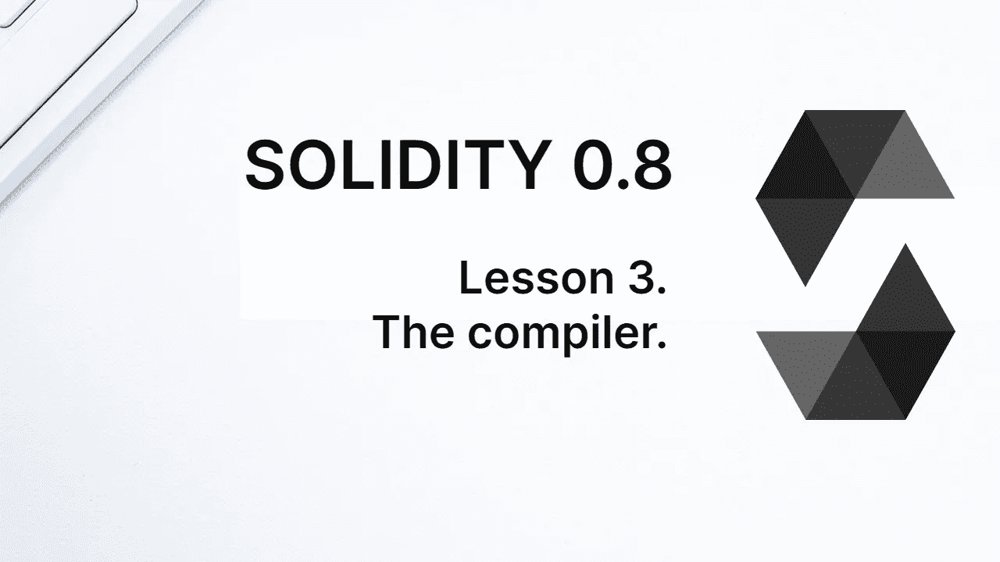
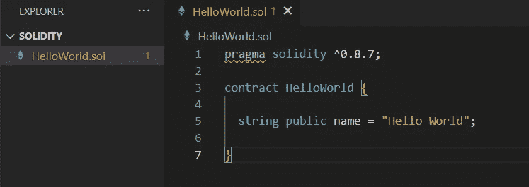
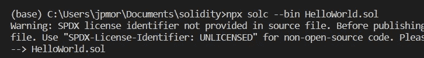
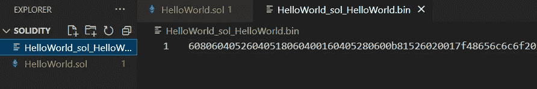
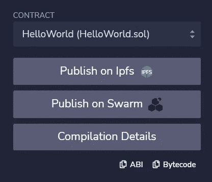
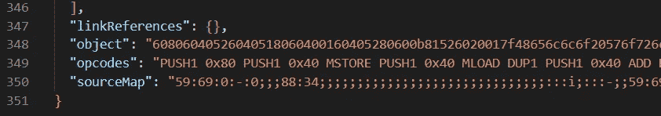
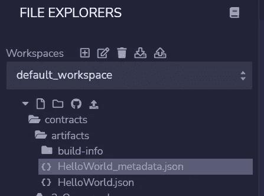
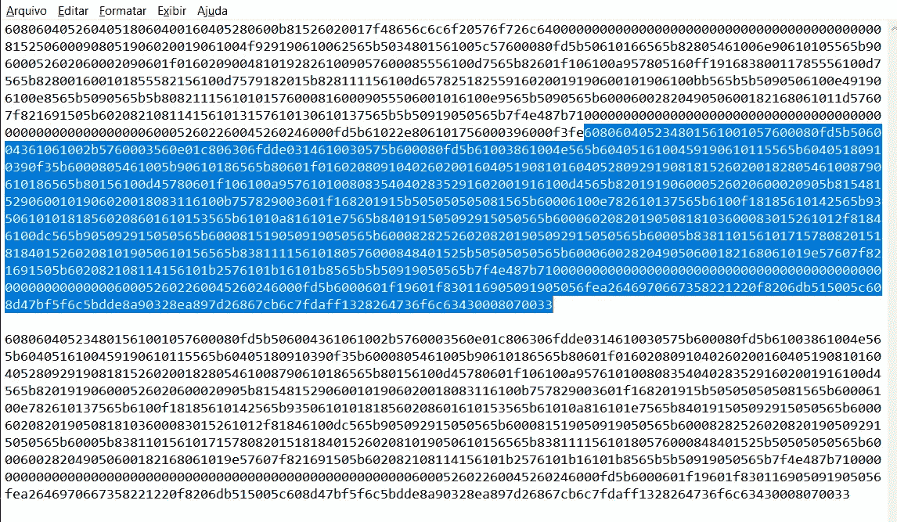

# 学习第三课的可靠性。编译器。

> 原文：<https://medium.com/coinmonks/learn-solidity-lesson-3-the-compiler-a9a6b8da1e70?source=collection_archive---------5----------------------->



当一个合同被保存在 Remix 中时，它被自动编译。在这一节中，我们将看到编译是如何发生的及其结果。首先，我们来看看 Solidity 编译器以及如何使用它。

# Solc

Solidity 编译器被命名为 *solc* ，它大部分是用 C++编写的，目前版本是 0.8.15。源代码可以在 github.com/ethereum/solidity 的[找到。有一个用 JavaScript(更准确的说是 TypeScript)写的包装器可以通过 **npm** (或者 **yarn** )安装，命名为 *solc-js* 。还是用 *solc-js* 吧，安装使用更方便。](http://github.com/ethereum/solidity)

为了展示 solc 的用法，让我们暂时远离 Remix。使用您选择的任何文本编辑器，粘贴您编写的合同并将文件保存为 *HelloWorld.sol* 。我使用的是 VS 代码，如下图所示。



HelloWorld.sol

让我们运行 *solc* 来编译合同。为此，我们将使用 **npx** ，它在没有安装的情况下运行节点包。Npx 是和 **node.js** 一起安装的，如果你的电脑上没有安装，请到 [nodejs.dev](http://nodejs.dev) 按照说明操作。

要编译契约，也就是生成它的字节码，在 shell 中运行下面的命令行。我正在使用 Windows 命令提示符。

```
npx solc --bin HelloWorld.sol
```

Solc 接受几个参数，但是我们将把自己限制在严格必要的范围内。有必要使用选项 *— bin* 或 *— abi* 指出我们是想要生成字节码还是契约的 **ABI** 。我们使用 *— bin* 来生成字节码，这是 EVM 机器码。

在下图中，我们看到编译器警告我们缺少许可证声明，就像 Remix 一样。仅仅一个警告并不能阻止编译器编译，生成一个名为*hello world _ sol _ hello world . bin*的文件。



Generating the bytecode using *solc*.

*。bin* 文件包含必须在事务中发送到区块链的字节码。这是一个二进制代码，但以十六进制为基础，因此它可以包含数字和字母之间的' a '和' f '。我们可以在下图中看到这一点。



The bytecode of HelloWorld.sol.

另一个选项是生成 ABI，将在后面解释。现在让我们看看在哪里可以使用 Remix 找到字节码。在屏幕底部名为 *Solidity Compiler* 的选项卡中，注意两个按钮的存在:ABI 和字节码。见下图。



Bytecode and ABI in Remix.

可以点击*字节码*复制 Remix 生成的内容，粘贴到文本文件中。然而，您可能会注意到，它不仅仅是一个十六进制数，而是一个 JSON 文件。真正的字节码几乎是在 JSON 的末尾，在一个名为*对象*的属性中找到的，如下图所示。



The ‘Bytecode’ generated by Remix is a JSON file.

这个问题乍一看可能会令人困惑，但是让我们搞清楚:字节码是一个很大的十六进制数，这是 EVM 机器码。Remix 还显示了*操作码*，这是从字节码转换而来的汇编代码。虽然看到契约生成的操作码很有趣，但它们并不是发布所必需的。发布合同就是在事务中把字节码发送给区块链。

这正是我们在 Remix 中使用部署选项时所做的。它写给我们一个事务，其中事务数据包括字节码，这个事务被发送到网络中的一个节点。在 Remix 自己测试局域网的情况下，节点就是 Remix 本身。

> 交易新手？尝试[加密交易机器人](/coinmonks/crypto-trading-bot-c2ffce8acb2a)或[复制交易](/coinmonks/top-10-crypto-copy-trading-platforms-for-beginners-d0c37c7d698c)

# 史前古器物

工件是帮助描述软件架构的副产品。当我们在 Remix 中构建智能契约时，它会生成一个工件，保存在名为*contracts/artifacts/build-info*的文件夹中。这可以从下图中看出。



Artifacts generated by Remix.

生成了两个文件:*hello world _ metadata . JSON*和 *HelloWorld.json* 。两者不仅包含关于契约的信息，还包含关于编译器的信息。同一个契约，用不同版本的 *solc* 编译，可以生成不同的字节码，所以要知道用的是哪个版本的编译器。

其他面向 Solidity 的开发环境，比如**松露**和**安全帽**，也生成自己的工件。它们不一定相同，但是它们都包含字节码和 ABI。它们是发布和与合同交互所需的信息。

我们应该注意的一个问题是，Remix(以及其他 ide)通常会生成两个字节码。Remix 称它们为*字节码*和*‘部署的字节码’*。虽然它们是相关的，但它们并不相同。

*字节码*是在合同创建时，在事务中发送到网络的代码。*部署的字节码*(其他 ide 使用不同的命名法)是实际写入区块链的代码。

它们之间的区别在于，发送到区块链的代码除了包含将要保存的代码之外，还包含一个初始代码，该代码将在部署时执行。执行后，初始代码被丢弃。

字节码将总是比部署的字节码大，并且将包含它。我们可以在下图中看到这一点。我在记事本上复制了这两个字节码。上面，我们有字节码，用一个空行隔开，是部署的字节码。蓝色部分是字节码中与部署的字节码完全相同的部分。字节码的初始部分(没有用蓝色标记)将在部署时执行，然后被丢弃。



The bytecode and the deployed Bytecode.

**感谢阅读！**

> 加入 Coinmonks [电报频道](https://t.me/coincodecap)和 [Youtube 频道](https://www.youtube.com/c/coinmonks/videos)了解加密交易和投资

# 另外，阅读

*   [OKEx vs KuCoin](https://coincodecap.com/okex-kucoin) | [摄氏替代品](https://coincodecap.com/celsius-alternatives) | [如何购买 VeChain](https://coincodecap.com/buy-vechain)
*   [ProfitFarmers 回顾](https://coincodecap.com/profitfarmers-review) | [如何使用 Cornix Trading Bot](https://coincodecap.com/cornix-trading-bot)
*   [如何匿名购买比特币](https://coincodecap.com/buy-bitcoin-anonymously) | [比特币现金钱包](https://coincodecap.com/bitcoin-cash-wallets)
*   [瓦济里克斯 NFT 评论](https://coincodecap.com/wazirx-nft-review) | [比茨盖普 vs 皮奥克斯](https://coincodecap.com/bitsgap-vs-pionex) | [坦吉姆评论](https://coincodecap.com/tangem-wallet-review)
*   [如何使用 Solidity 在以太坊上创建 DApp？](https://coincodecap.com/create-a-dapp-on-ethereum-using-solidity)