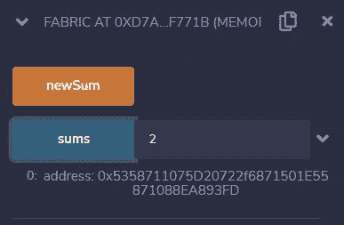

# 学习坚实度第 30 课。合同为类。

> 原文：<https://medium.com/coinmonks/learn-solidity-lesson-30-contracts-as-classes-ceff5e088dd6?source=collection_archive---------3----------------------->


正式的 Solidity 文档规定合同类似于面向对象语言中的类。我们将在本课和下一课中更详细地了解这一点。

类就像允许我们创建对象的模型。它们是柏拉图世界的理念，是真实物体的模型。这样想，契约代码就是类，当契约被部署到某个地址时，对象被创建(实例化)。

我们已经看到了如何通过交易部署合同，其中合同创建者是一个外部帐户。也可以通过另一个合同创建某个合同的新实例。让我们看看怎么做。

让我先复制所有代码，然后解释。

```
//SPDX-License-Identifier: MIT
pragma solidity ^0.8.7;contract Sum {
   function sum(uint x, uint y) public pure returns (uint) {
      return x + y;
   }
}contract Fabric {
   address[] public sums;
   function newSum() public {
      Sum sum = new Sum();
      sums.push(address(sum));
   }
}
```

我试图使代码尽可能简单。在同一份文件中，我写了两份合同。其中一个名为`Sum`，只有一个函数可以加 2 个数字。合同`Sum`将被另一个名为`Fabric`的合同实例化。

在`Fabric`契约中，有一个地址数组，我们将在其中存储创建的实例的地址。`newSum`还有一个功能，他的身体很简单。在第一行，我们使用关键字 **new** 创建合同的新实例`Sum`。在另一行，我们写下在名为`sums`的数组中创建的实例的地址。

`sum`实例是类型为`Sum`的对象，可以用来调用创建的合同中的函数。我们很快就会这样做。现在，让我们尝试使用 Remix 创建新的实例。

# 创建新实例

由于同一文件现在包含 2 份合同，有必要向 Remix 指出将部署哪份合同。在*部署&运行事务*页签中，选择合同*架构*，如下图所示。我经常忘记选择合同，结果部署了错误的合同，我所有的学生也是如此。


It is necessary to select which contract will be deployed.

一旦这样做了，每次调用`newSum`函数时，都会在给定的地址创建一个新的合同实例。我们可以将这些地址作为`sums`数组的元素进行检查。

作为测试，我调用了`newSum`函数 3 次，以便创建 3 个合同实例。为了检查最后一个实例的地址，我调用了函数`sums`，传递`2`的值作为参数(记住数组从 0 开始计数)。这可以在下图中看到。



Retrieving the address of the third instance created.

在实例化新契约时，也可以传递参数。此类参数将是所创建的协定的构造函数的参数。例如，让我们在同一个文件中定义下面的简单契约。

```
contract Token {
   string public name;
   constructor(string memory _name) {
      name = _name;
   }
}
```

上面的契约只有一个公共状态变量`name`，它是通过构造函数赋值的。

现在让我们在`Fabric`契约中编写一个函数，创建这个契约的新实例。在契约中包括下面的状态变量和函数。

```
address[] public tokens;function newToken(string memory _name) public {
   Token token = new Token(_name);
   tokens.push(address(token));
}
```

参数通过**新的**方法在构造函数中传递。一般来说，这就是我们在面向对象语言中创建类的方式。

# 调用合同中的函数

当我们通过 *new* 方法创建一个新契约时，返回的是它的一个实例。我们可以使用这个实例来调用创建的契约的公共或外部函数。

例如，`Token`契约有一个公共状态变量`name`。公共状态变量生成允许您检索它们的值的方法。为了调用这个函数，给定一个名为`token`的实例，我们可以编写下面的语句。

```
token.name();
```

我们已经看到，可以将契约实例转换为 address 类型的变量，如`address(token)`。我们这样做是为了将令牌地址存储在`tokens`地址数组中。也可以反过来，将地址转换成实例。下面我们来看看函数。

```
function getTokenName(uint8 _tokenId) public view returns (string memory) {
   string memory name = Token(tokens[_tokenId]).name();
   return name;
}
```

表达式`tokens[_tokenId]`返回一个地址，存储在`tokens`数组的`_tokenId`索引中。然后我们使用语法`Token([address])`转换成类型`Token`的实例。最后，我们使用语法`instance.method()`调用函数`name`。

在上面的例子中，我们调用了自己创建的契约中的一个函数，它的代码在同一个文件中。我们在任何契约中调用一个函数所需要的只是它的代码(或者它的接口)和地址。

现在让我们来看看一份不是我们在真实的区块链上签订的合同。在我生命中的某个时刻，我在币安智能链测试网络上创建了一个 ERC-20 令牌，其符号为 BTJ，地址如下:

```
0x6aefd30f8d96D56bD0021853140BE84BdE134Af7
```

我将编写一个简单的契约来检索该令牌的总供应量。以下代码可用于调用 ERC-20 标准令牌上的任何强制函数。

```
pragma solidity ^0.8.4;import "[@openzeppelin/contracts](http://twitter.com/openzeppelin/contracts)/token/ERC20/IERC20.sol";contract InvokeToken {
   function invokeTotalSupply(address _address) public view returns (uint256) {
      IERC20 token = IERC20(_address);
      return token.totalSupply();
    } 
}
```

在`invokeTotalSupply`函数中，我们检索位于地址`_address`的 ERC-20 令牌的一个实例。注意，我们没有创建一个新的实例(我们没有使用 *new* 关键字)，我们只是检索一个现有的实例。

我们可以这样做，因为我们有合同接口，它是用`import`关键字导入的。我们会看到接口是什么，但基本上它是契约所有功能的定义，没有它的主体。在这种情况下，拥有接口几乎等同于拥有 ABI。

将上述代码部署到币安智能链测试网后，我们可以调用`invokeTotalSupply`函数。结果可以在下图中看到。


Creating a function to retrieve the total supply of another contract through its address.

上述合同能够恢复币安测试网上任何标准 ERC20 合同的总供应量。为此，只需将其地址作为参数传递给函数。

**感谢阅读！**

欢迎对本文提出意见和建议。

欢迎任何投稿。[www.buymeacoffee.com/jpmorais](http://www.buymeacoffee.com/jpmorais)。

> 交易新手？尝试[加密交易机器人](/coinmonks/crypto-trading-bot-c2ffce8acb2a)或[复制交易](/coinmonks/top-10-crypto-copy-trading-platforms-for-beginners-d0c37c7d698c)