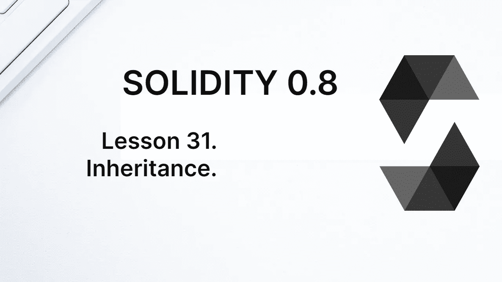
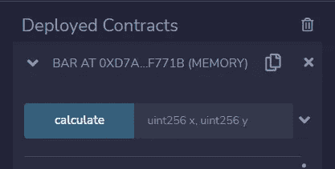
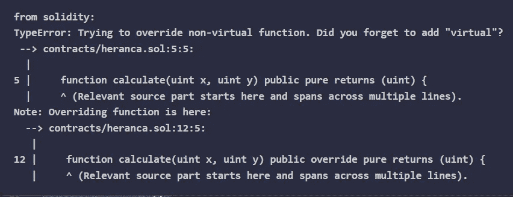

# 学习第 31 课坚固性。遗产。

> 原文：<https://medium.com/coinmonks/learn-solidity-lesson-31-inheritance-761ee4c66c0f?source=collection_archive---------4----------------------->



面向对象编程的支柱之一是继承的概念。一个类可以从另一个类继承属性和方法，形成一个继承树。我们将在本课和下一课中详细研究这一点。

在下面的代码中，定义了一个名为`Foo`的契约，带有一个状态变量。合同`Bar`继承自合同`Foo`。为了表明这一点，我们使用关键字**是**，就像`Bar is Foo`一样。

```
pragma solidity ^0.8.7;contract Foo {
   uint value = 30;
}contract Bar is Foo {
   function getValue() public view returns (uint) {
      return value;
   }
}
```

当契约`Bar`继承自`Foo`时，它继承了所有未声明为私有的状态变量和函数。在上面的例子中，函数`getValue`将返回值`30`，其值在契约`Foo`中被赋值。

应该清楚的是,`Bar`契约继承的所有东西都被插入到它的字节码中。就好像`value`状态变量是由`Bar`契约本身定义的。

现在，或许私有变量和内部变量之间的区别会变得更加清晰。内部变量由子契约继承，而私有变量则不是。如果我们更改 Foo 合同中的以下行:

```
uint private value = 30;
```

变量`value` 将不再被`Bar`继承，编译器将抛出一个错误。

# 继承函数

现在让我们编写一个从另一个契约继承函数的契约。让我们看看下面的代码。

```
pragma solidity ^0.8.7;contract Foo {
   function calculate(uint x, uint y) public pure returns (uint) {
      return x+y;
   } 
}contract Bar is Foo {}
```

虽然`Bar`契约被定义为空，但是它从`Foo`契约继承了`calculate`函数。通过在 Remix 中编译和部署`Bar`契约，我们可以看到可以调用`calculate`函数。如下图所示。



The Bar contract inherits the function of the Foo contract.

有时，我们希望定义一个从另一个继承而来的契约，但是使用一些行为不同的函数。然后，您需要覆盖被继承的函数。为此，我们使用关键字**虚拟**和**覆盖**。

让我们在`Bar`合同上覆盖`Foo`合同的`calculate` 功能。为此，您必须在`Bar`合同中使用`override`关键字。

```
contract Bar is Foo {
   function calculate(uint x, uint y) public override 
      pure returns (uint) {
      return x-y;
   }
}
```

请注意，`calculate`函数现在将值`x`和`y`相减，而不是相加。

重写函数只是完成了一半。只能覆盖标记为`virtual`的功能。在上面的例子中，编译器会抛出一个错误，如下图所示。



Only functions marked as virtual can be overridden.

要修复这个错误，只需将`Foo`契约的`calculate`函数标记为`virtual`，如下所示。

```
function calculate(uint x, uint y) public virtual pure returns (uint) {
   return x+y;
}
```

在`Bar`契约中，每次调用`calculate`函数时，都会调用重叠函数，这会减少值，而不是增加值。然而，只要明确声明，仍然可以调用`Foo`契约的`calculate`函数。

在下面的代码中，在 Bar 契约内部，我们创建了一个新函数，名为`oldCalculate`。在这个函数中，我们通过表达式`Foo.calculate`调用契约`Foo`的`calculate`函数。

```
function oldCalculate(uint x, uint y) public pure returns (uint) {
   return Foo.calculate(x,y);
}
```

我们也可以使用表达式`super.calculate`，其中关键字 **super** 指的是当前合同的父合同。

# 修饰语

修饰符是继承的，也可以被覆盖，类似于函数。许多库是由修饰符组成的，并且被广泛使用，比如 *Ownable* 库。

让我们看看下面的代码，它只实现了本库的修饰符。

```
pragma solidity ^0.8.7;contract Ownable {
   address public owner = msg.sender;
   modifier onlyOwner() {
      require(msg.sender == owner);
      _;
   }
}contract Foo is Ownable {
   function transferOwnership(address _new) public onlyOwner {
      owner = _new;
   } 
}
```

由于契约`Foo`继承了契约`Ownable`，所以可以使用它的修饰符。

要覆盖父合同中的修改量，关键字`override`必须包含在新修改量中，并且父修改量必须已声明为`virtual`。就像函数一样。

# 构造函数参数

如果父协定具有需要参数的构造函数，则必须通过子协定将参数传递给父构造函数。有两种方法可以做到这一点。

第一个是在子契约构造函数中。在实现 OpenZeppelin 的标准 ERC20 令牌契约时，我们已经看到了如何做到这一点。让我们看看下面的代码。

```
contract MyToken is ERC20 {
   constructor() ERC20("MyToken", "MTK") {}
}
```

当执行子契约的构造函数时，我们还使用父契约的名称调用父契约的构造函数，在本例中是 ERC20。此构造函数需要两个字符串参数。

第二种方法是在协定声明时传递构造函数参数，如下所示:

```
contract MyToken is ERC20("My Token", "MTK") {}
```

如果父协定的构造函数参数独立于子协定的构造函数参数，那么第二种方法更简单。如果参数不是字面量，则必须使用第二种方法。

例如，如果在部署时指定了两个字符串，如下所示，则必须使用第一个方法。

```
contract MyToken is ERC20 {
   constructor(string memory _name, string memory _symbol) ERC20(_name, _symbol) {}
}
```

**感谢阅读！**

欢迎对本文提出意见和建议。

欢迎任何投稿。www.buymeacoffee.com/jpmorais[。](http://www.buymeacoffee.com/jpmorais)

> 交易新手？试试[密码交易机器人](/coinmonks/crypto-trading-bot-c2ffce8acb2a)或[复制交易](/coinmonks/top-10-crypto-copy-trading-platforms-for-beginners-d0c37c7d698c)