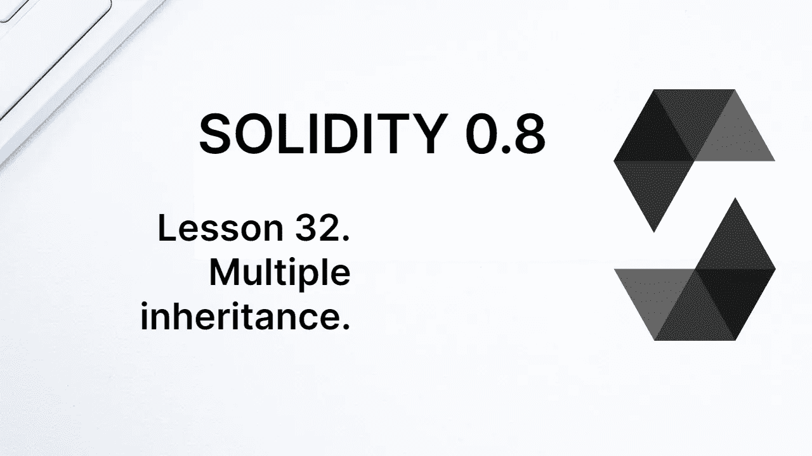
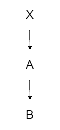
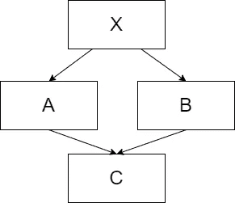
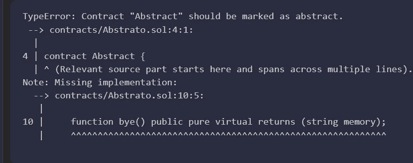
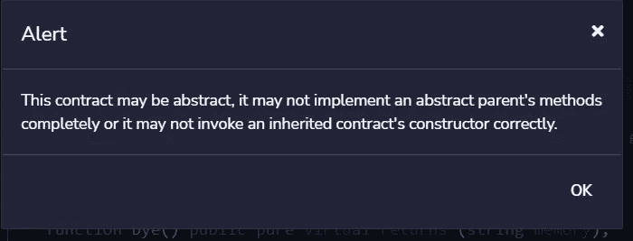

# 学习坚实度第 32 课。多重继承。

> 原文：<https://medium.com/coinmonks/learn-solidity-lesson-32-multiple-inheritance-d616e20182b7?source=collection_archive---------6----------------------->



在本文中，我们将更多地研究继承，尤其是当它涉及多个契约时。

继承合同可以将其遗产传递给子合同。最简单的方法是将继承直接传递给一个子契约。让我们看看下面的代码。

```
pragma solidity ^0.8.7;contract Foo {
   uint public number = 20;
   }
contract Baz is Foo {}
contract Bar is Baz {}
```

`Baz`合同继承了`Foo`合同的`number`状态变量，而`Bar`合同也继承了状态变量。

一个契约可以从多个契约中继承变量和函数。让我们看看下面的代码，其中一个契约从另外两个契约中继承变量。

```
pragma solidity ^0.8.7;contract Foo {
   uint public number = 20;
}
contract Baz {  
   string public name = "John";
}
contract Bar is Baz, Foo {}
```

合同`Bar`继承了`Baz`、`Foo`两者，因此也将继承`number`、`name`状态变量。我们很快会看到更多关于这个案子的情况。

重要的是要记住，当我们没有定义变量的可见性时，它会自动声明为*内部*。为了防止变量被继承，必须将其声明为 *private* 。

多重继承应该小心处理，因为它可能会导致一些错误。让我们写一个契约，从另外两个契约中继承相同的功能。

```
pragma solidity ^0.8.7;contract A {
   function hello() public virtual pure returns (string memory) {
      return "Hi from A";
   }
}contract B {
   function hello() public virtual pure returns (string memory) {
      return "Hi from B";
   }
}contract C is A,B {}
```

上述代码不会编译，因为`C`合同继承了两个具有相同签名的函数。要编译`C`合同，需要覆盖`hello`功能。

```
function hello() public override(A,B) pure returns (string memory) {
   return A.hello();
}
```

由于`hello`功能在`A`和`B`中都存在，因此有必要在`override(A,B)`中注明。在功能(或合同的任何功能)内，可以使用`A.hello()`或`B.hello()`语法调用`A`或`B`的功能`hello`。

虽然这种语法通常表示对另一个合同的外部调用，但事实并非如此。

# 钻石问题

多重继承会产生一些问题，比如所谓的钻石问题。在我们具体讨论钻石问题之前，我们来看另一个例子。假设我们想要一份遗产，如下图所示。



Linear inheritance between contracts.

在上述情况下，合同`B`继承自`A`，而`A`继承自`X`。但是，有几种方法可以建立这种继承。最简单的是通过单一继承，如下所示。

```
contract X {}
contract A is X {}
contract B is A {}
```

但是，合同`B`也有可能直接继承`X`。这将产生与上述结构不同的行为。我们可以这样做。

```
contract X {}
contract A is X {}
contract B is X,A {}
```

合同`X`和`A`被`B`继承的顺序很重要。从右到左，我们应该写最直接相关的合同。由于`B`直接从`A`继承而来，契约 A 必须在声明的最右边。

以下代码将不会编译:

```
contract X {}
contract A is X {}
contract B is A,X {}
```

对错误的解释很简单。在合同`A`的声明中，合同`A`优先于合同`X`。通过写`B is A, X`，我们在说契约`X`必须覆盖契约`A`，但是契约`A`也覆盖契约`X`，这是一个矛盾。

现在让我们介绍一下钻石问题。想象下面的继承结构，如下图所示。



The diamond problem.

合同`A`和`B`继承自`X`,`C`继承自`A`和`B`。有几种方法可以构建这个继承，我们将从一种无法编译的方法开始。

```
contract X {}
contract A is X {}
contract B is X {}
contract C is A,B,X {}
```

出于与上述相同的原因，此类代码将无法工作。我们说合同`X`继承自`B`，但是`B`也继承自`X`。这是一个矛盾。

我们可以用四种方式来声明合同。

```
contract C is X,A,B {}
contract C is X,B,A {}
contract C is A,B {}
contract C is B,A {}
```

最大的区别在于合同`A`和`B`的顺序。在上面的第一行和第三行中，`B`继承了`A`，而在第二行和第四行中，`A`继承了`B`。

在钻石问题上，我们必须最大限度地关注合同的构造者。让我们看看下面的代码。

```
contract X {
   string public letter;
}
contract A is X {
   constructor() {
      letter = "A";
   }
}
contract B is X {
   constructor() {
      letter = "B";
   }
}
contract C is A,B {}
```

你能算出`letter`变量的值是多少吗？由于合同`C`继承自`A`和`B`，根据合同`C`的申报继承顺序，可以是`“A”`或`“B”`。因为声明如下:`contract C is A, B`，这意味着契约`B`覆盖了`A`，所以变量`letter`将是`“B”`。

# 抽象合同

当一些函数没有实现时，或者当我们没有向它们的构造函数提供所有必要的参数时，契约必须被声明为抽象的。

抽象契约比接口更灵活，因为一些函数可以实现，我们可以声明状态变量。让我们看一个抽象契约的例子。

```
contract Abstract {
   function hello() public pure returns (string memory) {
      return "Hello World!";
   }
   function bye() public pure virtual returns (string memory);
}
```

上面的契约有一个未实现的函数，即`bye`函数。实际上，编译器会报告一个错误，如下图所示。



Contracts with unimplemented functions must be marked as abstract.

解决上述错误非常简单，只需使用 **abstract** 关键字将契约标记为抽象，如下所示。

```
abstract contract Abstract {...}
```

抽象协定不能被实例化。像接口一样，它们被构建为由其他契约继承。当尝试部署抽象契约时，Remix 会显示一个错误，如下图所示。



It is not possible to deploy (or instantiate) an abstract contract.

让我们写一个抽象契约的简单例子，它被用作另一个契约的基础。

```
//SPDX-License-Identifier: MIT
pragma solidity ^0.8.7;abstract contract ModelContract {
   uint public number;
   function setNumber(uint _number) public {
      number = _number;
   }
   function toBeImplemented() public virtual;
}contract MyContract is ModelContract {
   function toBeImplemented() public override  {}
}
```

`ModelContract` 契约是抽象的。它不能被实例化，但是我们使用它作为`MyContract`契约的基础。在其中，我们声明了一个状态变量和一个函数`setNumber`，两者都被实现了。还有一个未实现的功能，`toBeImplemented`。由于是要实现的函数，所以必须声明为*虚拟*。

**感谢阅读！**

欢迎对本文提出意见和建议。

欢迎任何投稿。[www.buymeacoffee.com/jpmorais](http://www.buymeacoffee.com/jpmorais)。

> 交易新手？尝试[加密交易机器人](/coinmonks/crypto-trading-bot-c2ffce8acb2a)或[复制交易](/coinmonks/top-10-crypto-copy-trading-platforms-for-beginners-d0c37c7d698c)