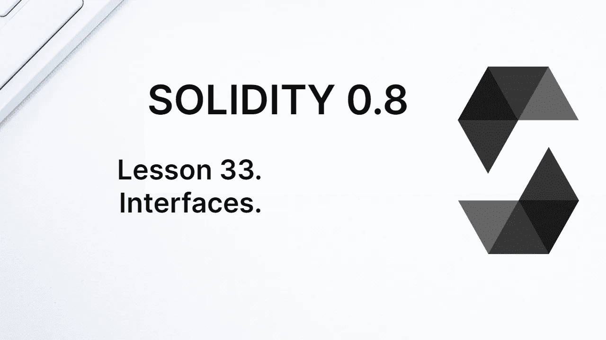

# 学习第 33 课坚固性。接口。

> 原文：<https://medium.com/coinmonks/learn-solidity-lesson-33-interfaces-ad41323beee2?source=collection_archive---------4----------------------->



接口类似于抽象契约，但是没有实现任何功能，也没有声明状态变量。在面向对象的编程语言中，接口就像蓝图，一系列要实现的功能，但是没有它们的实现。

接口在 Solidity 中被广泛使用有两个主要原因。描述要实现的标准，例如 ERC-20(令牌)和 ERC-721(不可替换令牌)。此外，契约的接口提供了用于与之交互的 ABI。

让我们更深入地研究一下 Solidity 中的接口。为了声明一个接口，我们使用关键字 **interface** ，后跟接口的名称。接口不能从协定继承，但可以从其他接口继承。

让我们看看下面的代码。这是完全有效的。

```
//SPDX-License-Identifier: MIT
pragma solidity ^0.8.7;interface Foo {}interface Bar is Foo{}
```

在接口中，我们可以声明函数头和事件，以及结构和可枚举数。不支持构造函数、状态变量和修饰符。

# 接口的一些规则

坚固性需要一些创建接口的规则。官方文件说，这些规则中的一些可能会在未来终止，但目前我们应该坚持它们。

每个函数都必须具有外部可见性，即使它在实现该接口的协定中被声明为 public。以下陈述是有效的。

```
function toBeImplemented() external returns (uint);
```

将*外部*可见性替换为*公共*将导致编译器抛出错误。同样，将函数声明为内部或私有也没有意义:*内部和私有*函数是契约实现的一部分，而不是它的接口。

没有必要声明接口中的函数是虚拟的，因为接口中的所有函数都是隐式虚拟的。同样，在实现时也没有必要使用关键字 *override* 。

如前所述，在一个接口中声明结构和枚举是可能的。下面的代码完全有效。

```
interface Foo { enum MyEnum{ First, Second} struct MyStruct{ uint first; string second;} function toBeImplemented() external returns (uint);}
```

# ERC-20 标准接口

ERC-20 标准是以太网上最广泛使用的可替换令牌标准。事实上，我们知道的大多数加密货币都是 ERC 20 代币。其标准在 2015 年末作为一项提案提交，以改进以太坊网络 20 号 EIP-20。可以在
[eips.ethereum.org/EIPS/eip-20](http://eips.ethereum.org/EIPS/eip-20)找到。

ERC-20 标准最广泛使用的实现之一是由 OpenZeppelin 实现的。代码如下。

```
interface IERC20 {function totalSupply() external view returns (uint256);function balanceOf(address who) external view returns (uint256);function allowance(address owner, address spender) external view returns (uint256);function transfer(address to, uint256 value) external returns (bool);function approve(address spender, uint256 value) external returns (bool);function transferFrom(address from, address to, uint256 value) external returns (bool);event Transfer(
    address indexed from,
    address indexed to,
    uint256 value
  );event Approval(
    address indexed owner,
    address indexed spender,
    uint256 value
  );
}
```

正如我们所看到的，这个接口只有函数和事件。所有函数都是外部的，没有标记为虚拟的。

# 实现和使用接口

接口是作为子契约实现的，需要重写接口中的所有函数。让我们看一个例子。我们从下面这个简单契约的接口开始，它将向数组中添加值。

```
interface IStoreUint {
   function addUint(uint _item) external;
   function getUint(uint _index) external view returns (uint); 
}
```

现在让我们在同一个文件中实现这个接口。

```
contract StoreUint is IStoreUint {uint[] items;function addUint(uint _item) public {
   items.push(_item);
}function getUint(uint _index) public view returns (uint) {
    return items[_index];
}
}
```

请注意，我们不使用 override 关键字来覆盖所有函数。以这种方式使用，接口就像一个模式，一种契约的蓝图。

接口的第二个功能是允许向实现这种接口的协定发送调用。

假设契约部署在某个地址，比如说`0xd9145CCE52D386f254917e481eB44e9943F39138`。现在，我们想通过另一个契约来执行`addUint()`方法。为此，我们可以创建接口的一个实例，如下所示。

```
IStoreUint storeUint = IStoreUint(0xd9...9138);
```

现在我们可以从另一个契约中执行该契约的方法。下面，遗嘱执行人合同的完整代码。

```
contract AddUints { function addUintInOtherContract(uint _item) public {
      IStoreUint storeUint = IStoreUint(0xd914...9138);
      storeUint.addUint(_item);
   }}
```

使用契约`StoreUint`，而不是它的接口，可以获得相同的结果。但是接口总是更小，我们经常希望向实现相同接口但实现不同的契约发送调用。

**感谢阅读！**

欢迎对本文提出意见和建议。

欢迎任何投稿。[www.buymeacoffee.com/jpmorais](http://www.buymeacoffee.com/jpmorais)。

> 交易新手？尝试[加密交易机器人](/coinmonks/crypto-trading-bot-c2ffce8acb2a)或[复制交易](/coinmonks/top-10-crypto-copy-trading-platforms-for-beginners-d0c37c7d698c)