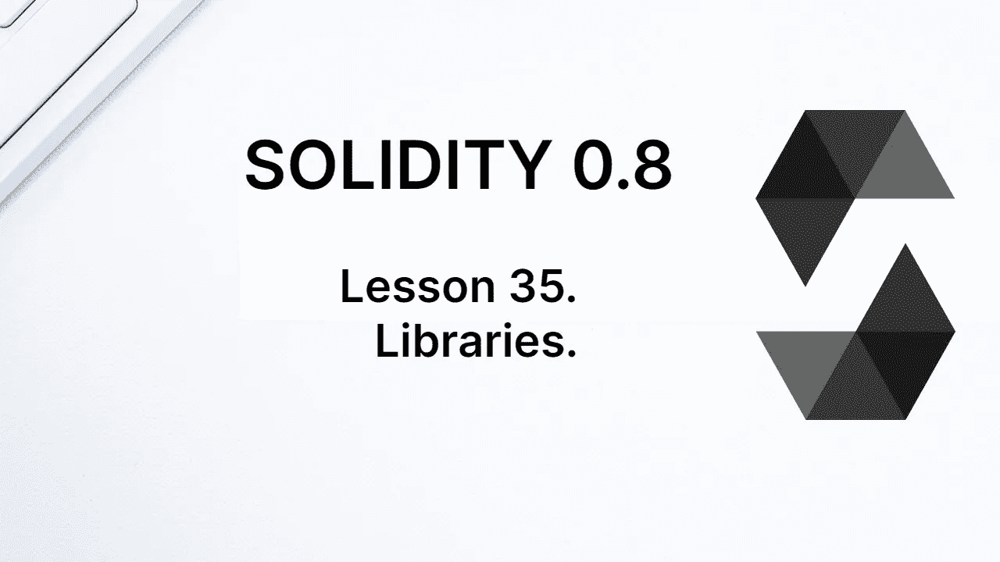
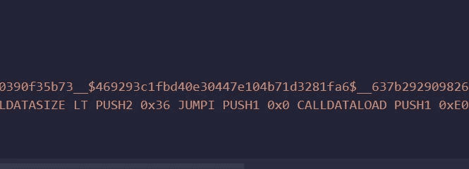
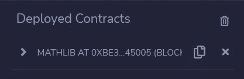
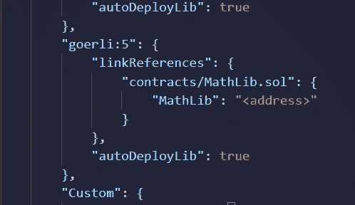
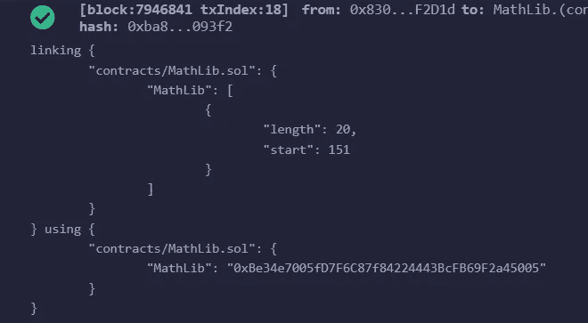
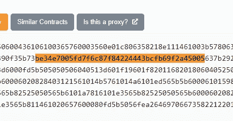

# 学习第 35 课固体。图书馆。

> 原文：<https://medium.com/coinmonks/learn-solidity-lesson-35-libraries-74beb9fff0e6?source=collection_archive---------2----------------------->



库的目的是作为一个可重用的代码库。这样的代码可以合并到合同中，也可以发布到一个外部地址，最好是发布一次，然后从那里使用。在第二种情况下，使用操作码 *delegatecall* 调用库，因为库是无状态的。

有一点应该明确:库应该被其他契约使用。因此，库没有状态变量。试图声明状态变量将产生编译错误。

在一个库中，具有内部可见性的函数将被使用该库的契约合并，并且将被执行，就像它们是契约本身的内部函数一样。这意味着它们将出现在合同字节码中。

参考库的外部地址来执行库的外部函数。也就是说，库必须被部署，并且在契约的字节码中将只是对该函数的引用(以及库地址)。

让我们从创建一个具有内部可见性的函数的库开始，通过一个契约来合并。使用**库**关键字声明库。

```
pragma solidity ^0.8.7;

library MathLib {

  function square(uint x) internal pure returns (uint) {
    return x*x;
  }
}

contract MyContract {

  uint public number;

  function numberSquare(uint _x) public {
    number = MathLib.square(_x);
  }
}
```

在上面的代码中，声明了`MathLib` 库，契约
`MyContract` 使用该库，就像它是契约基的一部分一样。注意，我们使用库函数作为`MathLib.square()`，即使没有明确声明库是契约的基础。也就是说，我们不像在继承中那样使用 is 关键字。编译器负责这项任务。

库不需要和契约位于同一个文件中，用 **import** 关键字导入即可。让我们导入保存在文件`MathLib.sol`中的库。

```
import "./MathLib.sol";
```

现在让我们从外部使用一个库。

# 外部库

库也可以部署到一个地址，然后由其他契约使用。因此，要调用的函数的字节码不包含在契约字节码中，只是对将要执行的库的引用。

库与契约调用的其他契约中的函数有一些相似之处，但有两个主要区别。第一个是使用操作码 *delegatecall* 调用该函数，因此它是在调用契约的上下文中调用的。在库的上下文中调用它是没有意义的，因为库是无状态的。

第二个区别是我们如何在合同中引用库。编译器有生成引用的功能，所以在我们编译契约的时候需要声明。因此，不同的平台有不同的引用方法。

让我们编写一个带有外部函数的库，并在契约中调用该外部函数。为此，只需将库函数的可见性更改为 external。

```
library MathLib {

  function square(uint x) external pure returns (uint) {
    return x*x;
  }
}
```

现在我要编译契约`MyContract`，它使用了这个函数。下图显示了生成的部分字节码。



The bytecode contains a placeholder for the address of the library.

代码`__$469293c1fbd40e30447e104b71d3281fa6$__`是库地址的占位符。在发布合同之前，您必须用图书馆的地址替换此代码。在混音中，这是在元数据中指定的。

当使用 Remix 虚拟机时，在部署时没有问题，因为 Remix 会自动包含库地址。当我们部署到真正的区块链时，我们需要手动完成。我首先将库部署到 Goerli，如下图所示。该库现在位于以下地址:0 xbe 34 e 7005 FD 7 f 6 c 87 f 84224443 bcfb 69 F2 a 45005。



Deployment of the library on the Goerli network.

在元数据文件 *MyContract.json* 中，我们找到一个可以包含库地址的地方。这一点可以从下图中看出。



The library address must be included in the metadata.

将占位符“

”更改为库的地址，并将选项“autoDeployLib”更改为 false，因为我们不想部署库。

在部署时，Remix 会表明它已经将契约与库链接起来，如下图所示。



Remix indicates that the library has been linked to the contract.

然后将库地址放入字节码*中*，并将其发送给元掩码。例如，在块浏览器中搜索字节码中的库地址，可以清楚地看到地址就在那里，如下图所示。



The library address can be found in the contract bytecode.

因此，我们可以使用任何已经部署的库。为此，我们需要库代码，因为契约编译必须与库代码一起完成。此外，我们只需要图书馆地址，以链接到合同。

# 阅读和修改合同状态

由于库是无状态的，访问契约状态的唯一方法是将其作为参数显式发送给要调用的函数。最好是，库不应该改变契约状态，但是没有什么可以阻止这样做。

在下面的代码中，我们将创建一个函数库，该函数将对类型为 *uint* 的数组的所有元素求和。

```
library ArrayLib {

  function soma(uint[] storage array) external view returns (uint) {

    uint total = 0;
    for (uint i = 0; i < array.length; i++) {
      total = total + array[i];
    }
    return total;
  }
}
```

该数组作为函数的参数发送到库中。在参数中，我们必须指出变量在存储中。请记住，库函数是在调用契约的上下文中运行的，因此这是对调用契约的存储的引用。

现在让我们编写将使用该函数的契约。

```
pragma solidity ^0.8.7;

import "./ArrayLib.sol";

contract MyContract {

  uint[] public myArray = [1,2,3,4,5];

  function sumArray() public view returns (uint) {
    return ArrayLib.sum(myArray);
  }
}
```

除了读取状态变量，还可以改变调用契约的状态。举例来说，我们通过将引用传递给映射来实现这一点。让我们创建一个新的库。

```
pragma solidity ^0.8.7;

library MappingLib {

  function addMap(mapping(uint => address) storage map, uint key, address value ) external {
    map[key] = value;
  }
}
```

上面的函数很简单，它只是给*映射*。然而，这表明改变区块链的状态是完全可能的。

在契约中，我们可以如下调用这样的函数。

```
function addItem(uint key, address value) public {
  MappingLib.addItem(myMap, key, value);
}
```

# 扩展类型

库也可以用来扩展类型的功能。在上一节中，我们创建了一个库来对一个类型为 *uint* 的数组的所有元素求和，我们如下使用这个库。

```
ArrayLib.sum(myArray);
```

这种方法很实用，但不太优雅。如果能够使用函数`sum`作为类型 *uint[]* 的方法，那就更好了，这是可能的。

为此，只需使用库扩展 *uint[]* 类型。这是通过使用关键字使用**完成的，如下所示。**

```
contract MyContract {
  using ArrayLib for uint[];
  ...
}
```

现在`ArrayLib`库方法扩展了 *uint[]* 类型，我们可以如下使用`sum`方法。

```
myArray.sum();
```

`sum`函数期望类型为 *uint[]* 的值作为第一个参数，执行该方法的变量作为第一个参数发送。如果函数与变量不兼容(例如，如果它的第一个参数不是类型 *uint[]* )，编译器将抛出一个错误。

**感谢阅读！**

欢迎对本文提出意见和建议。

欢迎任何投稿。[www.buymeacoffee.com/jpmorais](http://www.buymeacoffee.com/jpmorais)。

> 交易新手？尝试[加密交易机器人](/coinmonks/crypto-trading-bot-c2ffce8acb2a)或[复制交易](/coinmonks/top-10-crypto-copy-trading-platforms-for-beginners-d0c37c7d698c)