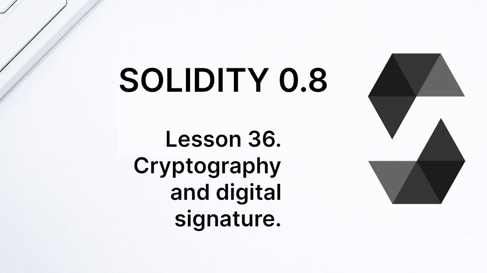
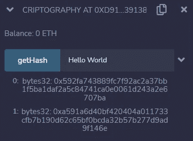
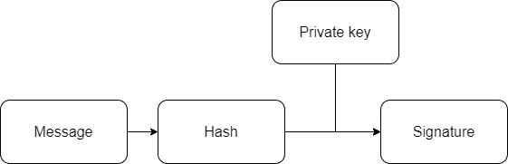
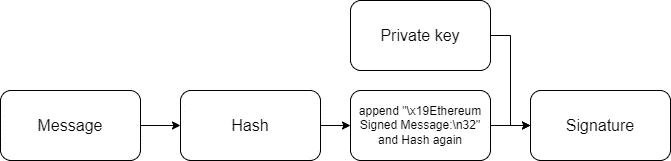
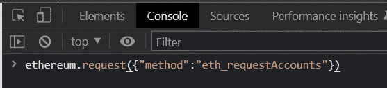
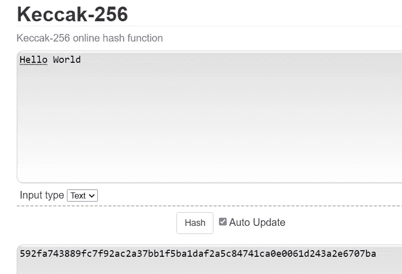
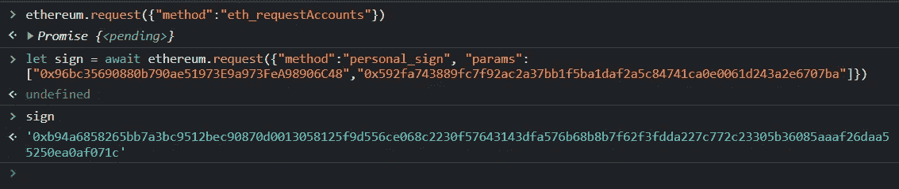
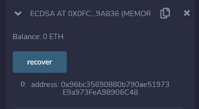

# 学习第 36 课固体。密码学和数字签名。

> 原文：<https://medium.com/coinmonks/learn-solidity-lesson-36-cryptography-and-digital-signature-5330e4ae600e?source=collection_archive---------1----------------------->



以太坊虚拟机有各种与密码相关的操作码，从散列一组通用字节到验证签名的真实性。Solidity 实现这样的操作码非常简单。让我们从散列函数开始。

# 哈希函数

Solidity 实现了三个加密哈希函数:keccak256、sha-256 和 ripemd160。以太坊网络主要使用 keccak256 来计算与给定公钥相关的地址。Sha-256 和 ripmemd160 在以太坊网络上用得不多，但在比特币等其他网络协议上被广泛使用。

keccak256 和 sha-256 都是从通用字节输入返回 32 字节值的函数。Ripemd160 返回值为 20 个字节。

让我们编写一个函数，根据给定的字符串计算 keccak256 和 sha-256。

```
function getHash(string memory _text) public pure returns (bytes32, bytes32) {
    return (keccak256(bytes(_text)), sha256(bytes(_text)));
}
```

函数 keccak256 和 sha-256 接收 bytes 类型的值作为输入，因此我们必须将字符串转换成字节。哈希来自字符串的 UTF-8 编码。在下图中，我们看到了对字符串`Hello World`执行函数`getHash`的结果。



Keccak and sha-256 for Hello World.

ripemd160 函数的工作方式类似，不同之处在于它返回一个 20 字节的值。

# 以太坊上的数字签名

以太坊和大多数其他区块链上的数字签名都是基于椭圆曲线加密，使用标准的 secp256k1 曲线。我们不会深入研究椭圆曲线加密的数学，但会展示它如何在以太坊上工作。这个想法很简单，但问题出在细节上。

数字签名的目的是保证消息的完整性和不可否认性。发送者使用他的私钥签署消息，生成签名。从签名和原始消息中，可以恢复签署消息的人的公钥(和地址)。签名者不可能否认他的私钥被用于签名消息。

对邮件的任何微小更改都会使签名无效。数字签名保证了消息的完整性，并且只对该特定消息有效。消息签名方案如下图所示。



The signature is generated by hashing the message using the private key.

由于消息的大小可以是任意的，所以通常不对消息本身进行签名，而是对消息的哈希进行签名，哈希的大小固定为 32 个字节。在以太坊中，keccak256 用于散列消息。

以太坊中的消息签名是一个 65 字节的值。分为三部分，分别用 **r** 、 **s** 和 **v** 表示。 *r* 和 *s* 都是 32 字节长，而 *v* 是 1 字节长。

然而，上述方案有一个潜在的安全缺陷。由于消息签名仅依赖于消息和私钥，所以理论上，同一个签名可以在多个网络中重复使用。为了解决这个问题，Ethereum 在消息散列和签名之间加入了一个中间步骤。

对消息进行哈希处理后，以太坊包含一个字符串来标识该消息是为以太坊签名的。该字符串与消息散列连接在一起，并生成一个新的散列。

最终的散列如下:`keccak256("\x19Ethereum Signed Message:\n32" + hashMsg)`，其中 hashMsg 是原始消息的散列。字符串`\x19Ethereum Signed Message:\n32`本身实际上是字符串`\x19Ethereum Signed Message:\n`和消息大小(以字节为单位)的串联，消息大小是`32`。

让我们用 Solidity 写一个函数，从一个普通的文本中生成要签名的最终散列。

```
function getHashFinal(string memory _text) public pure returns (bytes32) {

  bytes32 hashMsg = keccak256(bytes(_text));

  bytes32 hashFinal = keccak256(abi.encodePacked("\x19Ethereum Signed Message:\n32", hashMsg));

  return hashFinal;

}
```

这是必须签名的最终哈希。以太坊上的一个消息签名方案如下图所示。



The final hash includes a message indicating the Ethereum network.

# 用元掩码签名消息

为了测试消息签名，我们将使用元掩码。最快的方法是打开浏览器的控制台窗口，向 MetaMask 发送请求。

在任何打开的页面中，安装了 MetaMask，在 Windows 中用快捷键`Ctr+Shift+I`打开 Chrome 控制台，或者打开开发者工具(`more tools -> developer tools`)。要连接到元掩码，请运行以下脚本。

```
ethereum.request({"method":"eth_requestAccounts"})
```

见下图。



Connecting the page to MetaMask.

现在让我们执行一个方法来签署消息。为此，我们必须指出要签名的消息的散列值(在与字符串" \x19Ethereum 签名的消息:\n32" } "连接之前，**)。让我们在`Hello World`字符串上签名。为了表明这是我们正在签名的消息，我将计算它的 keccak256。如下图所示，哈希值为
`0x592fa743889fc7f92ac2a37bb1f5ba1daf2a5c84741ca0e0061d243a2e6707ba.`**



Keccak256 of the string Hello World.

现在让我们签署这个消息。为了让你可以重现我的步骤，我将使用一个特定的私钥:`0x9dee81d54c5a6189e671e6dec919e7409b02c8b8135b0394b9d25e33ac70d5bc.`

请仅使用此私钥来重现此示例。**在任何情况下都不要将它用于其他目的。**该私钥生成的地址为`0x96bc35690880b790ae51973E9a973FeA98906C48.`

为了给消息签名，我们使用了`personal_sign`方法。它需要两个参数:将对消息进行签名的地址和要签名的消息的哈希。我将使用以下脚本:

```
ethereum.request({"method":"personal_sign", "params":
["0x96bc35690880b790ae51973E9a973FeA98906C48", 
"0x592fa743889fc7f92ac2a37bb1f5ba1daf2a5c84741ca0e0061d243a2e6707ba"]})
```

第一个参数是上面指定的地址，hash 是字符串`Hello World`的 hash。结果可以在下图中看到。



Signing a hash using MetaMask.

签名是:
`0x11decfe054b01923d5eb5c3210b8a9a1ae89f55fa2e5d9001aac6c4ef55475f82ea29eb1a92a385fc3c555185acbd8ee595f9f297cdb86adf2f896a3cbe0b6ea1c`

# ecrecover

Solidity 有一个函数可以让你检索给定消息的签名地址: **ecrecover** 。为了检索地址，我们需要最终的消息散列和消息签名。

我们已经计算了`Hello World`消息的散列，现在让我们计算包括以太坊字符串在内的最终散列。我们可以使用在上一节中编写的 getHashFinal 函数来实现这一点。

最终的消息哈希是`0xdd7864675b904a6ab98e5092139baea95329b3130593ad10c3021e3368c8f5a6`

签名由 65 个字节组成，必须分为 3 个部分: *r* 、 *s* 和 *v* 。 *r* 的值是最左边的 32 个字节； *s* 的值是接下来的 32 个字节； *v* 的值是签名最右边的字节。

```
r b94a6858265bb7a3bc9512bec90870d0013058125f9d556ce068c2230f576431
s 43dfa576b68b8b7f62f3fdda227c772c23305b36085aaaf26daa55250ea0af07
v 1c
```

这些组件必须和消息的最终散列一起传递给`ecrecover`函数。为了便于学习，让我们写一个函数，其中所有的值都是硬编码的。

```
function recover() external pure returns (address) {

    return ecrecover(
    0xdd7864675b904a6ab98e5092139baea95329b3130593ad10c3021e3368c8f5a6, 
    0x1c,
    0xb94a6858265bb7a3bc9512bec90870d0013058125f9d556ce068c2230f576431,
    0x43dfa576b68b8b7f62f3fdda227c772c23305b36085aaaf26daa55250ea0af07);
}
```

注意，`ecrecover`函数有 4 个参数。最终的消息哈希， *v* ， *r* ，和 *s* 。执行该功能的结果如下图所示。请注意，正如所料，该地址与签署消息的地址相同。



Retrieving the address that signs the message.

我们已经拥有了使用`ecrecover`函数的所有要素。现在有趣的是创建一个接收消息、签名和地址的函数，如果该地址是签署消息的地址，则返回 true 或 false。

具有讽刺意味的是，编写这个函数最困难的部分是将签名分解成 *r* 、 *s* 和 *v* 组件，因为 Solidity 没有内置函数来完成这一任务。我们需要使用汇编。

让我们写一个函数，它的唯一目的是拆分签名部分。

```
function splitSignature(bytes memory sig) public pure returns (bytes32 r,bytes32 s,uint8 v) {

  require(sig.length == 65, "invalid signature length");

  assembly {
    r := mload(add(sig, 32))
    s := mload(add(sig, 64))
    v := byte(0, mload(add(sig, 96)))
  }
}
```

现在，让我们编写一个函数，它接收一条文本消息，并将其与一个签名和一个地址进行比较，以检查该地址是否是签署该消息的地址。

```
function checkSignature(bytes memory sig, string memory text, address sender) public pure returns (bool) {

  bytes32 hashMsg = keccak256(bytes(text));
  bytes32 hashFinal = keccak256(abi.encodePacked("\x19Ethereum Signed Message:\n32", hashMsg));

  (bytes32 r, bytes32 s, uint8 v) = splitSignature(sig);
  return (ecrecover(hashFinal, v, r, s) == sender);

}
```

一旦我们理解了所有的部分，注意检查某个地址是否签署了某个消息是相对简单的。只要正确地构造最终的散列，并将签名分成它的组成部分。`ecrecover`函数完成了这项艰巨的工作。

**感谢阅读！**

欢迎对本文提出意见和建议。

欢迎任何投稿。www.buymeacoffee.com/jpmorais[。](http://www.buymeacoffee.com/jpmorais)

> 交易新手？试试[密码交易机器人](/coinmonks/crypto-trading-bot-c2ffce8acb2a)或[复制交易](/coinmonks/top-10-crypto-copy-trading-platforms-for-beginners-d0c37c7d698c)