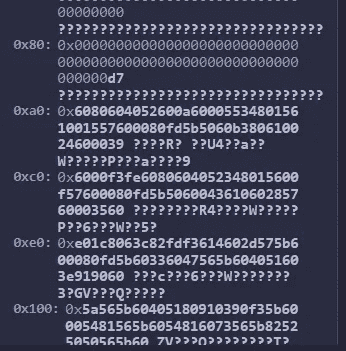

# 学习第 37 课固体。创建和销毁合同。

> 原文：<https://medium.com/coinmonks/learn-solidity-lesson-37-creating-and-destroying-contracts-6921ae32413a?source=collection_archive---------2----------------------->


在以太坊上创建合约账户有三种方式。外部拥有的账户可以通过向地址零(空地址)发送交易来创建合同账户。另外两种方法是使用 CREATE 和 CREATE2 操作码。智能合约可以调用这样的操作码。

# 通过交易创建合同

eoa 通过将事务发送到地址 0 来创建合同。以太坊虚拟机将接收这样的事务并执行初始代码。在执行过程中，当找到 RETURN 操作码时，将返回给发送方的十六进制数将被记录为约定代码。

上述解释与 EVM 的低层运行有关。Solidity 编译器的任务是创建必须通过网络发送的字节码。字节码是初始代码(init 代码)和实际记录在网络上的代码(运行时字节码)的连接。如果你不了解以太坊虚拟机的工作原理，也不用担心。正如我所说的，为您编写必要的字节码是编译器的工作。

然而，出于学习的目的，让我们发送一个任意的字节码到地址零。我们来发送下面的字节码:`6010602060306040`。这个字节码是非常无用的；它只是将 4 个 1 字节的值推到堆栈上。它不会生成任何要保存在区块链上的代码。

我将这个事务发送到 Goerli 网络，可以在下面的 hash 中找到:`0x9cf1fe5ce9e685d79d5a8e0fb103a5bfe0315f0302d44c08e8318d9c4ee9d34d.`有效负载可以在下图中看到。


The payload sent in the transaction.

尽管交易有要执行的代码，但保存的合同代码为空，如下图所示。


The contract has no code.

这个故事的寓意是:向地址零发送一个交易就足以创建一个合同帐户。然而，为了有效地编写区块链的契约代码，有效载荷必须是结构良好的。写给区块链的不是发送的。

# 使用 CREATE 创建合同

EVM 有两个创建合同的操作码:创建和创建 2。让我们看看 CREATE 操作码。当我们使用 **new** 关键字创建合同时，它被执行。

让我们看看下面的代码:

```
pragma solidity ^0.8.7;

contract A {
  uint public val1 = 10;
}

contract B {
  function create() public returns (address) {
    A newA = new A();
    return address(newA);
  }
} 
```

这是在 Solidity 中创建合同实例最常用的方法。要创建的协定的地址是确定的:它是创建者协定地址的 RLP 编码的 keccak256 的最后 20 个字节，加上协定的 nonce。大词，对吧？我会尽快解释清楚。由外部帐户创建的合同的地址以同样的方式确定。

**RLP** 是**R**e cursion**L**ength**P**refix 的首字母缩写。这是以太坊(执行层)序列化要在节点之间共享或存储在数据库中的数据的方式。RLP 的工作方式没有那么简单，超出了本文的范围。

以下代码可用于计算地址的 RLP 和帐户随机数:

```
const RLP = require("rlp")
const web3 = require("web3")

// address -> 0xd9145CCE52D386f254917e481eB44e9943F39138
// nonce -> 2
let buffer = RLP.encode([Buffer.from('d9145CCE52D386f254917e481eB44e9943F39138','hex'),2])

let nonceHash = web3.utils.sha3(Buffer.from(buffer))
console.log(`0x${nonceHash.substring(26,66)}`)
```

地址和随机数都被硬编码到代码中。要计算帐户创建的任何合同的地址，只需替换上面代码中的地址和 nonce。我决定在代码中明确这些值，使其更加清晰。

尽管具有确定性，但我们不可能准确选择要创建的合同的地址，因为我们无法直接控制账户的 *nonce* 。因此，在合同中，不可能计算将要创建的合同的地址。

为了能够可靠地计算将要创建的契约的地址，我们必须使用第二个操作码 CREATE2。

# 使用 CREATE2 创建合同

像 CREATE 操作码一样，CREATE2 操作码的目的是创建新的合同帐户。唯一的区别是如何计算新的合同地址。不是使用创建帐户的地址和它的 nonce，而是使用其他字段:地址、字节码散列和一个任意数字，称为 *salt* 。

示意性地，新合同的地址采用以下形式:

```
keccak256("0xff" + creatorAddr + salt + keccak256(bytecode))[24:64]
```

表达式[24:64]表明我们应该只获得生成的散列的最后 40 个字符(20 个字节)。

没有办法在 Solidity 中直接使用 CREATE2 操作码，所以我们必须使用 assembly 来实现。我不会在本文中深入讲授汇编，但我们将分析所使用的代码。下面我们来看看函数。

```
function createContract(uint _salt) public {
  bytes memory contractCode = type(TestContract).creationCode;
  address addr;
  assembly {
    addr := create2(0, add(contractCode, 0x20), mload(contractCode), _salt)
  }
}
```

要创建的契约在同一个文件中(这里没有显示)，并被命名为`TestContract`。为了获得它的字节码，我们使用下面的代码。

```
type(TesteContract).creationCode
```

为了在 Solidity 中使用 assembly，我们将代码放在 assembly 块`{}`中。CREATE2 操作码的使用在下面的语句中实现。

```
create2(0, add(contractCode, 0x20), mload(contractCode), _salt) 
```

这样一个操作码需要 4 个参数，形式为`create2(v,p,n,s)`。让我们看看每个参数代表什么。

*   v:要转到新帐户的金额，单位为魏。
*   p:内存中可以找到契约开始的位置。
*   n:合约大小。契约的结尾必须位于内存中，在 p+n 中。
*   s:一个 32 字节的数字，叫做 *salt。*

正如我们在上面的 create2 语句中看到的，`p`的值被声明为`add(contractCode, 0x20)`。这意味着合同位于由`contractCode`加 32 字节指示的内存位置。让我告诉你为什么。

`contractCode`变量是引用类型的，所以它的值指示在哪里可以找到合同代码。我们为什么要通过`add(contractCode, 0x20)}`功能添加`0x20`？因为代码有效地从 32 个字节开始(`0x20)` 在`contractCode`指向的地方之后)。让我给你看看这个。

变量`contractCode`的值如下图所示，通过 contractCodeValue: `0x80`。


The contractCode variable has a value of 0x80.

这意味着合同代码位于存储器地址`0x80`。但是，在`0x80`中，前 32 个字节存储的是合同的长度，而不是代码本身。如下图所示，代码本身从`0xa0`开始。所以我们必须给`0x80`加 20 个字节，正好是`0xa0`。



The contract code is in memory, and it starts at 0xa0.

如前所述，契约的长度在`0x80`中找到，也就是在`contractCode`的值中找到。这个值可以通过句子`mload(contractCode)`读出。让我们记住 create2 的第三个参数正好是契约的大小。

现在我们已经学习了如何在 Solidity 中创建契约，让我们看看如何计算它的地址。

```
function getAddress(uint _salt) public view returns (address) {
  bytes memory contractCode = type(TestContract).creationCode;

  bytes memory toHash = abi.encodePacked(bytes1(0xff), 
  address(this), _salt, keccak256(contractCode));

  return address(uint160(uint(keccak256(toHash))));
}
```

用于计算新契约地址的方案从'`0xff`'开始，以避免与创建操作码冲突，如在原始提议中所解释的， [EIP-1014](https://eips.ethereum.org/EIPS/eip-1014) 。由于地址取决于合同的字节码，所以除了使用带有 salt 参数的强力方法之外，*没有办法选择新地址。*

# 销毁合同

到目前为止，我们已经学习了如何构建智能合约；现在让我们学习如何摧毁它们。为了使契约能够被销毁，它必须实现一个自毁按钮(或函数)。

让我们创建一个函数来销毁一个契约。

```
function kill(address _toSend) public {
  selfdestruct(payable(_toSend));
}
```

当执行`selfdestruct`时，合同的代码将被删除，状态变量将被清除，合同拥有的所有以太网将被发送到地址`_toSend`。这就是为什么`selfdestruct`方法有一个参数。

上面的函数一点也不安全，因为它可以被任何人调用。应该编写自毁功能，以便它们只能由授权帐户调用。

如果程序员没有实现契约中的`selfdestruct`函数，就不能销毁。因此，在部署时必须已经存在摧毁它的可能性。

**感谢阅读！**

欢迎对本文提出意见和建议。

欢迎任何投稿。[www.buymeacoffee.com/jpmorais](http://www.buymeacoffee.com/jpmorais)。

> 交易新手？尝试[加密交易机器人](/coinmonks/crypto-trading-bot-c2ffce8acb2a)或[复制交易](/coinmonks/top-10-crypto-copy-trading-platforms-for-beginners-d0c37c7d698c)