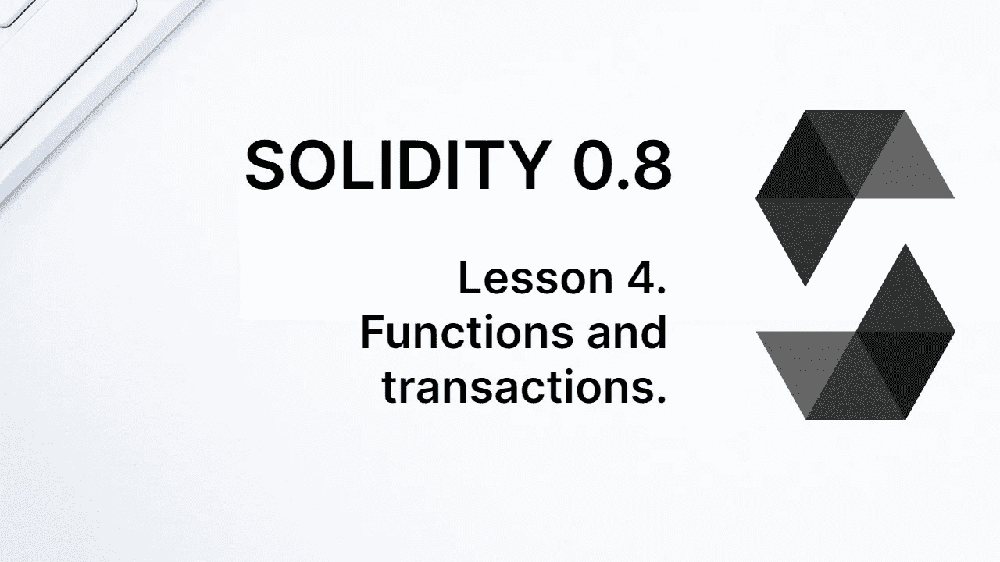
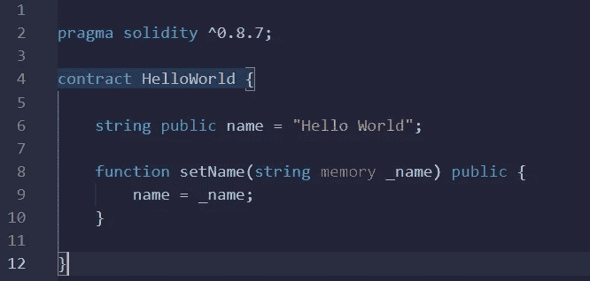
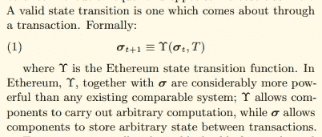
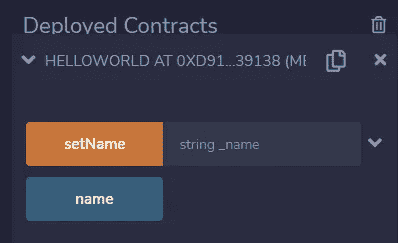
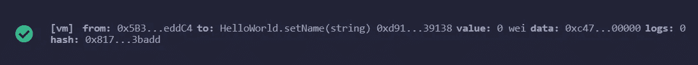
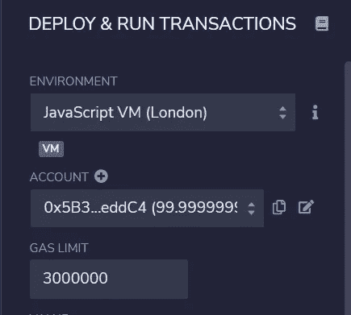
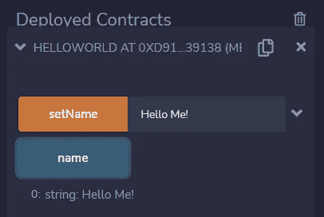

# 学习第四课的可靠性。功能和事务。

> 原文：<https://medium.com/coinmonks/learn-solidity-lesson-4-functions-and-transactions-9ef4214766df?source=collection_archive---------4----------------------->



在编程中，函数有多种用途。一种是简单地将一组语句聚合到一个代码块中。在 EVM，函数扮演着比简单的语句集合更重要的角色。

并不是每个函数都会改变区块链的状态，但是如果我们想要进行任何状态改变，这样的改变必须在函数内部进行。

对区块链的事务可以请求执行一个函数，传递它的参数。一个事务可以只要求执行一个函数，但是函数可以调用其他函数，从而生成一系列请求。

让我们在代码中看到这一点。向契约 *HelloWorld* 添加一个函数，如下所示。

```
function setName(string memory _name) public {
    name = _name;
}
```

完整的合同可以在下图中看到。我们先从理解函数开始，然后理解函数和一个事务的关系。



The full HelloWorld contract.

为了在 Solidity 中声明一个函数，我们从关键字 **function** 开始，后面是函数名。在括号中，我们定义了它的参数。在我们的例子中，函数只有一个参数，类型为*字符串*，名为 *_name* 。在类型和名字之间，我们找到另一个关键词，**内存**。很快我们将看到使用这个关键字的原因，现在只需理解它是强制的，如果不包含它，编译器将抛出一个错误。

函数名及其参数定义了**函数签名**。之后，我们声明它的可见性，在本例中是 **public** 。函数可以有四种可见性，**公共**、**外部**、**内部**或**私有**。我们很快会看到更多。可以从契约内部或外部访问公共函数。

函数体必须用大括号{ }括起来。在我们的示例中，函数体中只有一条语句，它将状态变量 *name* 更改为通过参数 *_name* 传递给函数的值。

函数可以返回值，但是在我们的例子中，函数不返回值。因此，没有必要定义退货。

> 交易新手？尝试[加密交易机器人](/coinmonks/crypto-trading-bot-c2ffce8acb2a)或[复制交易](/coinmonks/top-10-crypto-copy-trading-platforms-for-beginners-d0c37c7d698c)

# 处理

以太坊可以看做是通过交易改变状态的机器。让我们用我们的例子来理解这种行为。在其中，只有一个状态变量， *name* 。如果我们想改变这种状态，我们发送一个事务。该事务调用函数 *setName* ，该函数改变状态变量 *name* 。

虽然我们的例子非常简单，但它完美地总结了以太坊的工作方式。我们在契约中定义状态变量，以及改变这些状态变量的函数。然后，通过事务，我们调用这些函数，这些函数的目的是改变这样的状态变量(也有可能间接改变其他契约的状态)。

这个想法在以太坊的黄皮书中表达的很清楚，如下图所示。以太坊虚拟机在名为 sigma 的状态下运行，通过名为 T 的事务，生成一个新的 sigma 状态。



An excerpt from Ethereum’s yellow paper.

让我们保存新合同并将其部署到 Remix，就像我们之前所做的那样，单击 *Deploy* 按钮。当展开契约时，现在注意到出现了一个新按钮， *setName* ，如下图所示。



The function *setName* can be executed using Remix.

要执行此功能，只需在输入字段中插入一个字符串，即带有占位符 *string_name* 的字符串，然后单击 *setName* 。按钮为橙色表示将生成一个交易并发送给合同。让我们插入一些值并执行函数。

请注意，在屏幕底部，将会出现一个新的交易。如果一切顺利，将会显示绿色标志，如下图所示。



A transaction has been executed.

除了事务被成功执行的信息之外，Remix 还为我们带来了关于它的几个细节。在整个课程中，我们将更好地理解这些细节。现在，让我们仔细看看区块链是如何工作的。

区块链是一个大的交易分类账。每个区块链块相当于这个分类账的一页，我们在其中记录一定数量的交易。这种块以一种使其防篡改的方式连接。

我们执行的交易就像在分类账中写下类似于“*将变量名改为【新名称】*”的内容。在接收到该事务时，EVM 改变数据库中变量 *name* 的值。如果我们把以太坊想象成一家银行，区块链就是分类账，状态变量就是每个账户的金库，而 EVM 就是负责做出所需变更的员工。

这给我们留下了一个问题:谁要求这样的交易？

# 再混合账户

每笔交易都有一个发件人账户。Remix 有 10 个预先创建的账户，可以在*部署&运行交易*页签中看到，如下图所示。提交交易时，我们必须选择一个帐户，默认情况下，第一个帐户已经选定。



Remix has some pre-created accounts.

以太坊上的账户由一个地址表示，这个地址是一个 20 字节的十六进制数。与帐户一起，Remix 指示以太中的余额。上图显示第一个账户， *0x5B3…* 的余额为 99.9999…乙醚。

默认情况下，混合账户有 100 个醚的余额。为什么提到的账号现在在 100 醚以下？因为它必须付费才能将交易发送到以太坊。每笔交易都要交一笔费用，燃气费，后面会进一步解释。

事务有两个非排他性的目的:将本地货币(在本例中是乙醚)发送到其他帐户，或者调用合同中的某个功能。可以在对合同调用函数的同时向合同发送货币。

我们很快会谈到更多关于帐户的内容，但现在我只想说明，交易是通过帐户发送的。我们使用 Remix 创建的帐户向契约发送一个事务，调用函数 *setName* ，传递值“Hello Me！”作为它的参数。

成功执行事务后，我们现在可以调用变量*名称*，并看到它已经被更改，如下图所示。



The state variable has been changed by the transaction.

我想强调的是，电话不需要通过帐户发送，因为它们不会改变区块链的状态。因此，他们可以是匿名的，没有必要进行任何形式的支付。

**感谢阅读！**