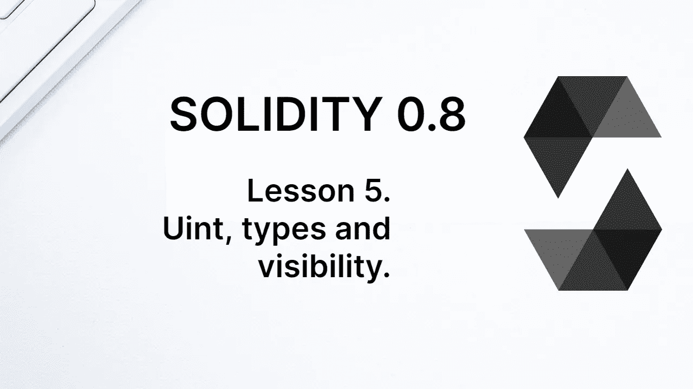
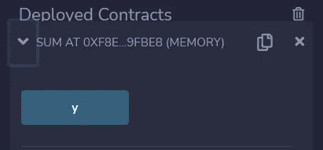
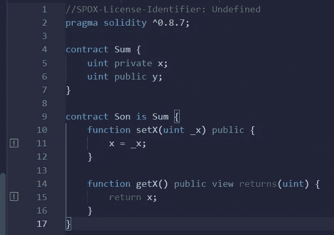
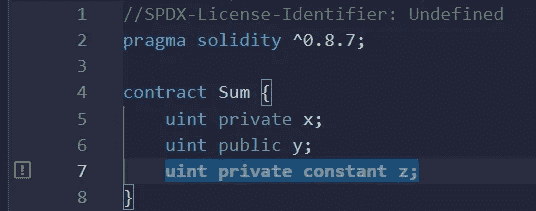
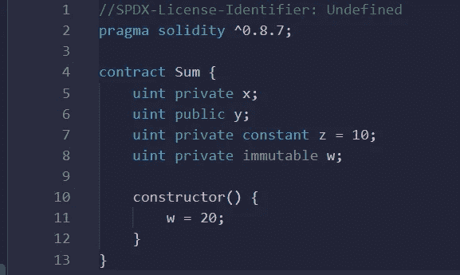
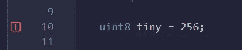
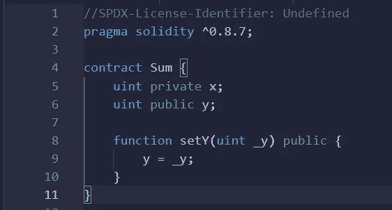

# 学习第五课“坚实”。单位、类型和可见性。

> 原文：<https://medium.com/coinmonks/learn-solidity-lesson-5-uint-types-and-visibility-fbebb221c311?source=collection_archive---------4----------------------->



在上一课中，我们创建了一个只有一个状态变量的协定，类型为 string。现在让我们创建一个新的契约，带有新的状态变量，类型为(无符号)整数。

在 Remix 中，编写以下代码。

```
pragma solidity ^0.8.7;
   contract Sum {
      uint x;
      uint public y;
   }
```

当保存文件时，将会编译合同，但是会有一个警告:同样，还没有定义许可。为什么会这样？每份合同在区块链上发布时都是公开的，因此其源代码可以被审计(也可能被复制)。因此，建议作者包含有关代码使用许可的信息。

让我们添加一个许可证。第一行包含以下句子:

```
//SPDX-License-Identifier: MIT
```

这样做后，再次编译，警告将会消失。我们将许可证定义为 *MIT* ，但是我们也可以使用*未定义的*，或者其他类型的公共或私有许可证。本课程将不研究许可证类型之间的差异。

# 能见度

Solidity 中的变量有三种可见性:**公开**、**私有**和**内部**。当没有显式声明可见性时，它被编译器认为是*内部的*。合同*总和*中的变量 *x* 就是这种情况。

正如我们已经看到的，public 类型的变量使得编译器通过调用自动创建一个方法来检索它。对于私有或内部变量来说，这种情况不会发生，正如我们在下图中看到的，只有变量 *y* 有一个关联的方法。



The compiler creates gettermethods only for public variables.

*私有*和*内部*的区别稍微微妙一些，但是很重要。*内部*变量被子契约继承，而*私有*变量不被继承。

契约之间的继承是一个更高级的话题，但是让我给你举个例子。在同一个合同文件 *Sum.sol* 中，我们定义第二个合同，命名为 *Son* ，如下。

```
contract Son is Sum {
    function setX(uint _x) public {
        x = _x;
    }function getX() public view returns(uint) {
        return x;
    }
}
```

它有两个函数， *setX* 和 *getX* ，第一个负责改变变量 *x* ，第二个负责返回变量 *x* 。但是，请注意，我们在任何时候都没有定义变量 *x* ！由合同*总和*定义，其中合同*子*是子合同，通过语句'*合同子是总和'*。

将变量 *x* 改为 *private* ，编译器会抛出错误，如下图所示。子契约不继承私有变量。



Private variables are not inherited by the child contract.

# 恒定不变

状态变量可以声明为**常量**和**不可变**。两者在初始化后都不能更改。

常量变量必须在声明时初始化，而不可变变量可以在契约的**构造函数**中初始化。构造函数是一个只在部署时运行的函数。

让我们为我们的契约添加一个新变量， *z* ，它将是*常量*。在状态变量中，包含以下代码行。

```
uint private constant z = 10;
```

一旦声明，变量 *z* 就不能再更改。从技术上讲，我们甚至不能说 *z* 是一个状态变量，因为区块链并没有在数据库中为它保留一个专用空间。它的值被直接写入字节码。

禁止在没有初始化的情况下声明常量变量，编译器会指出错误，如下图所示。



Constant variables must be initialized at declaration.

不可变变量可以不用初始化就声明，但是必须在构造函数中初始化。我们开始吧。我们首先声明一个新的变量， *w* ，它是*不可变的*。

```
uint private immutable w;
```

之后，我们使用函数*构造函数*为契约声明一个构造函数，如下所示。

```
constructor() {
   w = 20;
}
```

到目前为止，合同没有编译器错误或警告，可以在下图中看到。



Constant and immutable variables cannot be changed after initialization.

# 整数和无符号整数

在 Solidity 中，有必要在声明变量时指出变量的类型。在契约 *Sum* 中，我们使用类型 **uint** ，是**无符号整数**的简称，代表正整数。为了表示正整数和负整数，还有类型 **int** 。

实性有几种类型来表示整数和无符号整数。对于整数，有以下几种: **int8** ， **int16** ， **int24** …直至 **int256** ，与 **int** 相同。对于无符号整数，我们有: **uint8** ， **uint16** ， **uint24** …直到 **uint256** ，与 **uint** 相同。请注意，计数每 8 次发生一次，这是以位为单位的变量的大小。

例如，类型 *uint8* 有 8 位，即 1 个字节。这意味着它接受 0 到 255 之间的数字。类型 *uint256* ，32 字节，接受 0 和 2⁵⁶-1 之间的数字。如果我们试图给一个变量赋一个越界值，编译器会抛出一个错误。

例如，如果我们试图将值 256 赋给类型为 *uint8* 的变量，编译器会指出一个错误，如下图所示。



Variable of type uint8 accepts numbers between 0 and 255.

除了字符串和整数，Solidity 还有其他类型。我们可以将这些类型分为两类:**值类型**和**引用类型**。值类型是其变量直接存储其值的类型，而引用类型存储对赋值所在位置的引用。

整数和无符号整数是值类型的变量。字符串是引用类型的变量。这就是当函数参数是字符串时使用*内存*关键字的原因。这个主题将在另一课中进一步解释。

让我们在契约中包含一个改变变量 *y* 值的函数。在合同中包含以下代码:

```
function setY(uint _y) public {
   y = _y;
}
```

注意，没有必要指出函数的参数 *_y* 在内存中(或其他地方)，因为它是通过值传递给函数的，而不是通过引用。

> 交易新手？尝试[加密交易机器人](/coinmonks/crypto-trading-bot-c2ffce8acb2a)或[复制交易](/coinmonks/top-10-crypto-copy-trading-platforms-for-beginners-d0c37c7d698c)

合同到目前为止，没有编译器错误或警告，可以在下图中看到。在下一课中，我们将继续学习。



The contract *Sum*, so far.

**感谢阅读！**