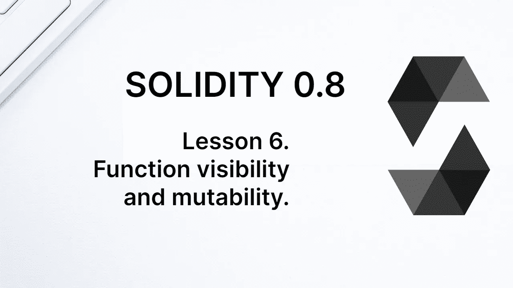
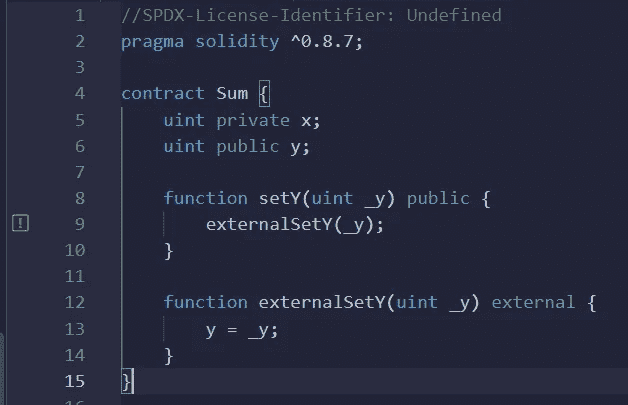
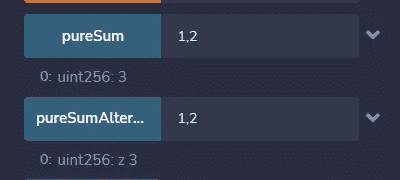

# 学习第六课“坚实”。函数的可见性和可变性。

> 原文：<https://medium.com/coinmonks/learn-solidity-lesson-6-function-visibility-and-mutability-7f16db2897db?source=collection_archive---------5----------------------->



像变量一样，函数也有可见性。除了*公有*、*私有*、*内部*之外，函数还可以有**外部**可见性。对于变量来说，*私有*和*内部*的区别是一样的:内部函数由子契约继承，而私有函数则不是。两者都可以通过契约访问。

现在的新奇之处在于公共函数和外部函数之间的区别。正如我们所看到的，两者都可以通过事务从契约外部访问。但是，不能从协定内部访问外部函数。

让我们看看下面的代码:

```
contract Sum {
   uint private x;
   uint public y;

   function setY(uint _y) public {
      externalSetY(_y);
   }    
   function externalSetY(uint _y) external {
      y = _y;
   }
}
```

名为*外部安全性*的新函数已经创建，具有*外部*可见性。该函数可以由事务调用，但不能由契约直接调用。当试图这样做时，编译器会显示一个错误，如下图所示。



External functions cannot be invoked by the contract.

有一种方法可以从契约中调用函数 *setY* 。将语句*外部安全性(_y)* (第 9 行)替换为下面的语句。

```
this.externalSetY(_y);
```

这可能看起来很混乱，所以让我们把事情搞清楚。契约可以从其他契约中调用函数，只要这些函数是公共的或外部的。为了从其他契约中调用函数，我们使用下面的结构:**【契约地址】。【T21 功能】。**

关键字 **this** 表示契约的地址，所以我们调用函数 *externalSetY* 就好像它属于另一个契约一样。也就是说，我们在外部调用函数 *externalSetY* (即使它是同一个契约的一部分)。

有区别吗？谢谢关心。是的有。当我们通过一个契约调用另一个契约的功能时，我们称之为内部事务。使用 *this.externalSetY* ，生成了一个内部事务，它的执行路径不同于契约本身的函数调用。

# 不改变世界状态的函数

区块链的状态通过函数的执行、通过事务来改变，但是并不是每个函数调用都需要通过事务来完成。我们已经在公共变量中见过这种情况，它的编译器为变量创建了一个 *getter* 函数。

可以显式地构造不改变世界状态的函数，并且可以通过调用来调用。这种请求可以是匿名的，并且不花费任何费用。这相当于只是读取一个数据库，而不改变任何东西。

让我们创建一个新函数，它将变量 *x* 和 *y* 相加，并返回值。

```
function Sum() public view returns (uint) {
   return x + y;
}
```

函数 *Sum* 返回一个正整数，如 *returns (uint)* 所示。退货通过**退货**关键字指定。

为了表示函数不会改变区块链的状态，可以使用两个关键字: **view** 和 **pure** 。是函数的**可变性**。可变性为*视图*或*纯*的函数是通过调用而不是事务来调用的。

可变性*视图*表明该函数不会改变区块链的状态，但是它可以读取状态变量。可变性 *pure* 表示函数既不会改变也不会读取状态变量。

纯函数的一个例子如下。

```
function pureSum(uint _x, uint _y) public pure returns (uint) {
   return _x + _y;
}
```

# 第六集。函数的返回

函数可以返回多个参数。有两种方法可以表明函数将返回什么。使用关键字*显式返回*，或者命名返回变量。

让我们看看下面函数中的第二个方法。

```
function pureSumAlternative(uint _x, uint _y) public pure returns (uint z) {
   z = _x + _y;
}
```

返回参数现在有一个标识符， *z* ，并且 *z* 的值在函数体中被显式赋值。

函数 *pureSum* 和*pure sum alternation*是公共的，因此可以通过调用来访问它们(它们不改变世界状态)。Remix 为我们构造了这些调用，可以在选项卡'*Deploy&run transactions*中执行，如下图所示。



Executing a call in Remix. The parameters must be separated by commas.

当声明返回参数的标识符时，它会显示在 return 中，如上图所示。

如果函数返回一个以上的变量，有两种方法来声明返回。第一种是使用**元组**；用逗号分隔变量，如下例所示。

```
function returnMultiple() public view returns (uint, uint) {
   return (x + y, x * y);
   }
```

另一种方法是声明返回变量的标识符，然后分别给它们赋值。请参见下面的示例。

```
function returnMultiple() public view returns (uint _sum, uint _mult) {
   _sum = x + y;
   _mult = x * y;
}
```

这两种方法的区别在于，在后者中，参数标识符与其值一起返回。

**感谢阅读！**

> 交易新手？尝试[加密交易机器人](/coinmonks/crypto-trading-bot-c2ffce8acb2a)或[复制交易](/coinmonks/top-10-crypto-copy-trading-platforms-for-beginners-d0c37c7d698c)