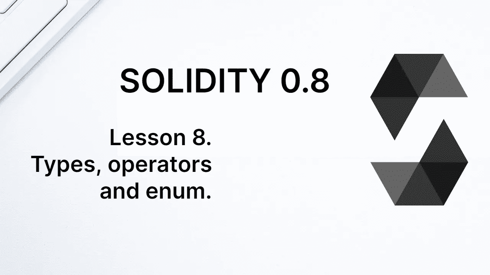
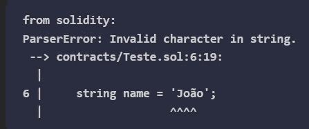
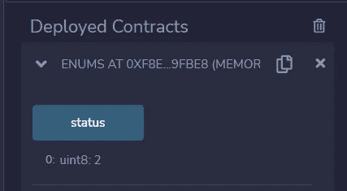

# 学习第八课“坚实”。类型、运算符和枚举。

> 原文：<https://medium.com/coinmonks/learn-solidity-lesson-8-types-operators-and-enum-b5975aaa546f?source=collection_archive---------7----------------------->



Solidity 是一种静态类型语言，类型必须在变量声明的时候被赋值。这是必要的，因为区块链将在存储中为变量值保留一个专用空间。

**存储器**是存储区块链状态变量的地方。它是一个键/值存储，由数据库实现。通常使用 LevelDB 数据库，但是程序员不需要知道这样的实现细节。

实体中的变量被分类为类型**值**或类型**引用**。值类型变量的值直接由变量存储，而引用类型变量指向存储值的位置。

基本上，值类型变量的值最多可容纳 32 个字节，而引用类型变量的值是动态的，可能需要超过 32 个字节，如字符串、结构、数组和映射。

# 文字

文字是给定类型的不可变值。Solidity 中整数文字的例子有`3`和`-7`，第一个是类型 *int* (或 *uint* )的文字，第二个是类型 *int* 的文字。

**Boolean** 是编程语言中非常常见的类型，可以取两个值:`true`或`false`。这是这种类型仅有的两个文字。

另一种类型的稳固性是**地址**。这不是编程语言中的标准类型，但在区块链很重要，因为它表示一个帐户。例如，这个类型的属性和方法允许检查一个帐户的余额，或者向它发送以太网。

地址的文字是 20 字节的十六进制数，例如，`0xC66d07097f4823343bf116463070B3be5e941C4E`。前缀“0x”用于表示十六进制基数。

Solidity 也有类型 **byteX** ，其中 **X** 表示该类型的字节数，范围从 1 到 32。同样，最大字节数是 32 字节，与 256 位相同。这样做的原因是因为以太坊使用每个值为 32 字节的内存(以及数据库)。

bytesX 的文字是它的十六进制表示，作为一个由 *X* 字节组成的数组。例如，字节 2 的文字是`0x83a3`，字节 4 的文字是`0x84a8b3cc`。

字符串是引用类型的，因为它们的值不一定占用少于 32 个字节。它的文字用单引号或双引号括起来。文字的例子有`“Hello”`和`‘World’`。

Solidity 中可以使用任何 **Unicode** 字符，但是必须明确说明。Unicode 是一种字符编码形式，包括许多语言的字符以及现代符号，如表情符号。Unicode 字符可以占用 1 到 4 个字节。

如果字符串文字有编译器错误，请尝试将该值显式指示为 Unicode。例如，参见下面关于坚固性的声明。

```
string name = "João";
```

编译器会显示一个错误，如下图所示。



Some characters are not accepted by the compiler unless we indicate that they should be treated as Unicode.

要修复这个错误，只需更改如下声明。

```
string name = unicode"João";
```

另一种可能是在 Unicode 中显式使用字符值，如下面的声明所示。

```
string name = 'Jo\u00E3o';
```

在整个课程中，我们将会看到更多其他类型的实性，尤其是动态类型，如结构、数组和映射。

# 经营者

运算符类似于作用于表达式以返回某个值的函数。运算符对值进行运算以生成新值是很常见的。运算符的一个简单例子是 sum 运算符，它作用于两个整数并返回一个新的整数。

Solidity 和任何编程语言一样，有几个运算符，比如算术运算符、比较运算符等。我们不会详细讨论所有的问题，只是一些可能会引起混淆的问题。

例如，sum 运算符不能用于连接字符串。在许多编程语言中这是可能的，但在 Solidity 中不允许。禁止下列语句。

```
string name = "John " + "Paul";
```

相反，您需要使用串联方法，如下面的语句所示。

```
string name = string.concat("John","Paul");
```

比较运算符是一个双等号`==`，而不等式运算符是`!=`。逻辑运算符有:`!`(否定)、`&&`(与)和`||`(或)。其他不那么显而易见的运算符是模数运算符`%`，它返回除法的余数，以及由运算符`**`执行的取幂运算。

# 枚举

枚举是用户定义的值类型。解释枚举类型的最好方式是用一个例子。假设我们正在创建一个帮助台程序，每个票证都有一个状态:打开、进度、关闭。

每张票从一个阶段移动到另一个阶段，这个赋值必须在程序中完成。为此，您需要做出如下陈述。

```
status = "open";
```

假设程序员犯了一个错误，把一些字母从允许值改成了状态。

```
status = "opened";
```

这将创建一个不同于 3 个可接受值的新状态类型。为了尽量减少这种问题，建议使用枚举。

使用枚举，可以使用预定义的选项定义新类型，如下所示。

```
enum Status {Open,Progress,Closed}
```

现在，我们可以将状态变量声明为*状态*类型，并使用枚举来更改其值，而不是将状态变量定义为字符串类型。让我们看看下面的语句作为例子。

```
Status status = Status.Open;
```

尽管是用户定义的类型，枚举变量的值还是一个数字。每个值按顺序被分配一个 0 到 255 之间的数字。在上面的示例中，打开状态相当于数字 0，进度状态相当于数字 1，关闭状态相当于数字 2。

要看到这一点，请编写以下契约。

```
//SPDX-License-Identifier: MIT
pragma solidity ^0.8.12;contract Enums {
   enum Status {Open,Progress,Closed}
   Status public status = Status.Closed;
}
```

保存合同并部署它。由于变量`status`是公共的，编译器将生成一个函数，允许我们检索它的值。当调用这个函数时，在 Remix 中，我们看到变量`status`的值为`2`，如下图所示。



The enumeration is, in essence, a variable of type uint8.

本质上，枚举类型是一个类型为 *uint8* 的变量。它的主要功能是避免可能导致 bug 的错别字。

**感谢阅读！**

欢迎任何投稿。[www.buymeacoffee.com/jpmorais](http://www.buymeacoffee.com/jpmorais)

> 交易新手？尝试[加密交易机器人](/coinmonks/crypto-trading-bot-c2ffce8acb2a)或[复制交易](/coinmonks/top-10-crypto-copy-trading-platforms-for-beginners-d0c37c7d698c)