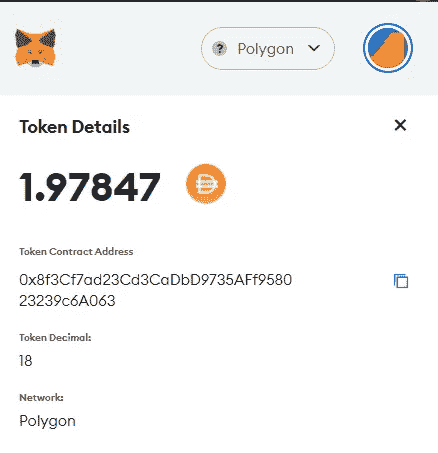
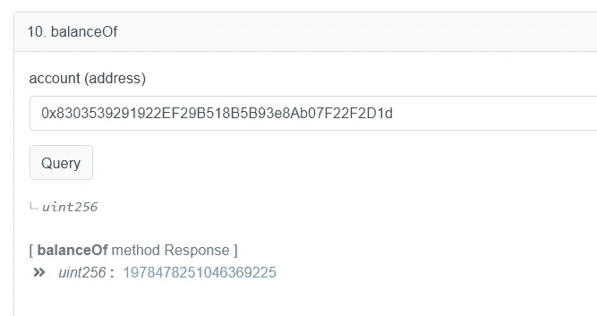

# 学习第九课“坚实”。映射。

> 原文：<https://medium.com/coinmonks/learn-solidity-lesson-9-mappings-ec84cf501af3?source=collection_archive---------6----------------------->


映射是一种将键与值相关联的类型。就像一个函数，把键作为参数，然后返回值。但是，键不记录在区块链中，只记录它的哈希，因此不可能从值中检索键。

地图声明如下。

```
mapping(keyType => valueType) variableName;
```

密钥可以是任何值类型、字符串、字节、枚举甚至其他契约。该值可以是任何类型，包括另一个映射。例如，字符串到 uint 映射的一个示例可以声明如下。

```
mapping(string => uint) distribution;
```

为了向上面的映射添加新元素，使用了下面的语句。

```
distribution["John"] = 10;
```

重要的是要理解密钥文字`John`并不存储在区块链上。文字`John`被转换成一个散列值，该散列值作为查找值`10`的地址。

**哈希函数**将任何大小的任何数据类型(从单个字到 1 TB 的数据)转换成固定长度的数字。在以太坊使用的散列函数的情况下，固定值是 32 字节。所以我们可以理解为什么散列函数是不可逆的:从 32 字节的散列中不可能恢复出初始信息。

不可能迭代映射，因为键不是连续的。因此，如果不显式地尝试获取`John`的值，就不可能知道键`John`是否有值。要从键中检索映射值，使用以下语法。

```
mappingName[key]
```

在我们的示例中，为了检索键`John`的值并将该值赋给一个变量，我们使用下面的语句。

```
uint value = distribution["João"];
```

地图在 Solidity 中的许多用途之一是在 ERC-20 令牌合同中。

# ERC-20 令牌中的映射

ERC-20 令牌是以太坊和兼容区块链上最广泛使用的令牌标准。如果你拥有一些加密货币或游戏的代币，最有可能的是合同变量中的记录。

每个 ERC-20 令牌都有一个名为 **balanceOf** 的映射，通常声明如下。

```
mapping(address => uint256) public balanceOf;
```

上面的映射将地址作为键，将无符号整数作为值，它存储关于地址拥有多少令牌的信息。该变量是公共的，因此可以通过调用获取值。

当您的 wallet(例如 MetaMask)通知您拥有给定合约的 *X* 令牌时，它所做的是获取合约的变量 *balanceOf* 的值，将您的帐户作为密钥传递。

让我们看一个例子。我在多角形网上有一个有一定戴量的账号。**戴**是一种美元**稳定币**，也就是说，它是一种保持(或试图保持)与美元 1:1 平价的代币。在下图中，MetaMask 显示了我在该帐户中有多少 Dai。



MetaMask reports the amount of tokens an account owns.

同样的信息可以直接从契约中检索，调用的函数*balance。在下图中，我们使用多边形的块资源管理器[polygonscan.com](http://polygonscan.com)来完成这个任务。*



Using the block explorer it is possible to interact with the contract directly.

注意，值是相同的，但是 MetaMask 知道令牌有 18 个小数位，并根据该信息格式化令牌的数量。我希望大家都清楚，拥有 ERC-20 代币只不过是地图中*平衡的一个记录。*

ERC-20 代币也使用地图来存储关于账户的信息，允许其他账户代表他/她处理一定量的代币。让我们进一步解释一下。Ana 可以允许 Bob 代表她发送来自给定合同的多达 30 个令牌。

Bob 可以移动 30 个令牌的信息是从地址到整数的映射，类型为(Bob -> 20)。但是，这张地图链接到了另一个地址，Ana 的地址，as:Ana-->(Bob--> 20)。该数据结构可以如下实现。

```
mapping(address => mapping(address => uint)) _allowance;
```

变量名为 *_allowance* ，是一个地址到另一个地址的映射。注意，这是允许的，因为两个映射的键类型都是类型*地址*。

# 迭代映射

正如我们已经说过的，不可能迭代映射的*类型的变量，因为键是从原始键值的散列中生成的 32 字节数字。*

如果我们想要存储密钥的原始值，我们需要在另一种类型的变量中进行:一个*数组*。我们还没有谈到数组，但我们将简要解释如何在数组的帮助下迭代地图。

该方法包括每次在映射中存储新条目时，将原始键存储在一个数组中。让我们看看下面的代码。

```
mapping(string => uint) myMap;
arrayKeys.push(string);
```

第一行已经知道了。第二行在名为 *arrayKeys* 的数组中存储了一个新条目。这样，我们将所有的键存储在一个键数组中。因为数组是可迭代的，所以可以迭代数组，并为数组的每个元素检索映射中的键值。

**感谢阅读！**

欢迎任何投稿。[www.buymeacoffee.com/jpmorais](http://www.buymeacoffee.com/jpmorais)

> 交易新手？试试[加密交易机器人](/coinmonks/crypto-trading-bot-c2ffce8acb2a)或者[复制交易](/coinmonks/top-10-crypto-copy-trading-platforms-for-beginners-d0c37c7d698c)