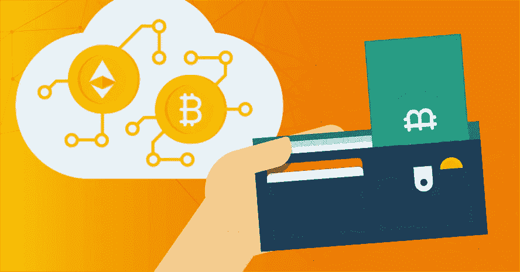
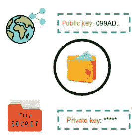
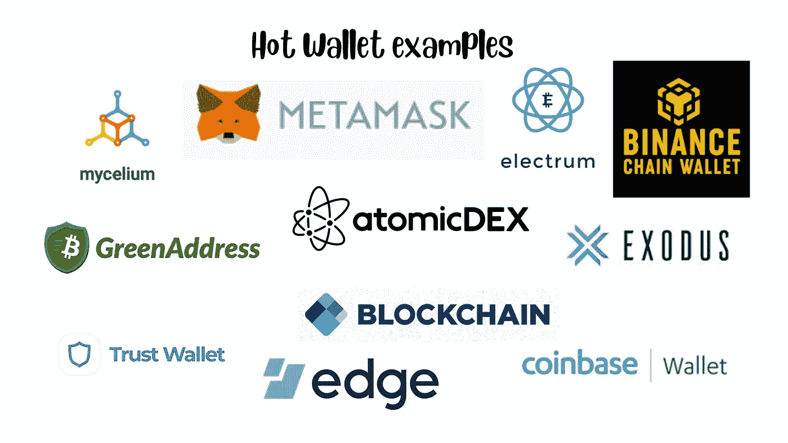
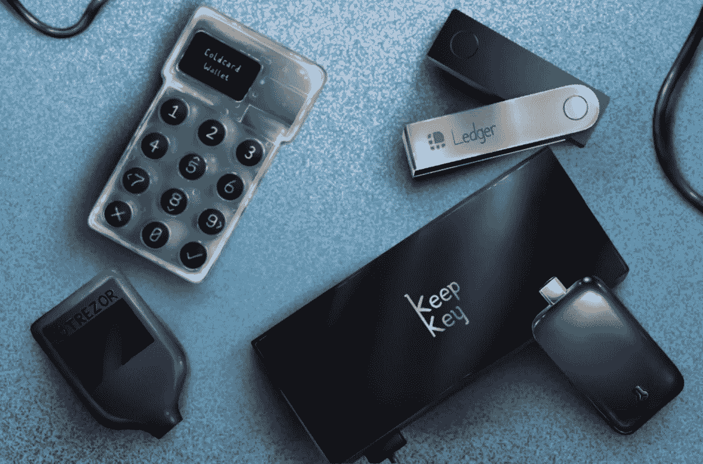

# 了解加密钱包

> 原文：<https://medium.com/coinmonks/learning-about-crypto-wallets-897a30f8f79a?source=collection_archive---------36----------------------->

加密货币是通过[区块链](/coinmonks/what-is-blockchain-a7082404caa2)的建设和管理产生的代币，对于网络内的价值转移至关重要。然而，加密钱包不应该被误认为是这些令牌的存放处，就像现实世界的钱包保存实物货币一样。那么，加密钱包的本质是什么？简单地说，它是区块链结构中不可或缺的[组件。没有专业技术，任何人都无法进入区块链。因此，加密钱包使普通用户能够查看区块链的数据并与之交互。换句话说，它是一个用户界面(UI ),用于收集、显示区块链并与之交互。](https://coinsbench.com/understanding-the-architecture-of-a-blockchain-f50ad412bdc4)

**钱包如何工作**

[**Crypto wallet is not like a real-world wallet**](https://blog.gurock.com/cryptocurrency-wallet/)

加密钱包由两部分组成——一个公钥和一个私钥，由[加密货币的](/coinmonks/what-is-blockchain-a7082404caa2)加密算法生成。公钥表示钱包的地址，其功能类似于账号。它是一个唯一的字母数字字符串，必须共享才能接收或发送钱包中的任何加密资产。私钥像密码一样被加密，必须防止未经授权的使用。无论是发送、接收、、交换、消费还是交易，访问钱包中的加密资产都是至关重要的。

[**Public and private keys**](https://www.simplilearn.com/tutorials/blockchain-tutorial/blockchain-wallet)

**类型**

当中本聪推出比特币时，他也推出了世界上第一个加密钱包。如今，随着众多新加密货币的出现，各种类型的钱包应运而生。它们属于两类中的一类——热的或冷的。

[**Hot and cold wallets**](https://coinmarketcap.com/alexandria/article/hot-wallets-vs-cold-wallets-whats-the-difference)

**热门钱包**

也被称为软件钱包，热钱包这样命名是因为它们需要一个活跃的互联网连接才能工作。热门钱包数字应用程序的用户界面允许其所有者通过在线服务器存储、访问和交易其加密货币。根据可访问性，它可以是以下三种类型之一。

● **桌面钱包** —它可以下载到用户的计算机上，并且只允许在安装了它的系统上访问。私钥存储在计算机中，由系统所有者管理其安全性。例如:银金矿。

● **网络或在线钱包** —它就像是浏览器的扩展。用户可以打开 Chrome 之类的浏览器，使用他的在线签名登录软件程序，并通过任何有互联网连接的设备访问它。私钥存储在本地浏览器中。例如:元掩码。

● **手机钱包**——这类似于网络钱包，但只能在手机上使用。例如:菌丝体。

**Examples of hot wallets**

其他热门钱包的例子包括比特币基地钱包、Edge、信托钱包、Exodus、币安链钱包、区块链钱包、AtomicDEX、GreenAddress 比特币钱包等。

**风险与回报**

热钱包好用，性价比高。由于交易构成了大部分加密交易，加密货币交易所提供了内置的热门钱包设施。尽管有足够的安全措施，热钱包也不能完全免受间谍软件或恶意软件的攻击。由于这两个密钥都是通过第三方 web 服务器存储和访问的，私钥泄露的可能性是不可否认的。即使高度安全的加密交换服务器也无法抵御黑客攻击。

> 交易新手？尝试[加密交易机器人](/coinmonks/crypto-trading-bot-c2ffce8acb2a)或[复制交易](/coinmonks/top-10-crypto-copy-trading-platforms-for-beginners-d0c37c7d698c)

**冷钱包**

冷钱包之所以如此命名，是因为数据存储完全离线。因此，希望操作其加密资产的用户可以在线发起交易。然后，在访问私钥时，该过程被转移到离线状态。一旦用户签署并授权交易，该过程将恢复为在线完成。由于私钥永远不会暴露在互联网上，因此安全性是原始的。也称冷藏技术，有两种。

● **纸钱包** —这是大多数用户最初的偏好。它本质上是一张打印的纸，允许通过 QR 码扫描访问钱包密钥对。虽然它的离线过程非常适合安全地存储大量的加密令牌，但没有多少用户再去使用这种相当原始的钱包形式了。例子:比特币纸质钱包。

● **硬件或离线钱包** —如今最安全、最受欢迎的钱包形式之一，冷钱包和硬件钱包这两个术语经常互换使用。它由看起来像智能卡的便携式设备、外部硬盘或拇指驱动器组成。用户可以通过将设备插入他们的计算机来访问存储在硬件钱包中的密钥。主要的例子包括 Ledger、Trezor、KeepKey、CoolWallet、SafePal 和 GridPlus。

[**Hardware wallet examples**](https://www.defipulse.com/blog/crypto-hardware-wallets-or-cold-wallets-explained)

**冷钱包优于热钱包**

所有的加密货币操作都依赖于互联网。因此，任何数字功能常见的恶意在线活动也是对加密交易的威胁。在这方面，加密货币的分散性和匿名性不利于它，因为任何资金损失通常都是不可逆转的，几乎没有恢复或补救的机会。因此，冷钱包比热钱包有明显的优势。

当谈到便宜和无缝交易时，热门钱包具有优势，这是不争的事实。相比之下，冷钱包有在线和离线之间切换的烦人过程。但是，通过保护私钥不被网上泄露，并消除任何黑客攻击的机会，冷钱包为用户的加密资产提供了最大的安全性。一些冷钱包的另一个好处是多签名功能。这意味着直到多个用户的私钥签核，交易授权才是完整的。在设备损坏的情况下，检索 cold wallet 的信息涉及使用种子短语恢复功能，该功能是 12 或 24 个单词的随机列表。这显然强调了冷钱包的安全优势。

**结论**

没有加密钱包，任何人都不能持有任何[加密货币](/coinmonks/what-is-blockchain-a7082404caa2)，更不用说进行交易了。在委托一个人的加密资产之前，研究这里提到的各种冷热钱包是至关重要的。用户拥有多个钱包并根据自己的操作偏好在其中分配加密货币的情况也并不少见。

**亦读:**

[*了解共识在区块链中的作用*](/@DC.600/understanding-the-role-of-consensus-in-blockchain-db724fa63a53) *|* [*什么是跑马圈地？*](/coinmonks/what-is-staking-7ca67fa9d4da)

跟随我:

[**LinkedIn**](https://www.linkedin.com/in/a600dc/)|[**Twitter**](https://twitter.com/dc_111)

联系人:**arnab.dc111@gmail.com**