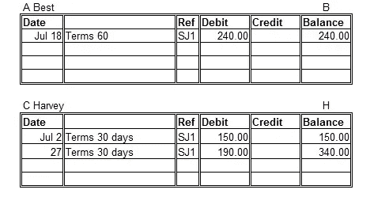

# 通过 Python 学习区块链:第 1 部分

> 原文：<https://medium.com/coinmonks/learning-blockchain-through-python-part-1-51f74c70e4ad?source=collection_archive---------42----------------------->

Photo by [GuerrillaBuzz Crypto PR](https://unsplash.com/@theshubhamdhage?utm_source=medium&utm_medium=referral) on [Unsplash](https://unsplash.com?utm_source=medium&utm_medium=referral) and Check out [http://guerrillabuzz.com/](http://guerrillabuzz.com/)

区块链对于新手来说是一个很大的词，也是一个容易混淆的词。

区块链是一个在线公共簿记分类账。

[https://www.beginner-bookkeeping.com/bookkeeping-ledgers.html](https://www.beginner-bookkeeping.com/bookkeeping-ledgers.html)

它自动登记从发送者到接收者的金融交易。