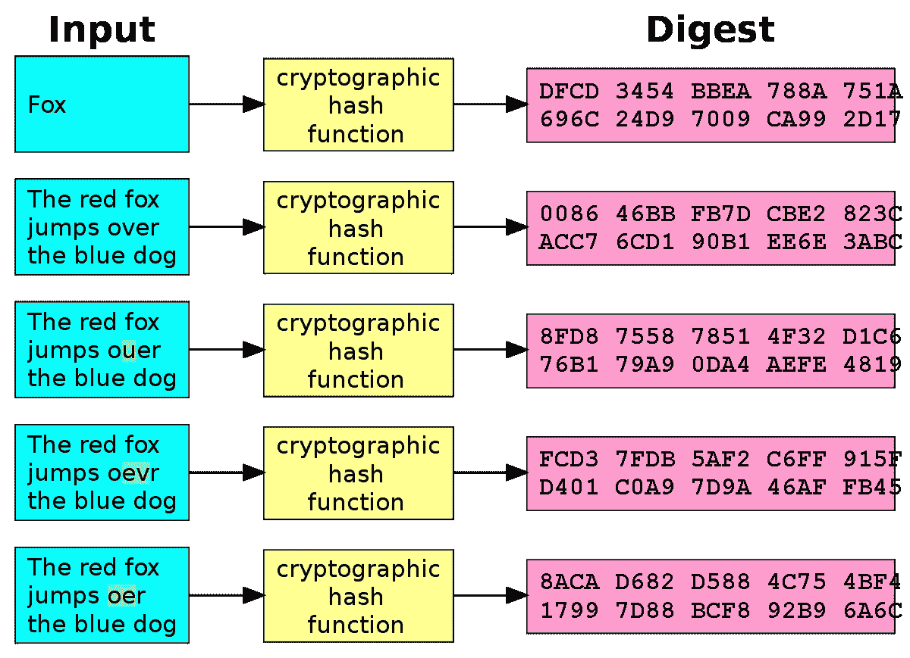

# 通过 Python 学习区块链:第 2 部分

> 原文：<https://medium.com/coinmonks/learning-blockchain-through-python-part-2-ad6b4ccbd2f9?source=collection_archive---------30----------------------->

Photo by [Michael Fousert](https://unsplash.com/@michaelfousert?utm_source=medium&utm_medium=referral) on [Unsplash](https://unsplash.com?utm_source=medium&utm_medium=referral)

在 Python 构建区块链系列的第 2 部分中，我们将模拟散列操作。

## 什么是哈希函数？

[https://en.wikipedia.org/wiki/Cryptographic_hash_function](https://en.wikipedia.org/wiki/Cryptographic_hash_function)