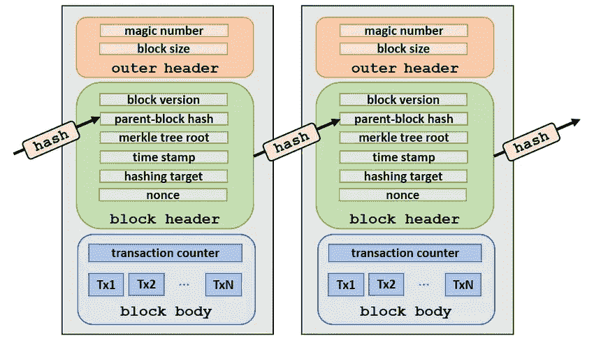

# 通过 Python 学习区块链:第 3 部分

> 原文：<https://medium.com/coinmonks/learning-blockchain-through-python-part-3-242b14494ba5?source=collection_archive---------38----------------------->

Photo by [Joel Filipe](https://unsplash.com/@joelfilip?utm_source=medium&utm_medium=referral) on [Unsplash](https://unsplash.com?utm_source=medium&utm_medium=referral)

这里是关于通过 Python 学习区块链的第 2 部分的继续。

# 什么是街区？

[https://www.researchgate.net/figure/Representation-of-a-blockchain-structure_fig4_334434726](https://www.researchgate.net/figure/Representation-of-a-blockchain-structure_fig4_334434726)

数据块是一段信息，包含事务处理的关键信息…