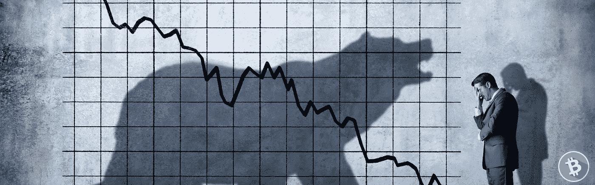

# 从 2022 年的熊市中吸取教训

> 原文：<https://medium.com/coinmonks/learning-from-the-2022-bear-market-65b0805fb5b0?source=collection_archive---------42----------------------->

## 为什么密码德根只是硅谷拒绝

Bitcoin 2022

****不是财务建议。这篇文章只是一篇对近期市场走向下行波动的严厉报道****

又一轮牛市结束，又一波骗子从这个奇怪的密码市场中被消灭。几年的时间，揭露丑闻，遭受停电和地毯拉。

按照传统， [*比特币*](https://nakamotoinstitute.org/literature/bitcoin/)*决定“大幅贬值，*可能会持续一段时间。嗷。**

*短期的时间范围实际上相当暗淡。*

*泵被视为只是救济集会。熊市是官方的，因为所有有影响力的人现在都这么称呼它。*

*我个人不在乎。*

****一个比特币将永远是一个比特币*，我只关注** [**通过分配我的现金流来增加数量**](https://www.investopedia.com/terms/d/dollarcostaveraging.asp) **。***

*对我来说，这种奇怪但珍贵的虚拟商品的基本价值主张没有改变。因此，我将所有这些贬值归因于贪婪和不幸的宏观环境(战争和流行病，对吗？).*

*在我看来，比特币的货币化仍然是不可避免的。我的论文没有被宣布无效。*

*事实上，我不会因为恐慌而跳槽，也不会因为清算而被迫跳槽。*

*显然，人们需要通过主要购买比特币来对冲骗子……而且主要是在现货市场。*

*希望你也一样幸运。*

## *市场的受害者*

*不幸的是，比特币价格下跌 ***带来了众所周知的浪潮***——我们很快意识到有些人没有穿任何众所周知的泳裤。*

*唉，每一个革命性的技术创意都会带来骗子和受害者。*

*最近，这个市场上的许多投资者被*引导*进入了**秘密资产**的迷人的、营销良好的金融化领域——一家被认为*比你*习惯的银行*更好的银行。事实上，比一家*【trad-fi】银行*更有利可图，比一家银行*更安全，老弟。比如比特币。***

**但实际上——更多的是硅谷时代的大型科技初创企业计划，用时髦的营销和疯狂的主张吸收资金，而提供的实际价值却很少。这些秘密主题的游乐园，你可以拥有代币并获得收益——它们会让你财务自由。比如比特币。**

## **那么，我们学到了什么？**

**这个领域曾经的大人物——最有影响力，做着*大事，*在播客上出现，并被他们的[追随者崇拜者](https://cointelegraph.com/news/novogratz-says-luna-tattoo-is-a-constant-reminder-investing-requires-humility)——**称赞——现在不见了。****

**在过去的一年里，随着每一次虚假的加油和不可避免的价格暴跌，又一轮戏剧在秘密地带上演。大屠杀停止可能还需要一段时间。**

**关于犯罪，人们不禁要问，这些项目是否是真诚地策划和开发的，他们只是高估了自己的能力，或者，也许他们从一开始就注定要失败，他们的计划一直是在他们的企业不可避免地破产之前尽可能多地吸取价值。**

***有人问:一级诈骗还是三级诈骗？***

**很可能两者兼而有之。从历史上看，有无数的项目属于光谱的两端，在非常艰难地跌落之前达到了成功的极致。**

**罪魁祸首？**

## **傲慢**

**我们一次又一次地看到，人类很容易对他们的短期成功过于自信。有时，过去的成功错误地保证了未来的成功。计划看起来是 100%可持续的，直到它们不再可持续。**

**这些人将获得一批不知情的支持者，他们希望搭上这种短期成功的顺风车，给他们一个关于他们能力和未来成功的错误正反馈循环。他们把越来越多的放在线上。他们筹集越来越多的资金，或者从毫无戒心的散户那里招揽越来越多的资本。**

**不幸的是，**傲慢**仅仅意味着他们会觉得**不可战胜**，直到他们被**完全**击败。当我们发现它一直是一座纸牌搭建的房子时，那只是因为它们散落在地板上。**

**前一周看起来像个天才，下一周就人间蒸发了。**

**保护自己，谨防炒作。看你参加的 ***基本面*** 。区分**营销**和**实际产品**。**

## **但是这种傲慢来自哪里呢？**

**讽刺的是，比特币要为这种狂妄负责。一堂简短的比特币历史课:**

**随着*比特币*的价值主张暴涨其价格，它迅速获得了市场和主流的关注。**

**这里有一个健全的货币网络，**运作得非常好，许多人通过很小的投资就变得富有。然而，比特币花了一段时间才走到那一步，整整 2 年，它一文不值 [*什么*。只有真正的密码迷在尝试这种分散的、安全的互联网价值转移的全新方式。](https://en.wikipedia.org/wiki/History_of_bitcoin#Prices_and_value_history)****

**这是一种全新的互联网使用方式，以前没有人能够实现。为了成为像比特币一样的互联网货币，另类硬币必须复制这一点，但它们都没有。**

**突然间，当比特币达到其初始值的数百万倍时，很多人在正确的时间出现在正确的地点。**

**市场价值的实现创造了许多百万富翁，如此规模的繁荣自然会不可避免地带来风险资本。很快，任何与“加密货币”名称相关的东西都被自动认为是创新的，是科技的下一次发展。**

****由于比特币的作用**，这些风险投资家可以创办打着加密货币旗号的科技公司，加密货币的权力在于*协会*真正革命性的东西。**

**这些新晋百万富翁中的一小部分人，带着他们的风险资本，决定创建分散的项目，模仿比特币的价值主张，但并没有真正了解全貌。**

**唉，在正确的时间进入正确的市场给了他们一种错误的能力感，于是他们决定把目光瞄准星星。他们决定要废黜密码之王，并因此大赚一笔。**

**或许，他们的心态是，他们错过了硅谷带来的网络泡沫和科技繁荣，现在他们要向他们展示硅谷可能是什么样子……但在一个乌托邦式的分权世界里。又或许，桌面上的钱是以市场参与者的形式出现的，而不可持续的秘密项目是吸收这一切的好方法。**

**每一个周期，生命储蓄都在流失。很大比例的密码持有量为零。由于少数人的恶意和傲慢，难以想象的苦难席卷了整个世界。**

## **结论:无能的德根**

**无需在本文中点出名字——无论你身处哪个行业，哪个文化现象席卷了市场，这些**骗子实体**都会存在。更重要的是要熟悉它的 [**原型精神**](https://wilsonlee123.medium.com/charisma-peddlers-d96b32f262fe) ，这样在你的投资生涯中，你参与的每一件事都能像躲避瘟疫一样避开它们。**

**如果你像我和大多数人一样，你会谦逊地相信你无法创造一种新的全球货币或推翻现有的银行机构。当然，成千上万的投资者希望这些商人也有同样的谦逊。**

**不过，我想知道这些投资者中是否有人对他们刚刚获得的投资者 101 学习经验心存感激。如果每个人都能从这次熊市中吸取教训，并在下一次繁荣中通过投资稳健资产赚很多钱，那么在这些金融灾难中可能会有一线希望。**

**让那成为你。**

> **交易新手？尝试[加密交易机器人](/coinmonks/crypto-trading-bot-c2ffce8acb2a)或[复制交易](/coinmonks/top-10-crypto-copy-trading-platforms-for-beginners-d0c37c7d698c)**