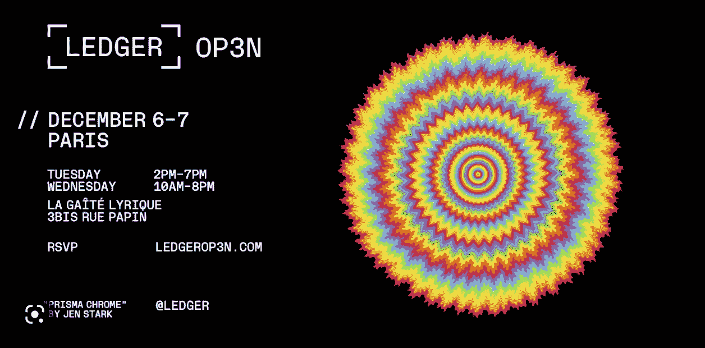
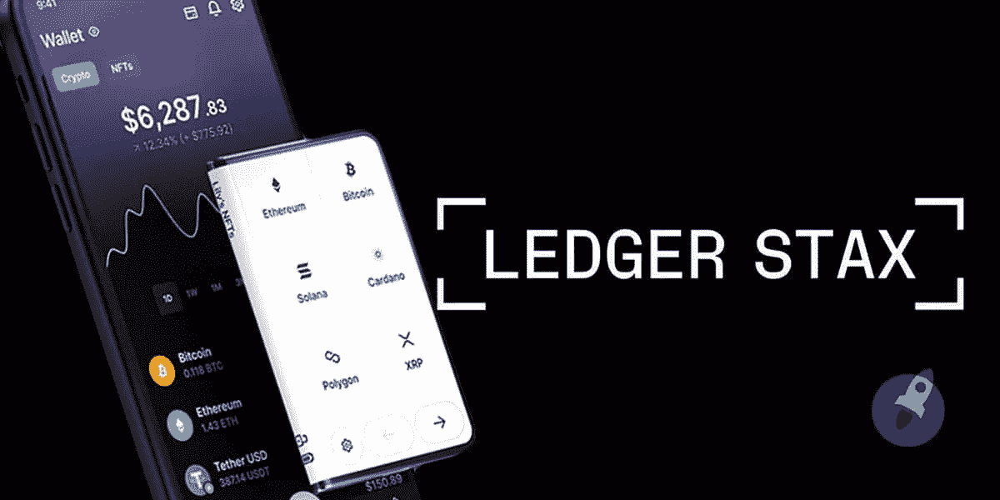
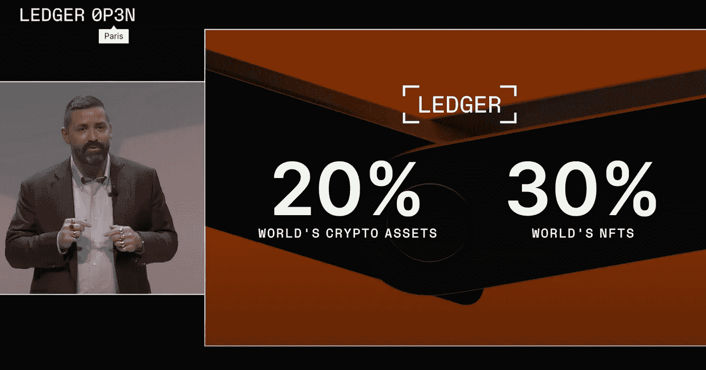

# Ledger Stax |在强大的熊市期间发现大规模创新发布！

> 原文：<https://medium.com/coinmonks/ledger-stax-discover-a-massive-innovation-release-during-a-powerful-bear-market-1aed98157c09?source=collection_archive---------13----------------------->

12 月 6 日星期二，Ledger 在巴黎组织了一年两次的#op3n 主题会议，宣传品牌在过去 6 个月的创新和进步。这个 2022 年 12 月的主题演讲发生在一个强大的加密冬天，将为加密资产和区块链技术的未来建立一个新的坚实基础。

如果你没有听说过，这里是为什么！👇

## [莱杰](https://www.linkedin.com/company/ledgerhq/) [#op3n](https://www.linkedin.com/feed/hashtag/?keywords=op3n&highlightedUpdateUrns=urn%3Ali%3Aactivity%3A7006300887614648321) 2022 |一个将被多年铭记的历史主题演讲，比如[史蒂夫·乔布斯，2007 年 MacWorld 主题演讲](https://www.youtube.com/watch?v=VQKMoT-6XSg)💫

[https://www.youtube.com/watch?v=nNsSO7S8buk](https://www.youtube.com/watch?v=nNsSO7S8buk)

## [#LedgerStax](https://www.linkedin.com/feed/hashtag/?keywords=ledgerstax&highlightedUpdateUrns=urn%3Ali%3Aactivity%3A7006300887614648321) ，我们一直想要的创新！

虽然 crypto &区块链的最新新闻大多是关于#FTX、#Celsius 或#BlockFi 破产的，但莱杰提醒我们区块链的核心基础之一:去中心化和所有权。
**不是你的钥匙，不是你的硬币，**从第一天起，[总账](https://www.ledger.com/)了解它，成为硬件钱包 [*(此处了解更多关于硬件钱包)*](https://www.ledger.com/academy/crypto/where-are-my-coins) 。然而，硬件钱包的使用并不是每个人都可以使用的，用户体验的真正贫困使得许多密码所有者无法使用整个所有权过程。

## 那么，Ledger Stax 的变化是什么？

**为清晰而生**:在世界上首款手掌大小的弯曲电子墨水触摸屏上，满怀信心地阅读、理解和签署交易。无论您去哪里，都能随身携带。

**受数百万人访问和信任**:体验无与伦比的安全性，由行业领先的安全元素芯片和 Ledger 的专有操作系统提供支持，经过安全专家多年的实战检验。

**可定制适合你:**给你的 Ledger Stax 起一个独特的名字，在锁定屏幕上用你最喜欢的照片或 NFT 定制它，即使 Ledger Stax 关闭了，它也会一直打开。

Ledger Stax

## 莱杰，建立强有力的领导

在这两天的主题会议中，莱杰不仅发布了他最强大的创新，还向世界展示了他在最鼓舞人心的专家团队领导下的专业精神和雄心。我们会注意到 LVMH 前首席数字官伊恩·罗杰斯、首席技术官查尔斯·古伊梅甚至著名的前苹果顾问兼 Ipod 创造者[托尼·法德尔](https://www.linkedin.com/in/tonyfadell/details/experience/)的出席，实现了新的分类账 Stax！

到 2022 年，Ledger 已经获得了全球 20%的加密资产和 30%的 NFTs，而硬件钱包的销售额达到 600 万(从 2021 年开始增长 2 倍)。
正如 [Pascal Gauthier](https://www.linkedin.com/in/ACoAAAACjiMBBM7x9Wq-rEjwD2BphFvzgv_ulmU) 所说，Leger 首席执行官:
*“这个法国品牌不仅仅是一个行业领导者，Ledger 还是一个先锋，引领着未来的使用案例，例如公用事业 NFTs、分散身份证明以及每个人的真正所有权。”*

Pascal Gauthier — Ledger CEO

在一个加密的冬天，在弹性熊市的中心，莱杰向行业发出了一个明确的信息:区块链技术将继续存在，创造一个新的创新世界，赋予真正的所有权、体验和财务自由。

感谢并祝贺这两天来整个分类账团队，提醒每个人，web3、区块链和加密资产远不止是一个投机泡沫。

## 太棒了。

*账本 Stax 展示:*[*https://www.youtube.com/watch?v=nNsSO7S8buk*](https://www.youtube.com/watch?v=nNsSO7S8buk) *保留你的账本 Stax:*[*https://shop.ledger.com/fr/products/ledger-stax*](https://shop.ledger.com/fr/products/ledger-stax) *关注账本推特:*[*https://twitter.com/Ledger*](https://twitter.com/Ledger)

*罗宾*

> 交易新手？尝试[加密交易机器人](/coinmonks/crypto-trading-bot-c2ffce8acb2a)或[复制交易](/coinmonks/top-10-crypto-copy-trading-platforms-for-beginners-d0c37c7d698c)