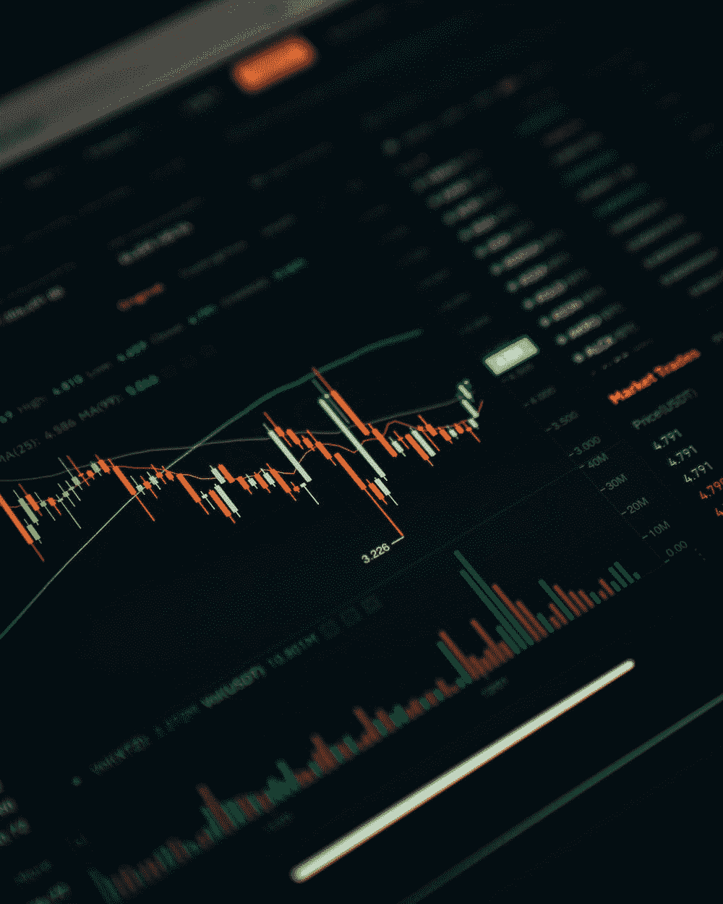

# 我们可以从 FTX 的崩溃中吸取的教训

> 原文：<https://medium.com/coinmonks/lessons-we-can-learn-from-ftxs-collapse-aa92dccf3a88?source=collection_archive---------31----------------------->

这些课程将帮助我们度过这个加密的冬天。

Photo by [Dylan Calluy](https://unsplash.com/@dylancalluy?utm_source=unsplash&utm_medium=referral&utm_content=creditCopyText) on [Unsplash](https://unsplash.com/s/photos/CRYPTO-COLLAPSE?utm_source=unsplash&utm_medium=referral&utm_content=creditCopyText)

> 这篇文章包含附属链接，它们有助于支持我们的运营。

首先，如果在这个行业发生了这么多事情之后，你仍然对加密感兴趣，你应该祝贺自己，因为你最有可能在熊市中幸存下来！

然而，如果你对你的加密投资不够小心，熊市肯定会把你的投资组合撕碎，就像它对航海家、Celcius 和最近的 FTX 所做的那样。

好消息是，如果我们都能从 FTX 的崩溃中吸取教训，我们就能消除或至少减少在这段艰难时期损失加密投资的风险。

## 没有高收益和无风险的投资

是的，你没看错。所有承诺给你高利息的投资都有内在的风险。如果一个集中的交易所为你的硬币提供 20%的 APY，它有内在的风险，即使他们说这是完全“无风险的”

如果你在这些交易所下注或锁定你的资金，你需要时刻注意密码行业发生的事情，并准备在必要时撤回你的资金。

FTX 能够提供这些高额赌注回报，因为他们基本上是在用你在他们平台上押下的资金赌博。

## 听“FUD”很重要

投资者应该把所有批评都贴上你最喜欢的硬币 FUD 的标签的日子已经一去不复返了。在任何投资中，自己做研究的一部分就是倾听故事的方方面面，包括负面的。

在 FTX 倒闭之前，已经有谣言在四处传播，说该公司已经破产了。然而，许多 FTX 投资者没有注意到这些谣言，并将其称为 FUD。结果，其中许多最终成为 FTX 崩溃的附带损害。

## 在加密领域，没有“大到不能倒”这样的事情

对于这个领域的新手来说，这不是第一次集中式加密交换(CEX)失败了。几年前，2014 年最大的 CEX mt . Gox 处理所有比特币交易的 70%以上，被黑客攻击并最终破产。

这次破产偷走了他们所有投资者的比特币，他们把资金留在了 CEX。从那以后，8 年已经过去了，但他们都没有找回自己的比特币。

加密货币的分散性质意味着，如果一家加密公司倒闭，没有人能够拯救任何人。因此，除非监管机构通过某种监管，否则从这些失败的交易所收回你的资金的可能性非常小。

## 不是你的钥匙，不是你的硬币

最后，最近 FTX 的失败，一个集中的交易，证明了古老的密码格言，“不是你的钥匙；不是你的硬币。”

如果你的加密钱包里没有你的硬币，那么你的硬币就被别人控制了。这意味着持有你的硬币的人可以用你的资金赌博，就像 FTX 所做的那样。

因此，为了确保你的硬币是安全的，除了你之外，其他任何人都无法获取，把它们放在你自己保管的加密钱包里是很重要的。没有人能比你更安全地保管你的硬币。

如果你想确保你的硬币尽可能安全，你甚至可以考虑购买一个 Trezor 硬件钱包。与常规加密钱包不同，Trezor 硬件钱包离线生成其种子短语。这个特点意味着黑客几乎没有机会访问你的硬币！

不仅如此。但有了 Trezor 硬件钱包，你就可以用它的专有应用安全地购买、出售和交易加密货币。这样你就不再需要把你的硬币委托给任何一个想要交易的集中交易所了！

今天就安全地 HODL、交易和保护您的加密货币——购买一个 [Trezor 硬件钱包](https://trezor.go2cloud.org/aff_c?offer_id=147&aff_id=31646)。

> 交易新手？试试[密码交易机器人](/coinmonks/crypto-trading-bot-c2ffce8acb2a)或者[复制交易](/coinmonks/top-10-crypto-copy-trading-platforms-for-beginners-d0c37c7d698c)