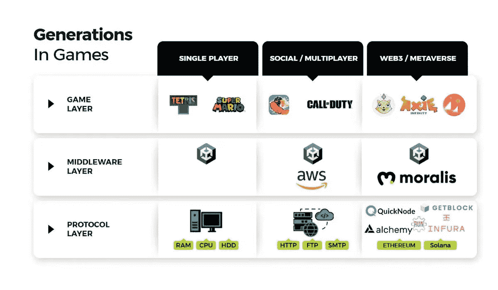
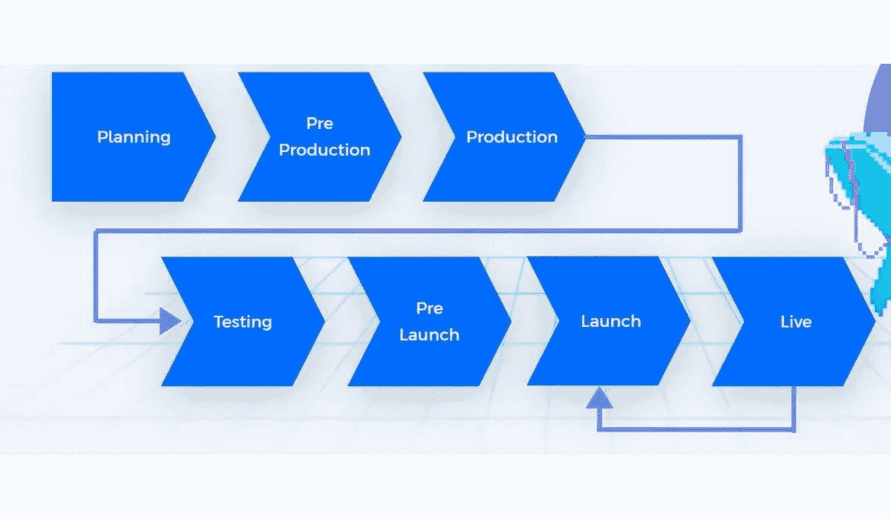
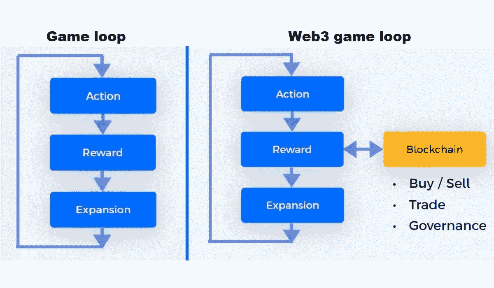
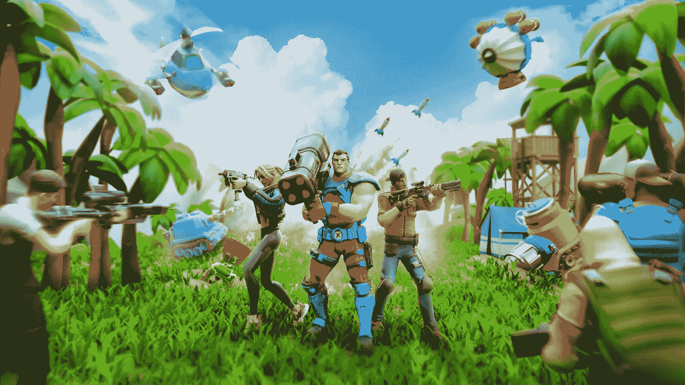

# 让我们构建一个网络 3 游戏！

> 原文：<https://medium.com/coinmonks/lets-build-a-web3-game-af2173caeaf5?source=collection_archive---------33----------------------->

Web3 游戏的设计与传统游戏的设计没有太大的区别。

当你在设计一款网络游戏时，你可能会担心这个过程会很复杂。设计一个 Web3 游戏如此复杂的原因是试图通过结合太多的结构来想出一个产品。例如，甚至在开始游戏设计之前，就必须创建标准的游戏结构。所以，举个例子，考虑一下项目的阶段，它的细节，以及哪种加密货币适合你的项目。但不要担心！本文将以最简化的方式描述 Web3 游戏设计。继续读！

Web3 及其技术堆栈的受欢迎程度在过去几年已经有了很大提高。这就是为什么 Web3 的游戏设计现在比你想象的要简单。但首先，让我们探讨一下什么是 web3，以及它是如何在今天变得如此有价值的。

# Web3 及其当前炒作

Web3 是一种基于分散化和代币经济的创新技术，它将区块链技术提升到了一个新的水平。**透明**在Web3 领域至关重要。这里没有任何一家公司或组织保存您的数据。你可以完全控制你的数据。我们看一下 Web3 游戏，玩家通过一个开放的数据生态系统拥有他们购买的所有资产。这样，所有的交易都是持久的和可公开验证的。这些基本技术实际上把我们引向了 P2E 的概念，另一个让 web3 得到如此大肆宣传的技术构造。我们已经谈到了在享受乐趣的同时赚钱的奇迹。有了 P2E，玩家可以在发展技能或找乐子的同时赚钱。除此之外，web3 还允许玩家投资 NFTs。在社会方面，不应忽视社区的概念及其给人们带来的归属感。

在当今世界，数字转型的概念和 web3 每天都在相互影响。Web3 之所以被大肆宣传，是因为它对玩家、投资者、艺术家和每个人都有很多好处。

# Web3 游戏设计

在 Web3 游戏中，一切都取决于项目的细节。因此，项目可能因团队质量而有很大差异。这些包括艺术家、动画师、声音专业人员、图形设计师、开发者、营销人员、制作人员、质量控制专业人员、销售专业人员、分析师、翻译、作家等。因此，如今的游戏非常复杂，用户的期望也越来越高。当然，在 Web3 中也可以预期到这种复杂性。不过，多亏了 **GameFi** 、 **Web3** 游戏可以凭借简单得多的游戏功能获得成功，

最典型的 Web3 游戏设计过程遵循传统的游戏模型:

上图展示了游戏设计的典型阶段。不过，当我们深入探讨每个标题时，我们将详细了解 web3 之间的差异。

**计划:**在这个阶段，团队决定游戏的概念和机制。这个阶段在 Web3 游戏设计中至关重要。此外，这也是团队决定包含哪些加密特性的地方。

**前期制作:**在这里，团队通常从事原型制作

**制作:**这是代码发挥作用的阶段，开发者将制作游戏软件。游戏的大部分部分都发生在这个阶段。

**测试:**在这个阶段，进行测试是为了优化用户体验，消除 bug。

**预发布:**根据所做的测试，测试版与预发布一起进行。这是一个潜在的测试版本的位置。

**发布-直播:**团队最终发布了游戏。然而，Web3 游戏的创作很少会在这一点上结束。今天的用户期望游戏在发布后会有所改变和改进，所以发布和实况部分是直接相关的。

# Web3 播放器类型

Web3 有不同于传统游戏的玩家类型。从下图可以看出，玩家是根据他们在游戏中的目标进行分组的。

于是乎，玩家中就包含了**【泡脚趾】****【赌徒】****【寻乐者】**。那么，在挣钱者中，有**【沉默的投资者】****【市场投机者】****【劳动者】**。那么，投资人中，又有**【隐鲸】****【早期采用者】****【创业者】**。在创作 Web3 游戏时，考虑这些玩家类型是至关重要的。因此，我们可以选择满足或忽略一些玩家的需求。这个过程的第一步是选择我们希望锁定的玩家。然后，我们必须考虑它们的区别特征、主要驱动因素、主要资产用途和保留策略。在这四个因素的帮助下，我们可以确定是什么让我们的目标玩家与众不同，他们想做什么，参与什么，并保持他们的兴趣。

# Web3 游戏设计中的循环

随着 Web3 游戏中财务方面的整合，游戏周期的奖励阶段变得更加有趣。必须创造一个可持续的循环，让玩家不断参与到生态系统中，并鼓励他们参与进来。在这里，通过将区块链整合到奖励系统中来赚钱的概念是与现实世界相关联的。因此，它变成了人们通过花费时间、雄心和精力所获得的真正等价物。

# 摘要

总结一下我们在这里说的，Web3 游戏设计一般是为了创建一个社区，并让这个社区保持活跃。应该在这个社区中创建一个吸引多种类型玩家的系统。例如，广泛的受众应该能够共同生活在一个单一游戏生态系统中，从那些只是为了好玩而玩的人到投资人或那些希望在玩的同时赚到钱的人。在 [**无投降英雄**](https://app.adjust.com/nw8swri?redirect=https%3A%2F%2Ftwitter.com%2FNoSurrenderHero) 中，我们基于这种游戏设计风格规划了我们的项目。来到编码阶段，这是 Web3 游戏设计之后最关键的部分，在这一点上与一个好的开发团队合作是至关重要的。在以前的文章中，我们讨论了为什么您应该与一个好的软件团队一起工作。如果你以前没有机会复习过， [**点击这里**](/blockchain-biz/tacticks-to-build-a-team-for-web3-projects-9602b463756a) 。

[**No Surrender Heroes**](https://app.adjust.com/nw8swri?redirect=https%3A%2F%2Ftwitter.com%2FNoSurrenderHero)

**关注我们了解更多信息；**[**Twitter**](https://app.adjust.com/nw8swri?redirect=https%3A%2F%2Ftwitter.com%2FNoSurrenderHero)**|**[**Medium**](/@nosurrenderheroes)