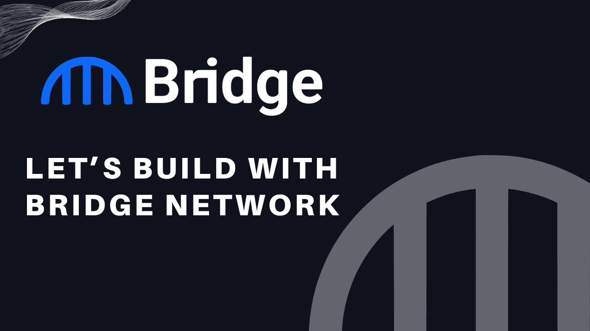

# 让我们用桥接网络来构建

> 原文：<https://medium.com/coinmonks/lets-build-with-bridge-network-6f98ce967abd?source=collection_archive---------49----------------------->

## 本文旨在介绍桥接网络工具 Bridge Socket 如何帮助任何 dapp 成为多链 dapp。

在构建 web3 应用程序时，为了让您的用户能够与多链世界通信，互操作性是一个基本特性。然而，通过复杂的基础设施实现这一点可能会很棘手，这可能会导致您的 dApp 变得混乱和复杂，以便维护隐私和安全。不幸的是，dApp 缺乏在 dApp 内部建立这种基础设施的资源，所以功能仍然局限于单个区块链。

互用性解决方案提供了一种从另一个链吸引用户的新方法。例如，在以太坊上运行没有互操作性的 Dapp 将会删除 BNB 链用户的任何可访问性，因为他们没有办法与你的产品交互。最终，这会对各种项目增长机会造成阻碍。在这种情况下，通过将他们的令牌限制在以太坊，用户可以搜索一个新的解决方案，利用他们所属的其他生态系统，如 BNB、多边形、索拉纳等。

互操作性对于 newage web3 dapps 来说至关重要，这不是什么秘密，但仍然存在一个问题，即 dapp 构建者如何以最小的成本、降低的开发复杂性和支持其增长的方式来利用跨链互操作性特性。

答案很简单，这就是我们桥插座发光的地方。对于开发人员来说，这是一个即插即用的解决方案，允许任何 dapp 将跨链桥接功能集成到他们的应用程序中，而无需构建和管理复杂的跨链基础架构。该套接字不仅有助于将桥接网络的互操作功能引入任何 dapp，还可以实现 dex、跨链农业、借贷、市场等功能。

桥套接字使用无状态契约，这意味着它在任何时候都不持有令牌。它独立于桥接网络的核心合同..关于集成和更多的完整信息，请查看这里的桥套接字代码！[https://github . com/bridgeNetworklabs/bridge contract/blob/master/contracts/bridge socket . sol](https://github.com/bridgeNetworklabs/bridgeContract/blob/master/contracts/bridgeSocket.sol)

**为什么插座是您的最佳解决方案？**

Web3 发展迅速，进入多连锁店世界的问题变得越来越必要，而不是可能。增长的障碍可以被打破，巨大的新生态系统随时可供你利用，同时只分配最少的发展资源。进入多链可访问性的项目数量与日俱增，并通过跨链合作带来指数级增长机会！

除了减少开发复杂性和降低成本之外，Socket 还允许您的 dApp 进入一个新的收入系统！对于你的用户产生的每一笔跨链交易，你都产生了收入！

**如何开始 Socket 的集成？**

将 Socket 集成到任何 dapp 中既简单又容易。您只需将您的信息[填写在这张表格上](https://forms.gle/2HNhXNu4ob2qBUzK8)，桥网团队将很快与您取得联系。

您可以在我们的[电报](https://t.me/BridgeNetwork0x)或[不和谐](https://discord.com/invite/PGHnWapB8u)中直接联系我们的团队讨论插座集成。

要了解更多关于 Bridge Network 的信息，您可以访问我们的[网站](https://www.bridgenetwork.com/)并关注我们的 [Twitter](https://twitter.com/bridgenetwork0x) 和 [Reddit](https://www.reddit.com/r/bridgenetwork0x/) 以获得关于 Bridge Network 公告的通知。

> 交易新手？尝试[加密交易机器人](/coinmonks/crypto-trading-bot-c2ffce8acb2a)或[复制交易](/coinmonks/top-10-crypto-copy-trading-platforms-for-beginners-d0c37c7d698c)