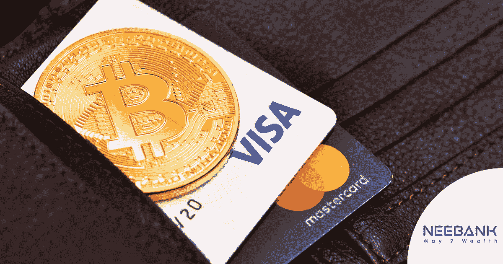
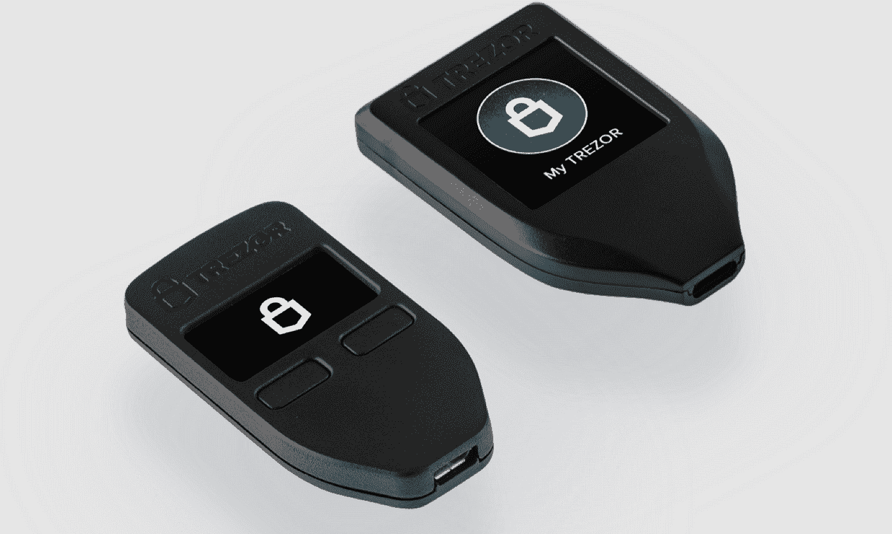

# 让我们消除一些密码的迷雾吧！

> 原文：<https://medium.com/coinmonks/lets-clear-the-fog-on-some-crypto-words-9f0895aa93f?source=collection_archive---------37----------------------->

Source: [https://cryptoslate.com/why-this-leading-trader-is-hesitant-to-build-a-bitcoin-short-position-here/](https://cryptoslate.com/why-this-leading-trader-is-hesitant-to-build-a-bitcoin-short-position-here/)

你有没有发现自己被困在一个比赛中使用的但有不同含义的单词中？

这个简短的综述，将着眼于所有那些被误用的术语；甚至是迷茫。

我们这些熟悉这门学科的人，必须正确地使用术语，以便人们用简单的几句话就能理解。

# 操作定义

这就是我将文章命名为“操作定义”的原因

但是什么是可操作的定义呢？

一个[操作定义](https://www.isixsigma.com/dictionary/operational-definition/)唯一且普遍地定义了如何测量一个量。

现在，我们不是在讨论密码的数量，但是，我们可以做一个比较。

通过熟悉每个术语的操作定义，我们完全知道加密环境的基础是如何工作的，并且我们可以毫无问题和误解地将其传达给其他人。

对此，我们先从经常出现的第一个困惑说起:

# 数字货币和加密货币

Source: [https://kalimatsempurna095.blogspot.com/2021/06/central-bank-digital-currencies-are-not.html](https://kalimatsempurna095.blogspot.com/2021/06/central-bank-digital-currencies-are-not.html)

D 数字货币代表任何通过电汇、借记卡或信用卡兑换的法定货币，并受法定货币的所有规定约束。

加密货币是数字化的，因为“它只通过精确的计算机算法的执行而存在，但它拥有数字(或法定)货币所没有的 5 个支柱

1)每个人都可以访问；

2)它是抗审查的

3)它是公共的

4)它没有边界

5)是中性的。

更容易？你不觉得吗？
没有技术术语，我们仍然设法弄清楚为什么加密货币不能与数字货币混淆。我奶奶总是说:

> 如果真正拥有了这个概念，简单的话就会随之而来

为了提高准确性，我们可以补充几句，区块链是一个分布式账本，每个人都可以访问，所以每个人都可以查阅；突出显示时间戳。

这是为了指出中央银行数字货币(CBDCs)永远不可能是加密货币，因为它们是集中式的，它们通常在私人区块链或简单的 DLT 上发行。

第二个不准确的地方，尤其是在媒体中，是

# 硬币和代币

Source: [https://digitaltokens.io/difference-between-cryptocurrency-coins-and-tokens/](https://digitaltokens.io/difference-between-cryptocurrency-coins-and-tokens/)

两者都是加密货币，所以不是一回事？

不要！

硬币本身就是一种加密货币，也有专用的区块链。

经典的例子是比特币，它有自己专用的区块链；至于替代硬币，我们可以参考阿尔格兰德，它有自己的加密货币和专有的区块链。

TOKEN 是一种加密货币，它没有专有的区块链，而是使用另一种区块链。作为一个例子，我们可以使用在以太坊区块链创建的 LPT ( [Livepeer](https://livepeer.org/) )令牌，事实上它是一个 ERC-20 令牌。

代币的另一个特点在于它们的创建:它们由一组称为智能契约的代码行产生，这些代码行定义了它们的所有特征，包括总金额。

你可以非常简单地看到，我们能够很好地理解硬币和代币之间的区别。

显然，我们无法创建它，但不是因为我们不知道需要做什么，而是我们不知道编写智能合同的命令！

使用的第三个误差在

# 钱包-账户交换

Source: Trezor

老实说:很容易混淆，因为两者都有一个公共地址，然而，区别是巨大的:谁有私钥。

在硬件钱夹中或在线，即，私钥在创建期间被直接传送给用户；在交换中，钱包由第三方创建，他们可能知道私钥。

私钥非常重要，因为它们代表一个代码，让你能够在任何设备上找回你的钱包；因此，它们非常重要，必须小心保管。

现在你清楚“不是你的钥匙，不是你的密码”这句话的意思了吧！

这些是我经常在各种场合听到的不准确的说法，显然是在日常生活中。

> 你听过其他的吗？
> 
> 把它们写在评论里吧！

> 交易新手？试试[密码交易机器人](/coinmonks/crypto-trading-bot-c2ffce8acb2a)或[复制交易](/coinmonks/top-10-crypto-copy-trading-platforms-for-beginners-d0c37c7d698c)