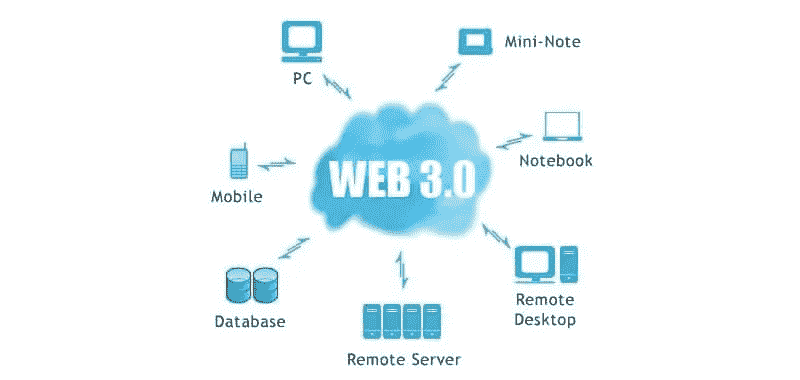

# 让我们拥抱即将到来的 Web 3.0——你需要知道的事情

> 原文：<https://medium.com/coinmonks/lets-embrace-the-upcoming-web-3-0-things-you-need-to-know-ef18b75ba782?source=collection_archive---------24----------------------->

关于发明和创新的黄金法则是，所有的发明和创新都是基于它之前的技术或想法。新的想法从其遗留平台开始，并在某些方面进行改进以引入新的东西。Web 3.0 也不例外。在我们跳到 Web 3.0 之前，让我们先简单了解一下什么是 Web 2.0，以及 Web 3.0 在哪些方面进行了改进或创新。

# 什么是 Web 2.0？—领先 Web 1.0 一步

Web 2.0 这个术语在 1999 年出现。在 Web 2.0 之前，人们只能从互联网上消费数据。这个系统被称为 Web 1.0。它包含来自 web 的静态页面，从系统文件服务器传送内容。信息的交流是单向的。Web 2.0 系统使互联网用户能够积极参与。参与者能够在互联网上创作和发表文章。还引入了创建用户账户的选项，以使平台更具互动性。当时，这被认为是网络世界的一场革命。仍然在使用的发布平台和社交媒体网站是 Web 2.0 的结果。

尽管 Web 2.0 提供了大量的特性和选项，但它确实有需要改进的地方。然而，也有一些担忧。这些改进是什么，为什么首先需要积累 Web 3.0？我们一会儿将深入探讨这个问题。

# web 3.0——伟大的继承者

创新是天生的；这是一种内在的意愿，也是现有技术合乎逻辑的下一步。为什么要创新？现有的技术解决了我们的问题，但我们每天都面临新的问题。为了解决这些问题，一些新的东西产生了。Web 3.0 也是一样。

Web 3.0 试图结束科技巨头的垄断和控制。一些组织拥有、控制和操作用户生成的数据。这给了他们相当大的权力和影响力，因为他们可以接触到几乎每个人生活的方方面面。不仅如此，他们还将数据出售给第三方，赚取可观的收入。

他们说，数据是新的石油。谁控制了数据，数据流量就控制了世界。Web 3.0，一个去中心化的系统，将终结这一切。互联网将是一个用户共享和控制的平台。

# 沟通

Web 3.0 带来的另一个效用是它支持端到端的通信，消除了任何中间实体。举个例子，如果一个人在互联网上购买了一种产品或服务，交易的一部分就进入了这些中介。随着 Web 3.0 的引入，这种做法可能会消失。顾客将直接与这些公司联系在一起，他们无需向任何人支付一分钱就可以购买商品。然而，确保交易和通信安全的监管机构将会存在，但它们将为数不多。

# 不再是假神了？

安全和保障一直被称为虚假的神，任何被认为安全的东西都只是海市蜃楼和错觉。从个人信息到在线支付，没有什么是假定安全的；政治家的文本到国家机密。这是 Web 2.0 的一个问题。另一个令人担忧的原因是，人们不愿意在社交媒体上露面或分享个人信息。

Web 3.0 的分散协议应确保数据的最大安全性。Web 3.0 的架构框架旨在使任何试图破坏协议的人都不可能不被追踪到。Web 3.0 可能会打破安全是虚假神的神话。

# 透明度

不久前，我们讨论了科技巨头如何随心所欲地控制和操纵数据。虽然很清楚他们控制的数据有特定的应用，但不清楚他们到底用这些数据做什么。这些公司有条款和条件，但对普通消费者来说听起来很陌生。另一方面，Web 3.0 应该确保透明性。区块链规定数据是安全的和不可更改的，这将有助于增加用户的信任。

# 人工智能

将语义能力与学习语言的自然过程结合起来，计算机可以像人类一样理解和交流信息。这将导致所需信息的更快和更相关的交易。

# 底线

Web 3.0 不再是白日梦，而是现实。拥抱 Web 3.0 等同于拥抱未来。一开始，我们讨论了自然继承和创新；Web 3.0 是前所未有的创新。它将改变我们的沟通方式，并为我们对安全性、可靠性的担忧提供答案。

# 免责声明:

我是一名金融分析师，分享观点仅供学习和参考。我不是你的顾问，你也不应该根据我的工作进行交易。在进行任何金融交易之前，一定要咨询你的独立财务顾问。我假设市场参与者的任何交易都没有造成损失或损害。

# 最后:

如果你喜欢我的作品，请为我鼓掌！这将有助于我接触更多的人。也会提升我的士气，我会更多的分享我的作品！非常欢迎你的评论。也欢迎你不同意我的观点！

> 交易新手？试试[加密交易机器人](/coinmonks/crypto-trading-bot-c2ffce8acb2a)或者[复制交易](/coinmonks/top-10-crypto-copy-trading-platforms-for-beginners-d0c37c7d698c)