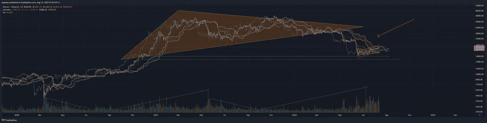
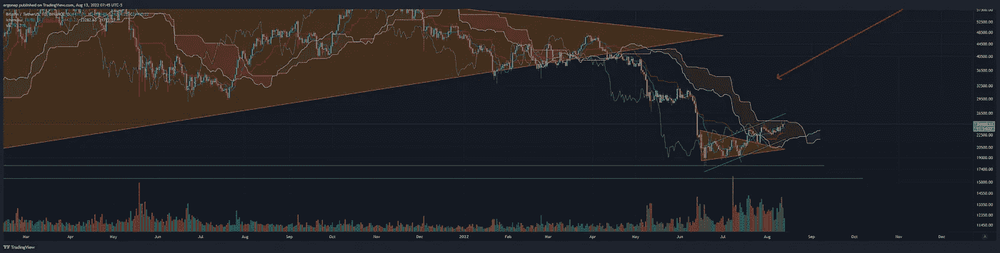
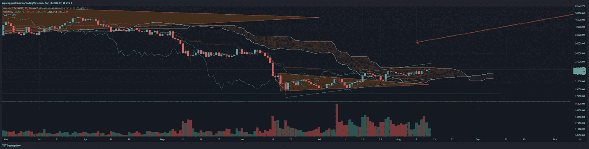
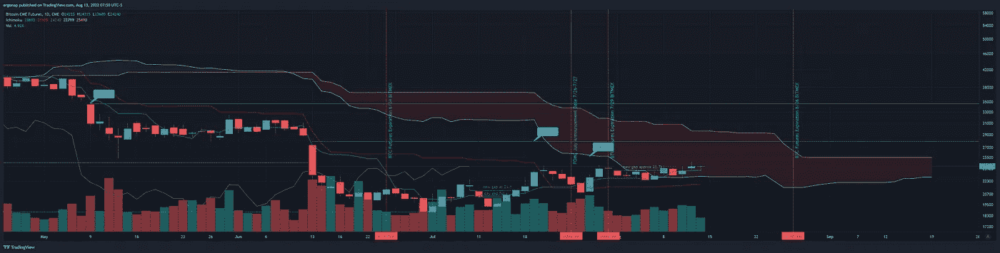
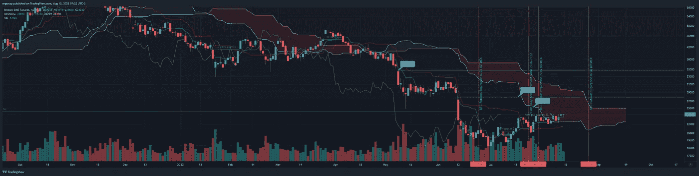

# 让我们来玩一个叫点音量的游戏

> 原文：<https://medium.com/coinmonks/lets-play-a-game-called-spot-the-volume-a0b004405d22?source=collection_archive---------20----------------------->

比特币/加密货币市场 8/13

今天，我想从宏观上帮助人们认识到市场中的一些具体问题。这将既是 TA，也是新闻。

第一，在新闻方面。问问你自己，什么时候，为什么人们支持龙卷风现金，并声称它只是一个工具。显然资助朝鲜是一项公益事业？

 [## 朝鲜通过龙卷风现金洗钱 10 亿美元，美国财政部刚刚猛烈抨击…

### 美国财政部批准了 Tornado Cash，这是一个被犯罪分子用来掩盖资金来源的加密货币平台。作为…

www.msn.com](https://www.msn.com/en-us/news/world/north-korea-has-laundered-241-billion-in-crypto-via-tornado-cash-and-the-us-treasury-just-slammed-the-platform-with-sanctions/ar-AA10rRHV) 

这就是我们处于熊市的原因，NK 从哪里获得这些资金？为什么人们说 crypto 只是“充满了黑客”，它就是这样，等等等等？也许有人应该开始问为什么我们被告知加密是 100%好的，尽管朝鲜比我们任何一个国家都获利更多。提醒:朝鲜能够像任何其他国家一样运作，实际上是整个秘密分权/秘密避免制裁/秘密由“人民”控制。没人说是哪些人。

总之，上 TA。下面我要指出的，是宏观层面的成交量走势，以及哪里成交量最高，哪个成交量最高。这在很大程度上与趋势的更大变化有关，但这一次有一些明显的不同，这代表着新人进入 crypto——也就是机构。

this is going to be all about those volume trendlines I’ve shown at the bottom. [https://www.tradingview.com/x/Uh71DplQ/](https://www.tradingview.com/x/Uh71DplQ/)

既然金融机构有各种自己的暗资金池，它们正在利用它们。例如，尽管答案是“他们使用了多少？”而答案可能是没有多少公司。

因此，这里跟踪的第一个成交量趋势是从 covid 开始的崩溃和累积期间的极高成交量。注意交易量趋势消失(和反转)的地方，也要注意最高的交易量在绝对底部。对于牛市来说，这是好事。这意味着人们被清算/止损到底部，但可能会回来。

注意到市场第二个顶部的交易量完全下降了吗？是啊。这就是……你可以看到，5 月份之后并没有出现真正的第二波牛市。然而，你可以看到，真正的抛售发生在。这意味着牛市延续了，因此熊市也将延续。

现在让我们放大一点，看看最近发生了什么，并指出一个问题。这是一种我称之为死亡螺旋的现象。在人们一次又一次地拿着包的地方，相信东西会上涨。Crypto 在很多方面都在追随股票市场，以获得他们的青睐，但它的能量已经消耗殆尽了。注意，交易量最高的一天是对通道顶部的强烈拒绝，这意味着一些白痴用手指指着一个买入点，而卖家也相应地做出了反应？不，这是流动性的流失。注意这里的买入和卖出是完全不同的。我们现在的成交量是上次看到的 40k，但现在是 25k。这是个大问题，亚尔。当我们低得多的时候，我们如何卖掉所有价值 4 万美元的交易量？

Ask yourself, why is the biggest volume a contest at a top, not a bottom? [https://www.tradingview.com/x/SbXzITip/](https://www.tradingview.com/x/SbXzITip/)

回答:我们没有。不是没有滑动和下降。

周末对低交易量的看涨尝试不会在这方面有好的结果，加上 24.2k CME 定价。

See how much red vs green volume? Which one’s bigger lately? Not hard to guess. [https://www.tradingview.com/x/GB71M3tf/](https://www.tradingview.com/x/GB71M3tf/)

因此，虽然传统的 ichi 可以在这里突破，但我想提醒人们看看正确的图表:

CME futures for bitcoin is the right chart. [https://www.tradingview.com/x/jJUm2YQU/](https://www.tradingview.com/x/jJUm2YQU/)

因此，当人们今天喊着看涨时，看看我们什么时候以及为什么不看涨。我们可以上去，但没什么可做的。在某个时候，我们会走得更低。

bearish outlook overall not changing, to be honest.

> 加入 Coinmonks [电报频道](https://t.me/coincodecap)和 [Youtube 频道](https://www.youtube.com/c/coinmonks/videos)了解加密交易和投资

# 另外，阅读

*   [加拿大最佳加密交易机器人](https://coincodecap.com/5-best-crypto-trading-bots-in-canada) | [库币评论](https://coincodecap.com/kucoin-review)
*   [用于 Huobi 的加密交易信号](https://coincodecap.com/huobi-crypto-trading-signals) | [HitBTC 审查](/coinmonks/hitbtc-review-c5143c5d53c2)
*   [TraderWagon 回顾](https://coincodecap.com/traderwagon-review) | [北海巨妖 vs 双子 vs 比特亚德](https://coincodecap.com/kraken-vs-gemini-vs-bityard)
*   [如何在 FTX 交易所交易期货](https://coincodecap.com/ftx-futures-trading)
*   [OKEx vs KuCoin](https://coincodecap.com/okex-kucoin) | [摄氏替代品](https://coincodecap.com/celsius-alternatives) | [如何购买 VeChain](https://coincodecap.com/buy-vechain)