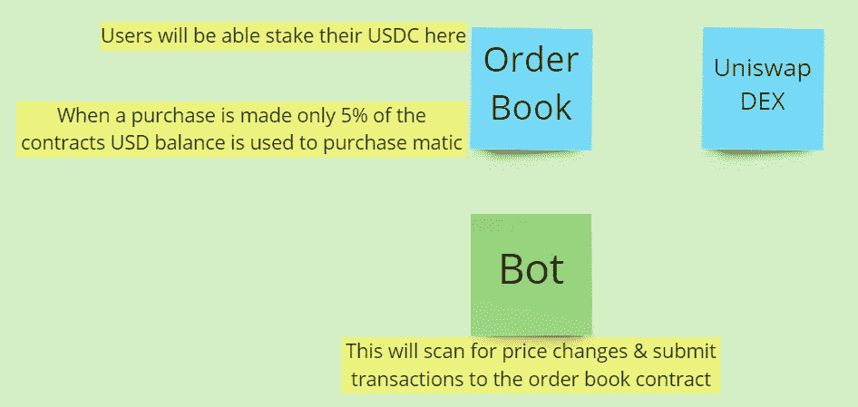
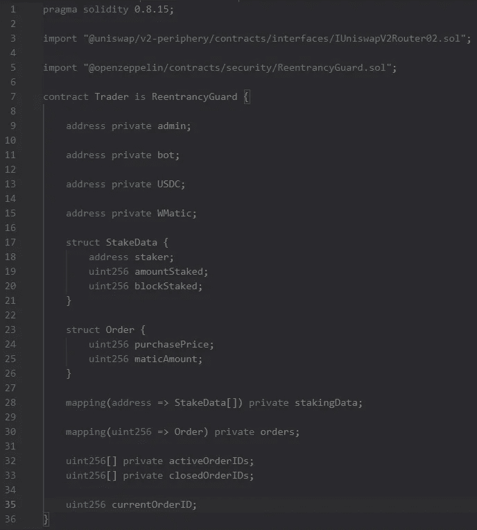

# 让我们来玩“坚实”——第一部分

> 原文：<https://medium.com/coinmonks/lets-play-solidity-part-1-e11b08622667?source=collection_archive---------5----------------------->

从今天开始休息。让我们做一个公共交易机器人。

让我们看一下每个合同所需的要求。

uni swap DEX:
-无需更改，因为我们将使用此架构的其他实例

订单簿:
-仅允许单个授权钱包进行订单
-该合同将交易 USDC-Matic
-该合同将在多边形网络上收费
-当发出订单时，合同 5%的美元余额被转换为 Matic
-该合同必须包含所有活跃的&过去交易的公开列表
-该合同必须保留关于赌注者的信息
-只能为给定订单调用卖出订单 当价格比最初的购买订单高 5%时
——用户可以在任何给定的时间下注/平仓
——这个合同必须存储有关它所获得的利润的信息

Bot:
-该 bot 将查询 Uniswap 的价格
-该 bot 将查询其活动订单列表的合同
-该 bot 将检查活动订单是否准备好出售
-该 bot 将检查价格是否下降到足以发送购买请求

这是合同的第一部分。

轮到你了！
明天我会展示更多 xD

坚实发展研究小组—[https://discord.gg/KzbcGmrnfN](https://discord.gg/KzbcGmrnfN)

-多边形联盟—[https://www.polygonalliance.com/](https://www.polygonalliance.com/)

——多边形联盟不和——[https://discord.gg/kJKPCGQu66](https://discord.gg/kJKPCGQu66)

你喜欢这篇文章吗？
想给我买杯咖啡吗？
Polygon/Eth/Bsc—0x4a 581 E0 EAF 6b 71d 05905 e8e 6014 DC 0277 a1 b 10 ad

> *交易新手？试试* [*加密交易机器人*](/coinmonks/crypto-trading-bot-c2ffce8acb2a) *或* [*复制交易*](/coinmonks/top-10-crypto-copy-trading-platforms-for-beginners-d0c37c7d698c) *上* [*最好的加密交易*](/coinmonks/crypto-exchange-dd2f9d6f3769)

> 加入 Coinmonks [电报频道](https://t.me/coincodecap)和 [Youtube 频道](https://www.youtube.com/c/coinmonks/videos)获取每日[加密新闻](http://coincodecap.com/)

# 另外，阅读

*   [免费加密信号](/coinmonks/free-crypto-signals-48b25e61a8da) | [加密交易机器人](/coinmonks/crypto-trading-bot-c2ffce8acb2a)
*   杠杆代币的终极指南
*   [16 款最佳折叠电动自行车](/coinmonks/top-17-folding-electric-bikes-5e296f0918cb)
*   [28 款最佳电动自行车评选](/coinmonks/the-28-best-electric-bikes-review-and-buying-guide-in-2023-7bb3146cb403)
*   前三名[币安期货交易机器人](/coinmonks/top-3-binance-futures-trading-bots-e6031f84b3f9)