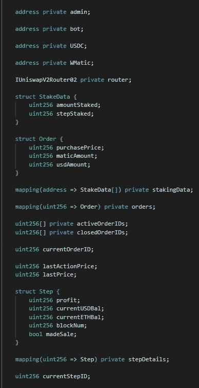
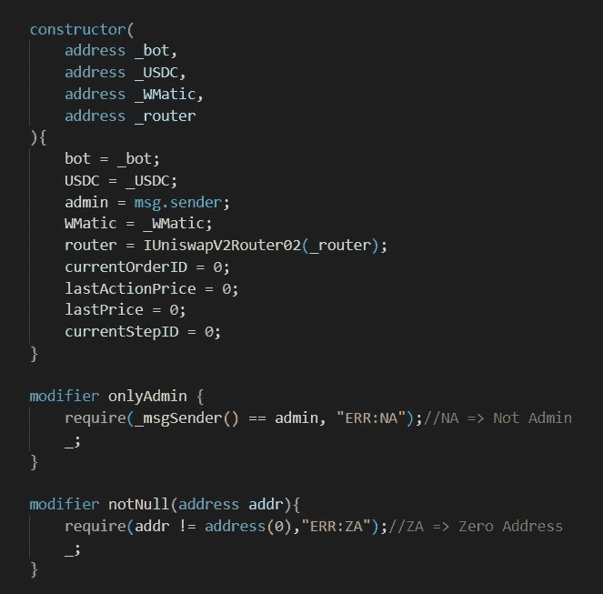
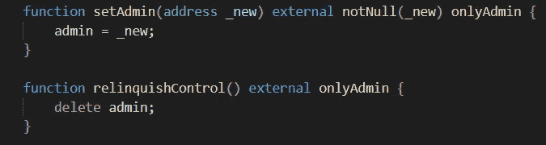
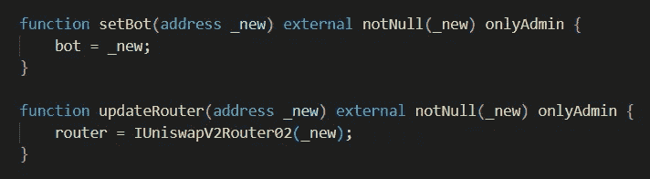
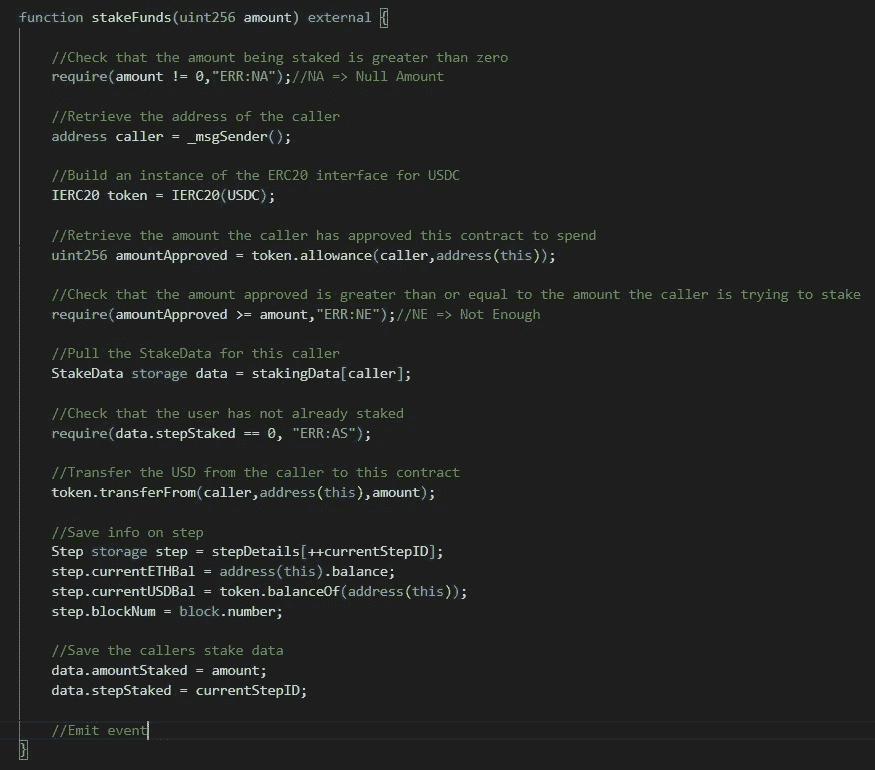
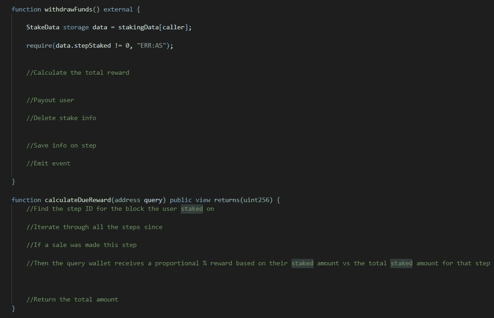
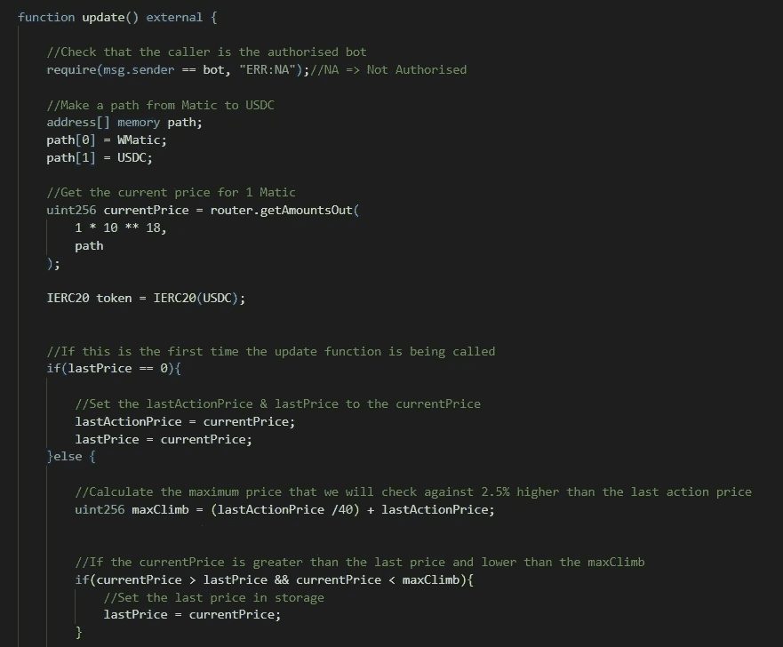
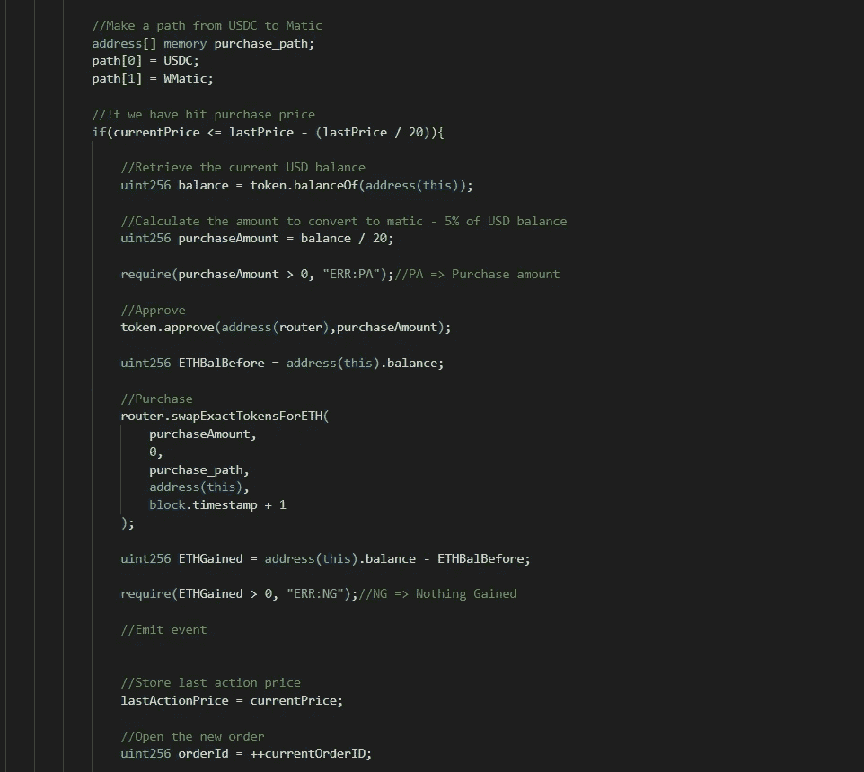
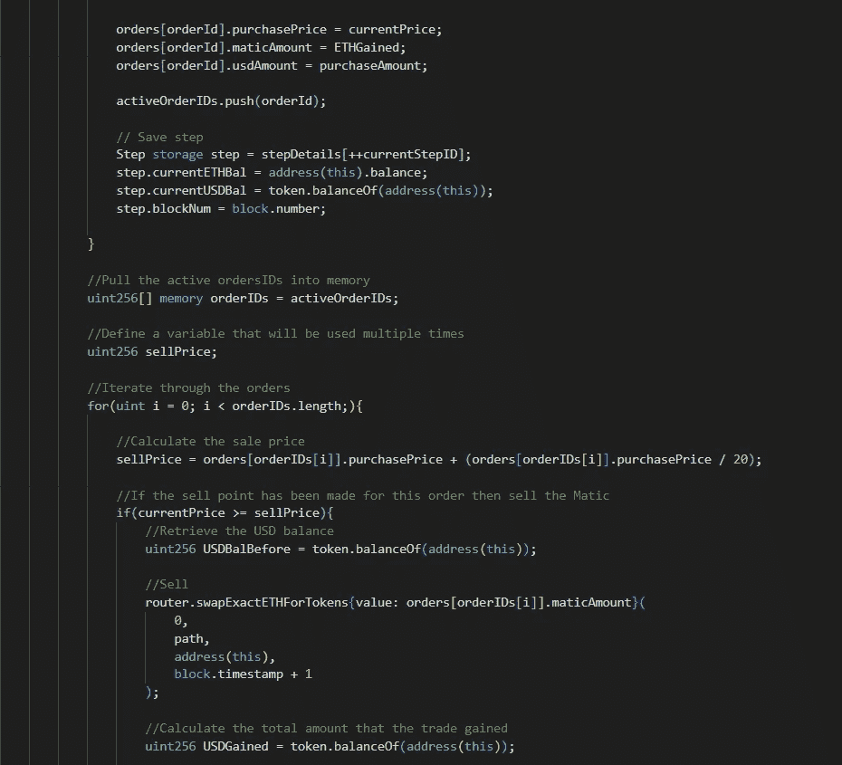
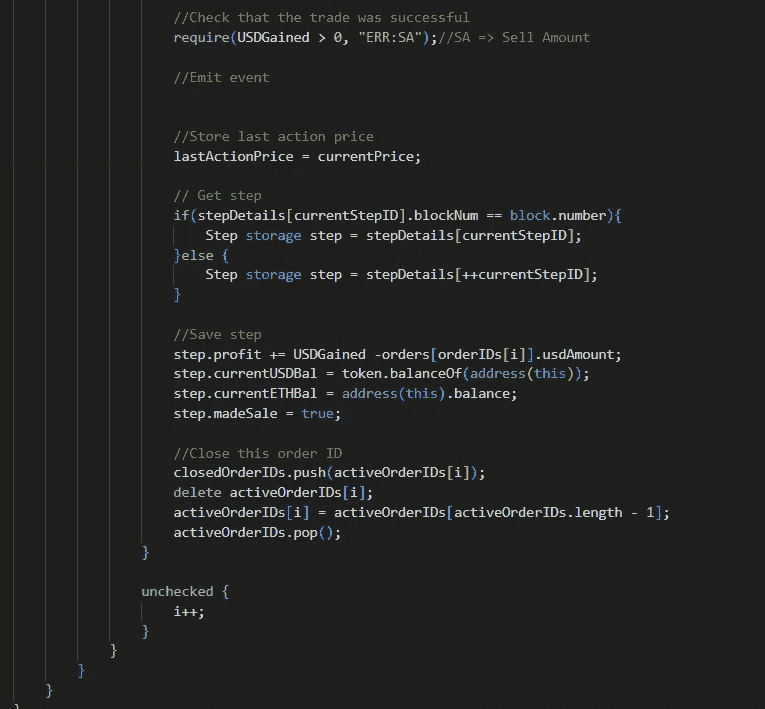

# 让我们来玩“坚实”——第二部分

> 原文：<https://medium.com/coinmonks/lets-play-solidity-part-2-6c3bb2878dc?source=collection_archive---------16----------------------->

所以继续上一篇文章，我们正在建立一个公共交易机器人。

第一部分—[https://medium.com/p/e11b08622667](/p/e11b08622667)

所以从这里开始是[回购](https://github.com/JEflyer/CommunalTradingBot/blob/first/file.sol)。这还没有完成，也没有测试。

好的，那么我先回顾一下我目前掌握的情况&然后如果你觉得可以接受挑战，你可以试着完成合同草案。

**变量**

我们存储管理员、机器人、USDC 令牌、WMatic 令牌的地址 Uniswap 路由器接口的一个实例。

我们有 3 个结构，第一个是特定于赌注者的细节&他们押什么/何时押，最后一个是我们将用于跟踪契约上的动作效果的步骤。

使用映射，我们可以存储这些结构的实例。例如，stakingData 映射存储给定地址的 StakeData 结构的一个实例。

为了确保我们跟踪我们的订单，我做了一个活动和关闭订单数组。

我们将存储我们采取的最后一次买入/卖出行动的价格，以及比最后一次行动价格高出 2.5%的最后一个价格变量。

在每次存款/取款/购买/出售时，我们将更新合同中的一个步骤，以便我们可以计算赌注者应得的奖励金额。

相当基本的构造函数，尽管我们在这里遗漏了一些安全检查，你能看出它们是什么吗？

两个基本修饰符，一个检查调用者是管理员，另一个检查给定的地址不为空。

这是一项安全措施，以避免合同管理的意外损失。admin 不能设置为空地址，但可以放弃控制权。

另外两个 admin only 函数，用于设置允许调用 update 函数的地址&用于更新我们将要进行交换的 DEX。

**打桩**

1.  检查一下打电话的人是不是在孤注一掷
2.  检查呼叫者是否允许此合同花费足够的代币来完成交易
3.  检查呼叫方是否已经下注
4.  将美元从调用方转移到此合同
5.  存储此步骤的详细信息
6.  存储此赌注者的详细信息

如果你准备好了，这部分就是你的任务！如果没有，它将在下次被填充。

这个函数只能被机器人调用。

1.  检查调用者是否是授权的机器人
2.  检索 1 Matic 到 USDC 的当前价格
3.  如果这是第一次调用更新函数，设置 lastPrice & lastActionPrice &结束调用
4.  其他
5.  计算当前价格可以与之比较的最高价格
6.  如果当前价格大于最后价格&小于最大爬升价格，则将最后价格设置为当前价格
7.  如果当前价格已经达到购买点，那么就购买并跟踪所有相关信息。
8.  遍历订单
9.  如果当前价格已经达到给定订单的卖价，则出售 Matic & store 相关信息

如果你觉得可以，一定要尝试挑战！

如果你觉得这个有趣，那就看看这个吧！
[https://medium.com/p/28a8bb064e86](/p/28a8bb064e86)

坚实发展研究小组—[https://discord.gg/KzbcGmrnfN](https://discord.gg/KzbcGmrnfN)

-多边形联盟—[https://www.polygonalliance.com/](https://www.polygonalliance.com/)

——多边形联盟不和—[https://discord.gg/kJKPCGQu66](https://discord.gg/kJKPCGQu66)

你喜欢这篇文章吗？想请我喝杯咖啡吗？
Polygon/Eth/Bsc—0x4a 581 E0 EAF 6b 71d 05905 e8e 6014 DC 0277 a1 b 10 ad

> *交易新手？试试* [*加密交易机器人*](/coinmonks/crypto-trading-bot-c2ffce8acb2a) *或* [*复制交易*](/coinmonks/top-10-crypto-copy-trading-platforms-for-beginners-d0c37c7d698c) *上* [*最好的加密交易*](/coinmonks/crypto-exchange-dd2f9d6f3769)

> 加入 Coinmonks [电报频道](https://t.me/coincodecap)和 [Youtube 频道](https://www.youtube.com/c/coinmonks/videos)获取每日[加密新闻](http://coincodecap.com/)

# 另外，阅读

*   [免费加密信号](/coinmonks/free-crypto-signals-48b25e61a8da) | [加密交易机器人](/coinmonks/crypto-trading-bot-c2ffce8acb2a)
*   [杠杆代币](/coinmonks/leveraged-token-3f5257808b22)终极指南
*   [16 款最佳折叠电动自行车](/coinmonks/top-17-folding-electric-bikes-5e296f0918cb)
*   [28 款最佳电动自行车点评](/coinmonks/the-28-best-electric-bikes-review-and-buying-guide-in-2023-7bb3146cb403)
*   前三名[币安期货交易机器人](/coinmonks/top-3-binance-futures-trading-bots-e6031f84b3f9)