# 让我们来玩“坚实”——第三部分

> 原文：<https://medium.com/coinmonks/lets-play-solidity-part-3-7cb69ec9d69b?source=collection_archive---------5----------------------->

克隆[回购](https://github.com/JEflyer/CommunalTradingBot/blob/first/file.sol)。

如果你错过了前两部分。
第一部—[https://medium.com/p/e11b08622667](/p/e11b08622667)第二部—[https://medium.com/p/6c3bb2878dc](/p/6c3bb2878dc)

对，所以今天主要集中在撤退部分。

但是首先让我们补充一些我上次忘记的东西。

在结构中。

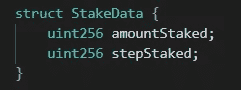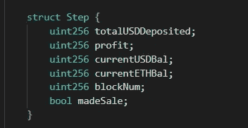

在赌注函数中。

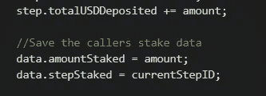

在取款功能中。

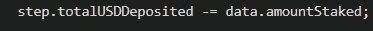

在更新功能中

@购买阶段

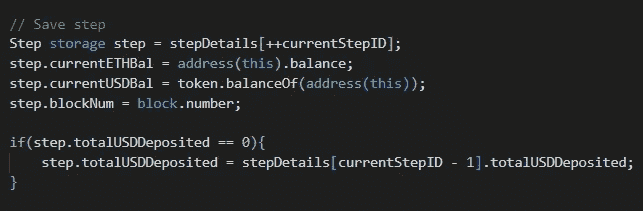

@销售阶段

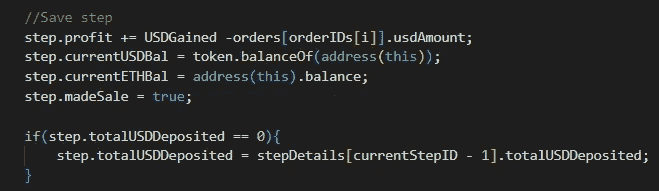

现在进入退出&奖励逻辑。

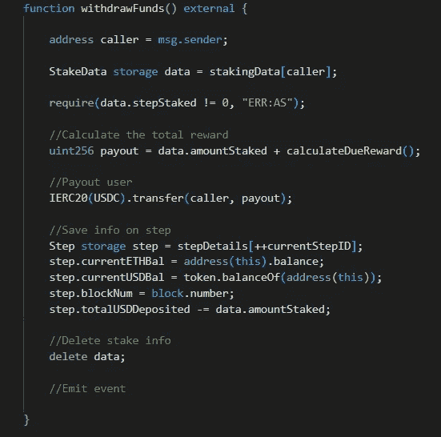

当从存入的美元中删除金额时，我们确保删除用户下注的金额，而不是他们支付的金额。这确保我们能够正确地分析应得的报酬。

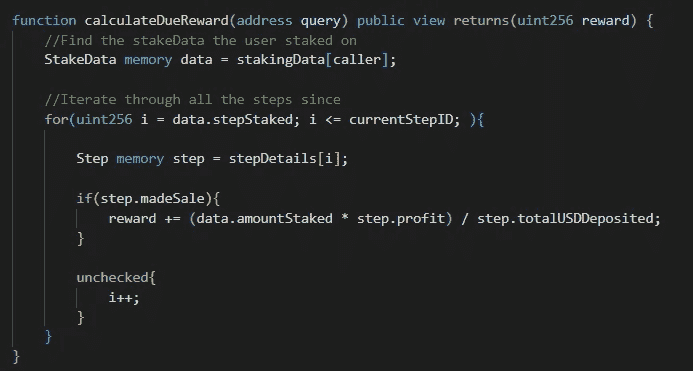

现在我明白了为什么在计算的时候会有一点混乱，所以我给你演示一下。

这是函数的通常格式。

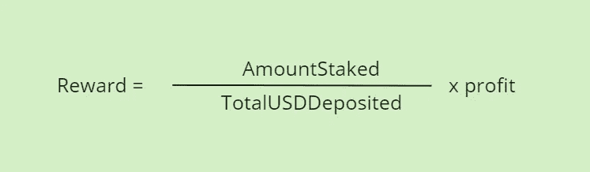

我们根据用户的美元存款按比例支付他们的报酬。

你注意到这里有问题吗？

在坚固性中没有小数点。所以…

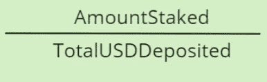

将始终等于零，因为存入的金额始终小于存入的美元总额。

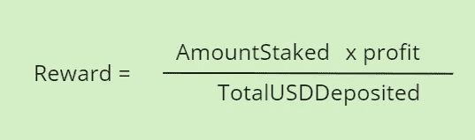

先将赌注乘以利润，然后除以，我们就能得到答案。

下次见！

如果你喜欢这一个，检查这一个 xD
https://medium.com/p/28a8bb064e86

坚实发展研究小组—[https://discord.gg/KzbcGmrnfN](https://discord.gg/KzbcGmrnfN)

-多边形联盟—[https://www.polygonalliance.com/](https://www.polygonalliance.com/)

——多边形联盟不和——[https://discord.gg/kJKPCGQu66](https://discord.gg/kJKPCGQu66)

你喜欢这篇文章吗？想请我喝杯咖啡吗？
Polygon/Eth/Bsc—0x4a 581 E0 EAF 6b 71d 05905 e8e 6014 DC 0277 a1 b 10 ad

> *交易新手？试试* [*密码交易机器人*](/coinmonks/crypto-trading-bot-c2ffce8acb2a) *或* [*复制交易*](/coinmonks/top-10-crypto-copy-trading-platforms-for-beginners-d0c37c7d698c)*[*最佳密码交易*](/coinmonks/crypto-exchange-dd2f9d6f3769)*

> *加入 Coinmonks [电报频道](https://t.me/coincodecap)和 [Youtube 频道](https://www.youtube.com/c/coinmonks/videos)获取每日[加密新闻](http://coincodecap.com/)*

# *另外，阅读*

*   *[免费加密信号](/coinmonks/free-crypto-signals-48b25e61a8da) | [加密交易机器人](/coinmonks/crypto-trading-bot-c2ffce8acb2a)*
*   *[杠杆代币的终极指南](/coinmonks/leveraged-token-3f5257808b22)*
*   *[16 款最佳折叠电动自行车](/coinmonks/top-17-folding-electric-bikes-5e296f0918cb)*
*   *[28 款最佳电动自行车点评](/coinmonks/the-28-best-electric-bikes-review-and-buying-guide-in-2023-7bb3146cb403)*
*   *前三名[币安期货交易机器人](/coinmonks/top-3-binance-futures-trading-bots-e6031f84b3f9)*