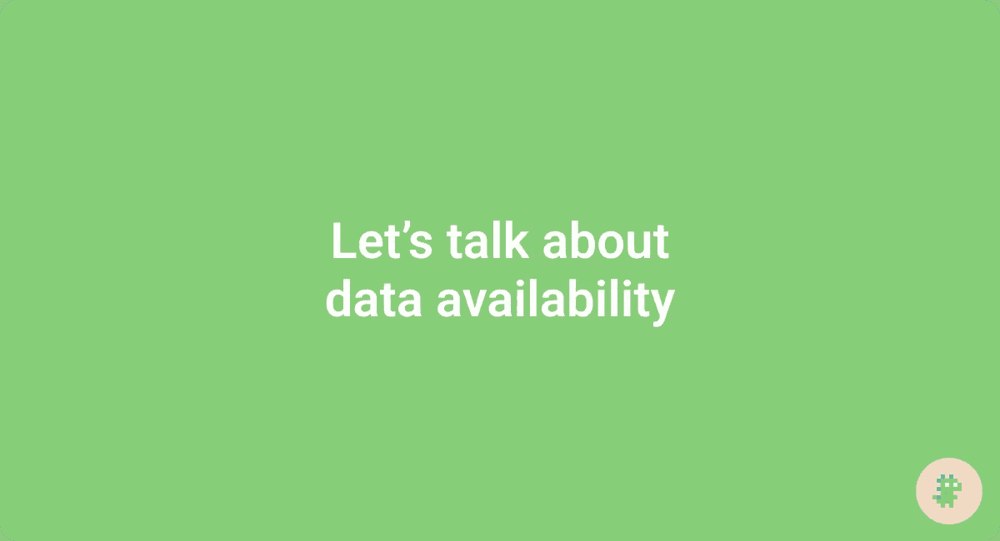
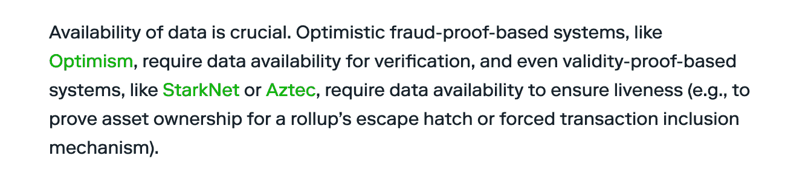
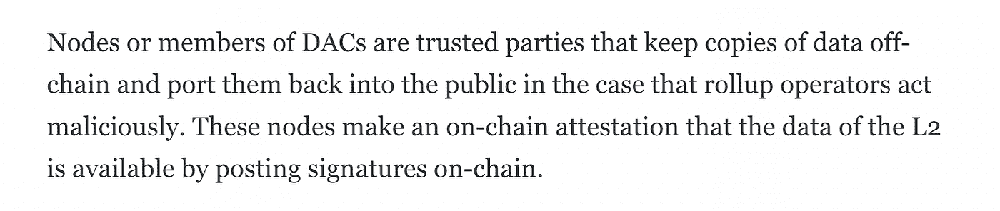
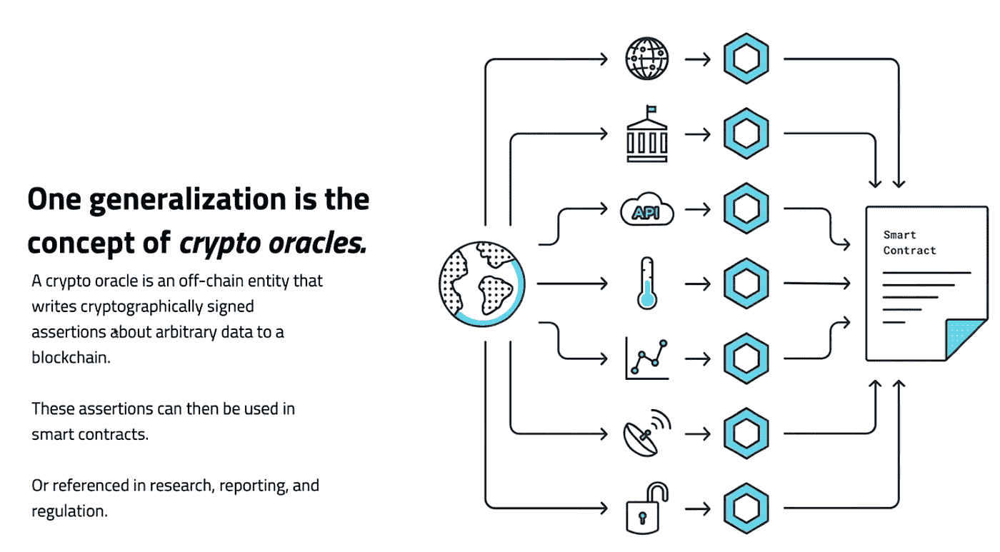
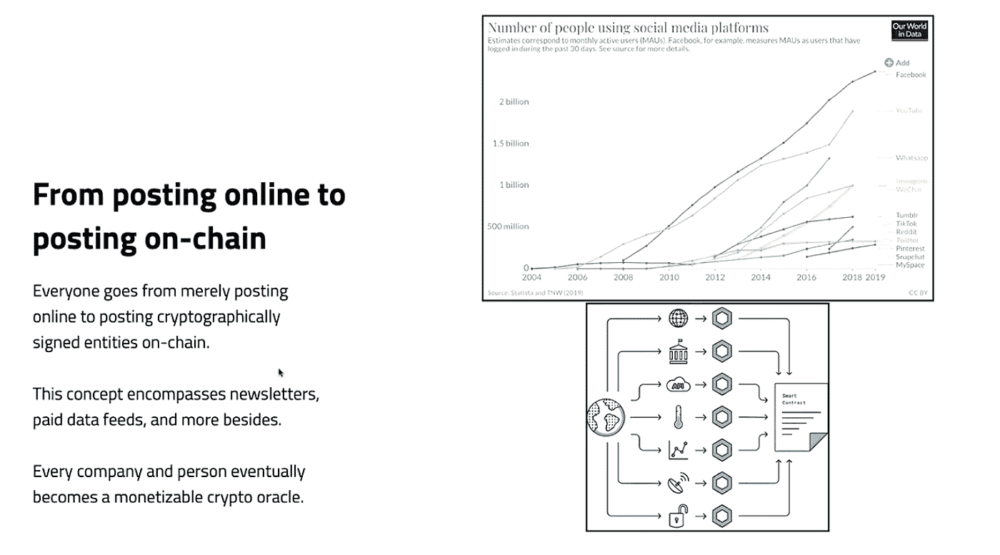

# 让我们谈谈数据可用性

> 原文：<https://medium.com/coinmonks/lets-talk-about-data-availability-7956a6e60a69?source=collection_archive---------32----------------------->

## 在这篇文章中，我讨论了所有关于数据可用性的事情:层、链、委员会、用例以及协议残局。

> [原载](https://mirror.xyz/polygonvillage.eth/Om49a9dKjsOxmSWeDgH1P2bEIkYnJV_gH362P_1a7zU)于[多边形刀](https://polygon.community/#/)博客

# 第一..什么是数据可用性？

根据 ethereum.org[的说法，数据可用性(DA)是“区块提议者发布一个区块的所有交易数据，并且交易数据可供其他网络参与者使用的保证。”](https://ethereum.org/en/developers/docs/data-availability/)

但是你如何保证数据是可用的呢？

对于大多数第 1 层(L1)来说，这非常简单。L1 节点知道事务数据可以通过自己下载和执行来获得。这就是节点验证数据块的方式，也是区块链工作方式的核心。

第二层(L2s)改变了模式。L2s(特别是 [rollups](https://vitalik.ca/general/2021/01/05/rollup.html) )使用奇特的密码证明来保证块是有效的，而节点不必执行每个事务。这开启了巨大的[利益](https://ethereum.org/en/developers/docs/scaling/#:~:text=Scaling%20overview,-As%20the%20number&text=The%20main%20goal%20of%20scalability,more%20on%20the%20Ethereum%20vision).)和[新 L1 设计](https://research.thetie.io/danksharding-ethereums-scalability-killer-post-merge/#:~:text=Danksharding%20gets%20its%20name%20from,called%20the%20%E2%80%9CScalability%20Killer%E2%80%9D.)！

但没那么快。[汇总仍然需要数据可用](https://www.paradigm.xyz/2022/08/das)，只是原因不同。

Why rollups need DA

那么我们如何扩展呢？似乎我们又回到了起点..

# DA 层

介绍 DA 层！

如您所料，DA 层专门向节点保证数据可用。这可以采取不同的形式，包括:

*   达区块链
*   DA 委员会
*   DA 中间件
*   数据分片

我们只讨论前两个，但是如果你想了解 [DA 中间件](https://www.youtube.com/watch?v=OtUOXTqrSyg)和[数据分片](https://research.thetie.io/danksharding-ethereums-scalability-killer-post-merge/#:~:text=Danksharding%20gets%20its%20name%20from,called%20the%20%E2%80%9CScalability%20Killer%E2%80%9D.)，这里有一些资源。

# DA 区块链对 DA 委员会

因为在以太坊上发布数据仍然非常昂贵，大多数 rollup 团队都是离线发布数据。这种设计在技术上把它们归类为[验证](https://ethereum.org/en/developers/docs/scaling/validium/)。

以太坊的[数据分片](https://notes.ethereum.org/@vbuterin/proto_danksharding_faq)路线图解决了这个问题，并实现了廉价的汇总数据，但为了安全起见，让我们假设距离第一次重大升级还有一年时间。同时，rollup 团队有两个主要选项:DA 委员会和 DA 区块链。

DA 委员会是选定的实体，持有交易数据的链外副本，并承诺在紧急情况下提供这些副本。这些[委员会](/starkware/data-availability-e5564c416424)通常[有 7-10 名成员](https://blog.celestia.org/ethereum-off-chain-data-availability-landscape/)，相对于完全依赖 rollup 操作者来说是一个小小的改进。

From Celestia article

达区块链将这一想法向前推进了几步，用有强大经济动机的大型、未经许可的委员会取代了小型、经许可的委员会。

# DA 层与数据存储层

一个常见的错误是认为数据可用性=数据存储。然而，事实并非如此。

一种简单的方法是从时间的角度来考虑这种差异。

DA 层确保节点可以在短时间范围内访问数据。他们的主要目标是让区块链国家平稳发展，他们通常不会做出更长远的保证。[正如 ethereum.org 所说](https://ethereum.org/en/developers/docs/data-availability/)，“当一个区块尚未通过共识时，数据可用性就很重要了”。

事实上，DA 层甚至可能在几周后丢弃数据。在以太坊的下一次重大升级中，这些数据将在大约 2 周后被删除[。](https://www.eip4844.com/)

数据存储层确保数据在更长的时间范围内可用，并且更接近大多数 web2 开发人员熟悉的云存储解决方案。当然，不难想象 web3 开发者会选择像 [Arweave](https://www.arweave.org/) 这样的分散版本。

# DA 层使用案例

有许多东西可以构建在 DA 层之上。让我们来谈三点:

*   [验证](https://blog.polygon.technology/from-rollup-to-validium-with-polygon-avail/)
*   [主权汇总](https://blog.celestia.org/sovereign-rollup-chains/)
*   [数据馈送](https://youtu.be/Cwbbxb987vE?t=523)

正如我们前面提到的，验证现在很常见。即使在以太坊实现了自己的分片 DA 层之后，rollup 团队很可能仍然会使用离线数据来降低成本。从历史上看，开发人员总是在拓展可能性的边界。

独占汇总不仅使用 DA 层来实现数据可用性，还实现了一致性。如果应用程序需要对状态转换进行完全控制，但又不想担心验证器集，那么它们很有可能成为独占式汇总(而不是 T2 智能契约汇总或验证器)。

在他最近在[的演讲](https://youtu.be/Cwbbxb987vE?t=152)，[中，Balaji Srinivasan](https://twitter.com/balajis) 展望了一个“法定信息”与“加密信息”竞争的未来。他使用类似于 [Chainlink](https://chain.link/) 的加密神谕描述了[可靠的数据馈送](https://youtu.be/Cwbbxb987vE?t=343)，其中 IRL 元数据被发布在 chain 上。这些数据可以发布到 DA 层上。

From Balaji’s presentation

From Balaji’s presentation

# DA 层残局

对于 DA 蛋鸡来说，现在还为时尚早。 [Polygon Avail](https://polygon.technology/blog/polygon-avails-ability-to-scale-the-way-forward) 、 [EigenDA](https://www.layrlabs.com/products) 和 [Celestia](https://blog.celestia.org/july-engineering-update/) 都还在 testnet 中，以太坊数据分片还需要 1-3 年的时间，这取决于正在讨论的升级。

然而，还是有很多值得期待的。让我们强调一下似乎是普遍存在的最终结果。大多数团队都是这样设想的:

逐步增加块大小，并在网络中对其进行分片。

使用 [KZG 承诺](https://twitter.com/SalomonCrypto/status/1583705993300492288)缓解下载满块的节点。

利用[数据可用性抽样](https://hackmd.io/@vbuterin/sharding_proposal#ELI5-data-availability-sampling)保持低验证成本。

最终我们到达了这样一个地方，DA 层支持[高吞吐量](https://twitter.com/SalomonCrypto/status/1559402384526258176)应用，而信任最小化的轻型客户端[在移动设备上进行验证](https://twitter.com/musalbas/status/1480901457633239048?s=46&t=M0oqH6RTgCxC6ESgFxGrqw)。

没错——性能和去中心化！

# 包扎

希望本文能帮助您更加熟悉数据可用性。目标是提供一个广泛的概述，并解决围绕该主题的常见误解。

关于它是如何工作的，有很多深入的探讨，所以如果你想跳进兔子洞，这里有一些资源:

*   [多边形博客](https://blog.polygon.technology/category/polygon-solutions/polygon-avail/)
*   [哈伊姆所罗门螺纹](https://salomoncrypto.notion.site/Ethereum-9dfdf1b2cd334bd8b713b8f8a1f5f26b)
*   [范例博客](https://www.paradigm.xyz/2022/08/das)

感谢阅读！

如果你觉得这篇文章有用，请给它一些👏为能见度鼓掌。

如果你想联系我，我在推特上@ 0x dinoegs([twitter.com/0xDinoEggs](https://twitter.com/0xDinoEggs))

> 交易新手？尝试[加密交易机器人](/coinmonks/crypto-trading-bot-c2ffce8acb2a)或[复制交易](/coinmonks/top-10-crypto-copy-trading-platforms-for-beginners-d0c37c7d698c)