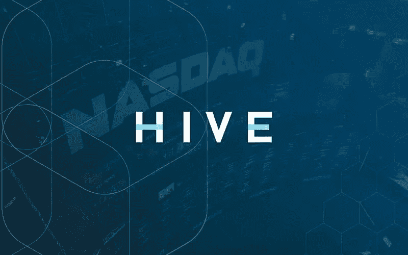

# 先说一下 HIVE Blockchain Technologies Ltd .(纳斯达克代码:HIVE)股票怎么样。

> 原文：<https://medium.com/coinmonks/lets-talk-about-how-hive-blockchain-technologies-ltd-nasdaq-hive-stock-is-doing-4949c6c5038c?source=collection_archive---------66----------------------->

在最后一个交易时段，交易了 272 万股 HIVE block chain Technologies ltd .(NASDAQ:HIVE)股票，其 beta 为 4.34。最近，该公司的股价为 3.62 美元，与上一次收盘时相比，其变化幅度约为-0.02 美元或-0.55%，这使得该公司的市场估值达到 3.86 亿美元。HIVE 目前的交易价格为 1.95 美元