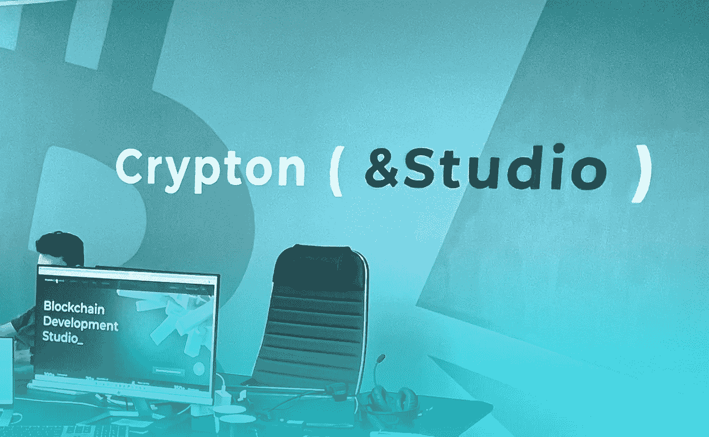

# 我们去 Crypton 工作室的办公室转转吧

> 原文：<https://medium.com/coinmonks/lets-walk-around-the-crypton-studio-office-b952b1c02252?source=collection_archive---------47----------------------->

[Crypton Studio](https://crypton.studio) 是一家专注于区块链开发的 IT 公司。在全球市场 6 年的时间里，我们已经成为欧洲定制区块链开发领域最大的公司。从那时起，我们已经为来自 20 个国家的客户做了 100 多个不同的项目。

在我们的团队中，有 160 多名员工，其中 72%是开发人员，18%是经理、设计师和质量工程师，10%是管理人员。我们负责创建项目的整个过程:从商业分析和开发到设计和签署必要的文件。

> 交易新手？试试[密码交易机器人](/coinmonks/crypto-trading-bot-c2ffce8acb2a)或者[复制交易](/coinmonks/top-10-crypto-copy-trading-platforms-for-beginners-d0c37c7d698c)

我们从经验中了解到，很难找到有才华的区块链开发人员，更容易培养他们。所以我们创建了 Crypton 工厂。我们为公司做实习，由合作公司(B2B)培训开发人员。这使得我们不仅可以将项目外包，还可以进行带有个人风格的专业外包。

*100+已完成项目*

*我们客户的 20 个国家数量*

*全球市场 6 年*

*150 多名员工*

# ***重点领域***

## 交换

我们将开发一个用户友好的交易所，区块链钱包，拥有加密货币，并将做一个伟大的用户界面。

## 智能合同

我们将使交易自动化和安全。消除对中间商的需求，以及相关的延迟和费用。

## 挑战

我们将帮助你转向现代金融体系。将为您的平台提供高质量的加密、分割和耕作。

## 市场

我们将为 NFT 组装一个市场，服务和连接一个分散的支付提供商。我们将添加与您的项目匹配的功能。

联系我们，让我们一起开始你的项目！ [https://crypton.studio](https://crypton.studio/)