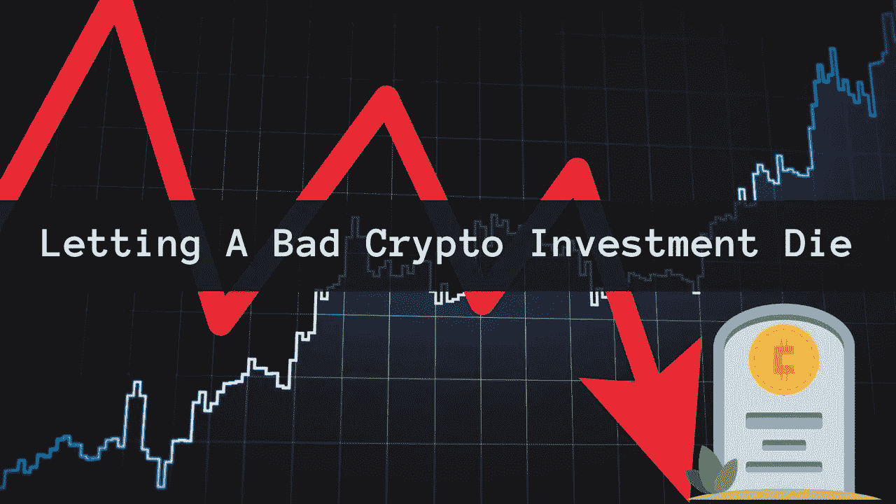
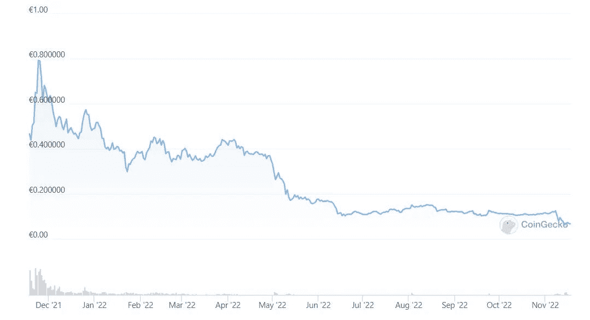
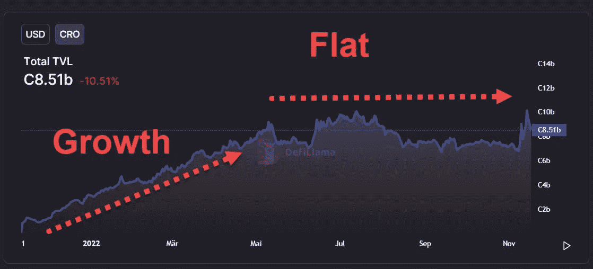

# 让一个糟糕的加密投资死掉

> 原文：<https://medium.com/coinmonks/letting-a-bad-crypto-investment-die-f4808a368e4?source=collection_archive---------18----------------------->

# 双倍下注并不总是好的。

你可能已经读过我上周写的关于 CRO 的文章。虽然我对 CRO 并不感兴趣，但我持有 CRO 代币，根据我上周分享的图表，我的投资下降了 80%左右。

[来源](https://www.coingecko.com/en/coins/cronos)

这里你可以看到更长的时间框架。我最初买 CRO 是为了在 CRO 用他们的 visa 卡返现。我想我付了 0.33 到 0.37 美元。我的买入是在他们削减主要福利之前，CRO 股价跌至 0.20 美元左右甚至更低。我在这里写了那个[。](https://ecency.com/hive-167922/@mypathtofire/cro-arnage-the-importance-of-a-usecase#@cryptosneeze/re-mypathtofire-rym9j)

[来源](https://defillama.com/chain/Cronos?currency=USD)

如果不提供任何好处，人们为什么会使用这些卡呢？你可以从图表中看到 CRO 的 TVL。直到 2022 年 5 月有一个巨大的差异，当时有一个大的增长，然后从 5 月份左右开始持平，接近他们改变 visa 卡的好处。熊市也可能是增长乏力的一个因素，但我认为收益减少是主要因素。

我们现在有一个看起来像是巨大的归属，内部人士已经从代币中取出了大量的价值，我的考虑是，我现在应该在预期反弹的情况下购买一些 CRO 吗？

你会怎么做？

在我研究白皮书、令牌组学以及钱包和用例的数量之前，我认为这将是一个非常好的赌注。我可以希望价格回升，套现我的旧 CRO，并把我的新投资存入银行。什么会出错？

在这个熊市中，还有许多其他机会，押注 CRO 可能不是最好的选择，因为我已经在那里投资了。

虽然从心理上来说，我可能想投资来阻止自己投资失败，但更明智的做法是让这项投资死掉，然后选择我现在能得到的最好的投资。

这意味着，如果我寻求高风险的 10 倍回报，我可以选择另一个替代方案，不像 crypto.com 那样有 FUD、象征性通胀、缺乏用例、增长等。这意味着我将承担更少的风险，并有更大的机会达到我的目标。

困难的部分是当事情发生时，不要认为你需要参与每一个令牌。虽然大多数人关注的是当前正在发生的“时髦的事情”，但更好的做法是关注那些在后台默默工作、日复一日创造利润的项目。

它们可能看起来很无聊，没有等待下一个 10 倍那么令人兴奋，但看到你无聊的加密堆栈慢慢地 10 倍更有价值。

感谢阅读。

**学分:**

使用来自 canva pro 的许可[图像](https://www.gettyimages.de/detail/foto/forex-charts-lizenzfreies-bild/165646728)和图像[源](https://www.canva.com/p/jemastock2/)和
源[在 canva 中创建的标题图像](https://play.google.com/store/apps/details?id=co.mona.android&hl=de&gl=NG&pli=1)

> 交易新手？尝试[加密交易机器人](/coinmonks/crypto-trading-bot-c2ffce8acb2a)或[复制交易](/coinmonks/top-10-crypto-copy-trading-platforms-for-beginners-d0c37c7d698c)