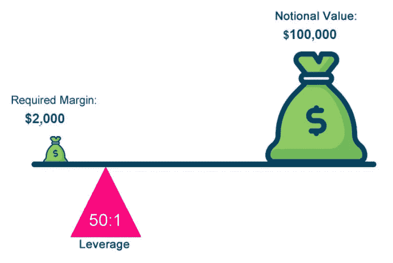

# 交易中的杠杆作用:为什么它只是一种工具而不是罪恶(通过一个例子)

> 原文：<https://medium.com/coinmonks/leverage-at-trading-why-its-just-a-tool-and-not-evil-trough-an-example-e8242cf63df9?source=collection_archive---------32----------------------->

免责声明:没有适当风险管理的杠杆将导致你的清算。不要在没有风险管理知识的情况下使用杠杆。

几个月来，我们一直被告知使用杠杆(当然特别是高杠杆)交易是赌徒的东西，使用 50 倍杠杆是你必须避免的，如果你真的这样做，你的账户很可能会被清算。这是有一定道理的:如果你没有正确管理你的风险，你的账户有 99.99%的可能最终变成 0 美元。

然而，这种妖魔化杠杆的话语也隐藏着对风险管理工具的深刻无知。事实上，你必须清楚，在某些市场(和时间框架)中，没有杠杆你将无法交易，今天我将用一个明显的例子来证明这一点。

> 交易新手？试试[密码交易机器人](/coinmonks/crypto-trading-bot-c2ffce8acb2a)或者[复制交易](/coinmonks/top-10-crypto-copy-trading-platforms-for-beginners-d0c37c7d698c)

假设我是一名外汇日内交易者，我的资料如下:

*   投资组合:1000 美元|风险:1%(= 0.01)| R = 1000 美元 x 0.01 = 10 美元

假设我用“欧元|美元”进行分析，我想在 100 万的时间框架内进行交易，其风险(进场点和止损点之间的距离)为 **0.03% (=0.0003)。**

我的风险是 10 美元。这意味着我最大愿意在一次交易中损失 10 美元，所以让我们来计算一下:

在 0.03%的价格变动中损失 10 美元，我应该接受什么样的合约价值？

*   (1000 美元 x 0.01)/0.0003 = 33，333.33 美元

这是什么意思？我们可以得出两个非常重要的结论:

1.  因为我的账户是 1000 美元，加上这些风险管理数据，我真的不能在没有杠杆的情况下交易。事实上，我需要+30 倍的杠杆才能接受。-> **杠杆是工具！**
2.  如果我错了，如果我的交易想法失败了，我只会损失 10 美元(+差价+我正在排除的费用)，因为我正确地应用了风险管理工具。-> **杠杠不作恶！**

当然，杠杆并不总是必要的，而且(当然)有一些限制。我还想借助这张表给你们展示一个例子。

让我们跟上 1000 美元的投资组合(一些例子)

*   如果我想进行 0.03%的风险交易，我必须投入 33.333，33 美元才能损失 10 美元，所以我必须使用杠杆。事实上，我不能接受低于 x50 的交易。
*   如果我想进行 0.1%的风险交易，我必须投入 10，000 美元来损失 10 美元，所以我仍然必须使用杠杆。事实上，我不能接受低于 10 倍杠杆的交易。
*   如果我想进行 1%的风险交易，我必须投入 1000 美元来损失 10 美元，但是我仍然需要使用杠杆，因为我通常需要支付费用。我可以决定使用 x2 杠杆。
*   如果我想进行 3%的风险交易，我必须投入 333，33 美元来损失 10 美元，所以我不必使用杠杆(但如果我想，我可以这样做)。另一方面，我不能对 x50 使用杠杆，因为如果我这样做，我的平仓水平会比止损更接近我的进场，所以我会被平仓。只是数学:100 / 50 = 2 ->在 x50 杠杆交易中，任何风险超过 2%的操作都会被平仓。
*   诸如此类…

我想明确一点，这不是一个鼓励你使用高杠杆(或根本不使用杠杆)的帖子，而是要表明这只是一个你可以使用的交易工具(甚至有时你只是不得不使用)。

此外，我想请你质疑那些反复念叨“使用杠杆(当然特别是高杠杆)进行交易是赌徒的东西”、“使用 50 倍杠杆是你必须避免的事情”和“你的账户很可能会被清算”的人的话。

总而言之，我想提醒你，交易中最重要的技巧是风险管理和资金保值，所以学习风险管理，运用这些策略，安全交易。

感谢您的阅读。

您可以在以下网址找到我:

推特:[https://twitter.com/Trader_WB](https://twitter.com/Trader_WB)

YouTube:【https://www.youtube.com/channel/UCTkUdfI6gL4oKQcT_wMX1Tg 