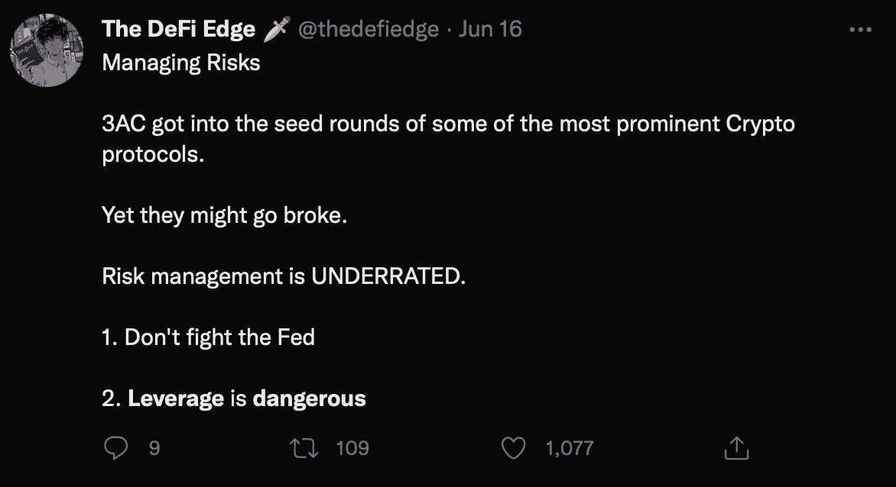

# 杠杆:万恶之源。

> 原文：<https://medium.com/coinmonks/leverage-the-bane-of-all-evil-2ee2497c0fb9?source=collection_archive---------13----------------------->

市场已经崩溃，在 Twitter 上快速浏览一下就会发现罪魁祸首:**杠杆**。我们看到和听到人们声称“你应该尽可能远离杠杆”。你应该吗？

source: @thedefiedge — Twitter

# 杠杆是什么？

首先:术语“杠杆”在 DeFi 中是一个简单但经常被误解的术语。Investopedia 将其描述为“…一种利用借来的钱来增加投资的潜在回报的投资策略”，杠杆的使用应该相当简单:无论何时你获得一笔贷款并用这笔贷款来增加你的潜在回报，你都在使用杠杆。

在传统金融中，杠杆通常用于交易。例如，在币安中央交易所，投资者可以通过保证金交易账户“杠杆化”交易。他们从交易所借钱，以加强他们的交易。看起来是这样的:

你有 200 美元，借 800 美元，给你 1000 美元投资。你买了比特币，由于你惊人的预测能力，它的价值立即翻倍。你价值 1000 美元的比特币现在价值 2000 美元，干得好！你卖掉你的比特币，还清你的 800 美元贷款，剩下$2000 — $800 = ) 1200 美元给你自己。尽管比特币“仅仅”增长了 100%，你却从 200 美元涨到了 1200 美元，500%的利润！

现在这为你的交易提供了动力。500%不是偶然的。当你在价值 200 美元的抵押品上再借 800 美元时，你可能投资的总价值是现在的 5 倍。这意味着你交易的利润和亏损的速度是原来的五倍。5 倍风险/回报。

杠杆由两件事组成:

1.  借入资金的使用
2.  目的是加强投资

# 那么危险在哪里呢？

当市场上涨时，加强你的投资是非常好的:你借了一堆资金，看到蜡烛变绿，然后退出。当市场下跌时，情况就不那么好了。如果你的(多头)杠杆是 5 倍，价格下跌了 20%，你(有时会自动)被迫卖掉一切，只是为了偿还你的贷款:清算。如果贷款没有自动偿还，你错过了应该强制出售一切的时机，你最终会负债。当然，当债务高达数百美元时，这可能是一种风险。然而，真正的风险是，一个庞大的秘密对冲基金最终负债 350 万美元。

> 如果你欠银行 100 美元，那是你的问题。如果你欠银行 1 亿美元，那是银行的问题。

那笔债务，不是电子表格上的数字。另一头坐着真人。人们将资金存入账户，相信他们可以随时取回。相信银行会明智地使用这笔资金，并确保他们能够偿还贷款。

有时这不会发生。

这是因为，虽然他们可能会尽最大努力不违反信任，但错误还是会发生。最安全的信用检查不能防止投资错误的发生，这意味着像这样的贷款总是有违约的风险。当这种风险转嫁给贷款人时，可能会导致我们在过去几个月中看到的污染效应:一个借款人无法偿还贷款，导致贷款人无法向贷款人偿还贷款，如此循环往复。

风险/回报的增加并不是杠杆的危险所在。违约污染才是真正的危险所在。再加上清算导致的价格下跌引发的清算瀑布，你可能会看到前所未有的崩盘。直到过去的几个月。

> 愚弄我一次，你真可耻。愚弄我两次，我感到羞耻

# 解决方案:不再使用杠杆？

虽然清算级联有尚未解决的固有风险，但污染影响可以被抑制到最低限度。解决方案:不要让贷款人承担违约风险。

过度抵押贷款协议就是这样运作的:你抵押的抵押品比你借的多，这意味着如果你违约，没有人会受到伤害。这种对违约时突然伤害的保护，是以一种渐进的、几乎察觉不到的其他伤害为代价的。过度放牧将数百亿美元锁定在生态系统之外，削弱了我们的赤字增长。

杠杆可能是金融领域非常强大的工具，投资者被它吸引的原因有很多。任务不是完全摆脱杠杆。诀窍在于创造杠杆，同时让借款人承担违约风险。一个自动清算系统，类似于一个单独的保证金交易，不同之处在于它跨越整个投资组合，而不是简单的单一交易。

# 解决方案:通过循环利用？

循环是创建杠杆头寸的一种流行方式。循环的好处是违约风险不会转移给贷款人，防止了上述问题。同时，你可以借比你的抵押品总价值更多的钱。怎么会？

1.  存价值 100 美元的抵押品，借 80 美元的贷款
2.  存款收到贷款作为抵押，拿 60 美元贷款
3.  重复直到 0。

这些确切的数字是行不通的，因为你可以借的金额是百分比，但你得到了要点。最后，你总共借了 200 美元，而你开始时的抵押品价值为 100 美元。神奇的互联网钱！

敏锐的读者会注意到这种借贷方式有几个缺点。首先，虽然你总共借了 200 美元，但现在所有的钱都被锁定在协议中。如果你的存款 APY(你得到的利息)大于你的借款 APY(你支付的利息)，协议将会慢慢出血。完全不可持续，这些协议知道*。任何像这样运作的产品都是一个等待发生的地毯。相反，如果情况相反，你会慢慢地流血不止，因为你付出的比你得到的要高。

此外，除了将其锁定为抵押品之外，你最终只能用零美元做任何事情。每一次循环都在削弱你的投资，而不是加强你的投资。是杠杆的坏处，没有好处。

*如果你循环交叉保证金，即你存入的代币不同于你借入的代币，循环可能有利可图。寻找有利可图的令牌对是困难的，并且通常是高风险/低回报的，但是为了完整性，重要的是要注意。

# 解决方法:杠杆还是杠杆？

并非所有的杠杆都是一样的。基于信任的杠杆会通过污染导致市场崩溃&基于循环的杠杆效率极低。与此同时，完全避免杠杆会导致巨大的机会成本，因为对资金的需求会导致数十亿美元的损失。

我们陷入僵局了。

当然，我们不会给你带来一系列的问题，也不会提供解决方案。我们称之为:[主账户](https://docs.deltaprime.io/prime-brokerage-account/prime-account)。主要账户本质上是一种以资本高效的方式提供杠杆的方式，同时防止污染效应。通过在专用智能合同中加入安全措施，T2 借款人可以获得资金，而不会让贷款人承担违约风险。你可以将借来的资金和抵押品投资于你通常会投资的协议。增加你自己的风险/回报，而不增加其他人的风险。

# 包起来。

如果没有杠杆，我们将面临数百亿美元的机会成本风险。利用杠杆有 4 种潜在风险:

*   倍增的风险/回报
*   清算级联
*   污染风险
*   缺乏可持续性带来巨大风险。

利用一个主要账户可以消除下面两个风险，以及机会成本。增加风险/回报是杠杆的目标。这给我们留下了清算级联的可能性。目前，没有办法在不冒这些级联风险的情况下提供杠杆。这意味着我们的贷款系统还有待改进。但是到目前为止，我们所看到的污染效应不会再发生了。

同时，我们也在不断改进。

# 关于 DeltaPrime

DeltaPrime 是您的主要经纪人，致力于释放 DeFi 的全部潜力。我们提供安全的低抵押贷款，没有任何信用检查，重新分配资产，重点是最大限度地发挥资金效用。我们的投资者建立在 Avalanche 网络的坚实基础之上，可以确保他们最重要的投资获得快速可靠的交易。

> ***|🐦***|👾* [*不和*](https://discord.gg/9bwsnsHEzD)*|*ℹ️[*文件*](http://docs.deltaprime.io)***