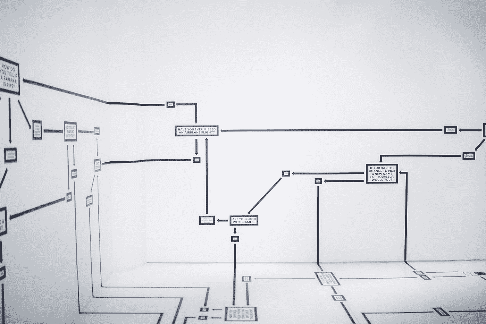
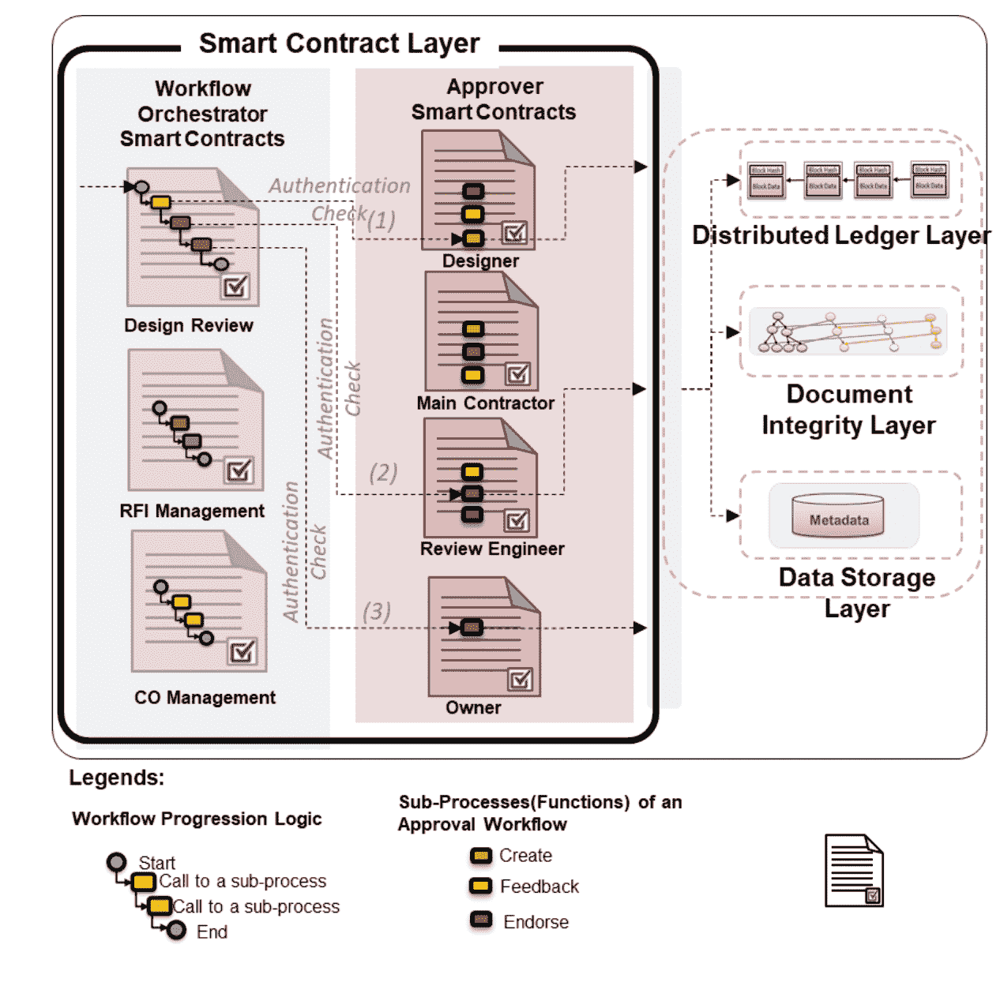
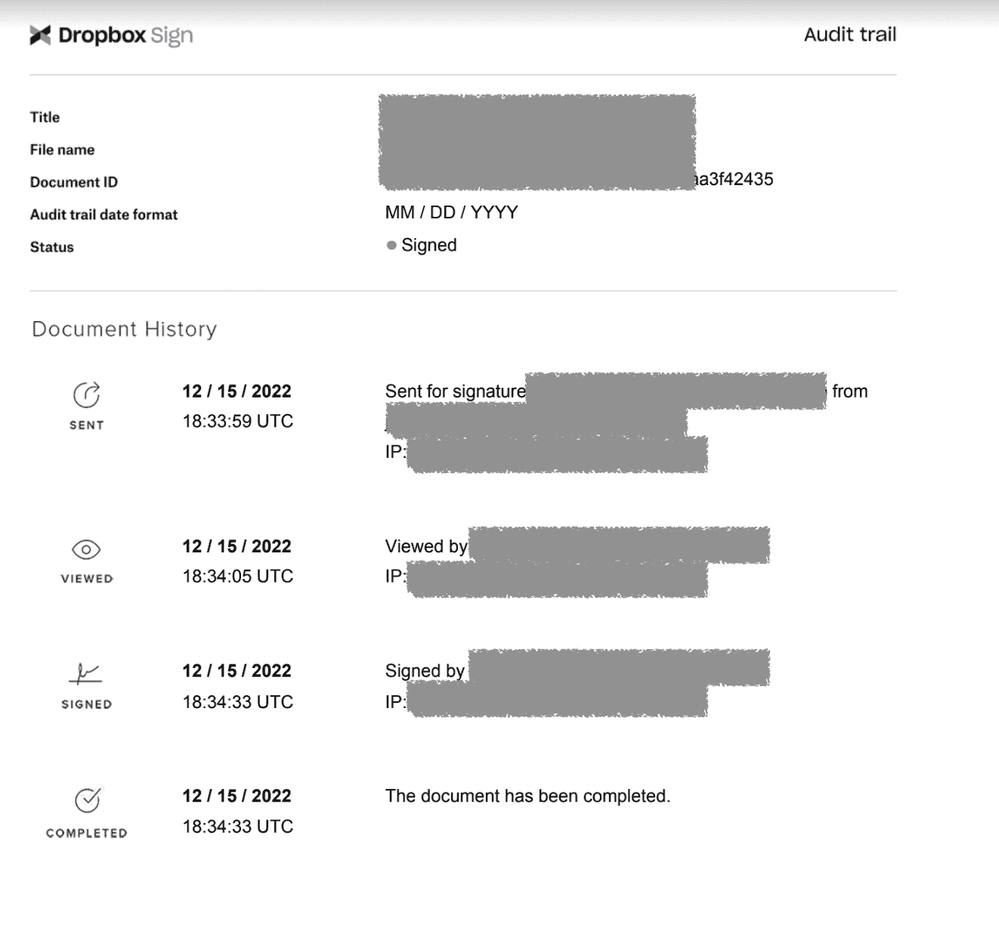

# 利用区块链技术自动化审批工作流程

> 原文：<https://medium.com/coinmonks/leveraging-blockchain-technology-to-automate-approval-workflows-86619c81070a?source=collection_archive---------34----------------------->

在当今的全球经济中，业务流程不断发展，需要创新的解决方案来自动化和简化工作流程。可以利用区块链技术有效地自动化这些流程，减少手动跟踪和批准文档所花费的时间和精力。它可以用来安全地存储数据，跟踪文档更改，并提供对批准过程的访问，使企业能够使用工作流管理系统来降低成本和提高效率。

> 交易新手？在[最佳密码交易所](/coinmonks/crypto-exchange-dd2f9d6f3769)上尝试[密码交易机器人](/coinmonks/crypto-trading-bot-c2ffce8acb2a)或[复制交易](/coinmonks/top-10-crypto-copy-trading-platforms-for-beginners-d0c37c7d698c)

# 将区块链用于审批工作流的优势

将区块链技术融入审批流程有很多好处。首先，区块链允许分散的分类帐，这意味着工作流中的参与者可以访问相同的信息。这意味着参与交易的所有各方都可以实时、透明地查看交易。

Architecture of the Smart Contract Layer for Document Approval Workflows, [Source](https://www.researchgate.net/publication/355824946_A_blockchain-based_integrated_document_management_framework_for_construction_applications)

第二，使用区块链技术和智能合同审批工作流可确保所有数据都得到安全存储和公证，没有单一实体或中介控制数据。这消除了数据泄露、伪造、篡改、被盗或丢失的风险。所有参与者以及外部各方(如审计员)都可以通过提高审批流程的可见性来信任审批记录。这对于拥有许多不同部门和分支机构的大型组织来说可能特别有用，因为它们需要遵守严格的法规遵从性和治理规则。

此外，使用智能合同，批准过程可以自动化和加速，并防止批准错误或借口。参与者可以安全地共享文档并实时签署任务，消除延迟并最大限度地降低风险。

# 基于区块链的数字签名如何工作

许多审批工作流应用程序都具有数字签名功能。数字签名是手写或打字签名的电子版本。数字签名通常用于保护合同和其他类型的商业协议。

Typical web2.0 eSign application trail page. Blockchain can be implemented for data-trust, compliance and transparency.

当有人在区块链上签署文档时，他们的私钥会加密与文档相关的信息，包括文档内容和他们的身份(元数据)。加密后，数据将与相关文档一起添加到区块链中。然后私钥被用来解密签名的数据，证明加密数据的人就是后来解密数据的人。此过程是可审核的，这意味着多方可以查看与区块链相关的信息，包括正在签名的文档、文档签名人的身份以及签名的日期和时间。

# 关闭

使用区块链技术，您可以在没有中介的情况下实现业务流程自动化，并获得成本效益之外的许多好处。您的数据以分布式方式存储，因此每个人都可以信任它，无论是房屋抵押贷款、房地产合同、租赁协议、业务合作伙伴关系还是内部项目。借助区块链技术，文档生命周期、审批工作流、数字签名和业务流程都符合法规要求。

*👉*[*gear Chain*](http://www.gearchain.io)*—供应链零编码区块链 App 构建者。
👉*[*Gear NBS*](http://getgear.io)*—零编码库存 App Builder 与 Google Sheets*