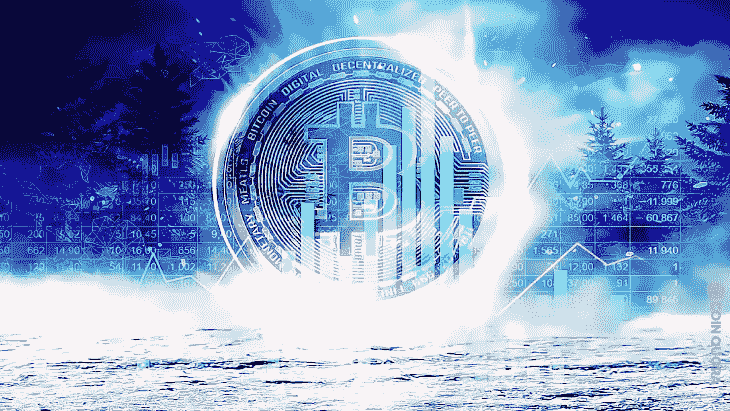

# 利用熊市:作为散户和大规模投资者如何度过加密冬天

> 原文：<https://medium.com/coinmonks/leveraging-the-bearish-market-how-to-navigate-crypto-winter-as-a-retail-trader-and-large-scale-1c0c456f3c92?source=collection_archive---------13----------------------->

Crypto Winter is coming… | [Capitalize Financial](http://capitalizefinancial.com/crypto-winter-is-coming-warns-experts/)

加密市场或特定加密货币经历巨大低迷的时间点被称为加密冬天。当市场失去其价值时，市场被认为是熊市，这进而导致相关加密货币的价格大幅下降。尽管熊市不利于投资，但专家表示，这是投资的最佳时机。

有趣的是，由于最近发生的重大衰退，许多人在这个阶段发现自己对加密市场失去了兴趣。由于害怕失去所有的资本和可用利润，他们以低价出售代币。话虽如此，出现的问题是，谁是那些购买这些代币，即使在市场最低？

在这篇文章中，我们将关注最近发生的重大衰退事件以及它对行业的影响。我们还将看看在这些事件中可能出现的机会，以及作为散户或大规模投资者，如何利用 crypto winter。

## **熊市和隐秘的冬天**

当一个市场经历投资价格的长期下跌时，这个市场就被认为是熊市。熊市的标准基准是大盘指数相对于近期高点下跌 20%。个股市场可能会下跌，整体市场也可能下跌。

例如，如果 Dogecoin 最近的高价是 50，000 美元——只是说，不要那样看着我。只有当价格下跌 20%或更多时，加密货币才会被认为是熊市。熊市的主要优势在于，它为长期投资者提供了一条以更低的价格买入更多的途径。

与熊市类似，加密冬天也是加密货币市场资产价格的长期下跌。也就是说，这是熊市的第二种情况，涉及整个市场。它可以随机发生在加密货币上，也可以共同影响大量加密资产。

由于没有价格预测的标准模型，预测“加密冬天”的爆发是困难和具有挑战性的。对于缺乏经验的投资者来说，这是他们投资之旅中最艰难的时刻。如前所述，长期投资者求助于“逢低买入”，希望市场在长期结束时反弹。

From crypto winter to defi… | [Blogger](https://cryptsnews.blogspot.com/2019/05/from-crypto-winter-to-defi-year-of-loss.html)

## **2022 年密码市场的重大事件**

与其他全球金融市场一样，加密货币市场在 2022 年初经历了一次大崩盘。

**降价**

**1。** **比特币和以太坊价格下跌**:2022 年 7 月 13 日比特币跌至 19617 美元，以太坊则跌至 1431 美元

**2。** **Dogecoin 价格下跌:** Dogecoin 下跌至 0.06154 美元，同时下跌的还有其他几种顶级加密货币，如卡尔达诺、XRP 和索拉纳等。

**裁员**

**1。****Crypto.com 裁员:**Crypto.com 裁员 2000 多人，约占员工总数的 40%。尽管该公司在报告中低估了这一数值，但 CoinDesk 报告称，约有 30% — 40%的员工被解雇。今年年初，该公司解雇了 260 名员工(占员工总数的 5%)。

**2。** **无链资本**2022 年 11 月 18 日裁员 15%。**比特币基地**减少 60 个工作岗位； **Meta** 裁员 11000 人**神话游戏**裁员 10%甚至更多。

**3。**T22【瓦尔基里投资公司】T23。:随着加密冬天开始，加密 ETF 提供商最近解雇了 30%的员工。

其他受到影响的公司包括 BitMEX、Buenbit、Bitso、Bullish.com 2TM、Bitpanda 等。

**崩溃**

**1。** **FTX 破产:** FTX 在经历了 11 月初的多次客户提款后，最近崩溃了。据报道，该公司创始人声称，可用的储备资产不足以满足客户需求。

**2。** **卢娜崩盘:**5 月 7 日，价值超过 20 亿美元的 UST 被平仓，数亿美元被清算。这使得 UST 的价格降到了 0.91 美元。当 Luna 加密网络崩溃时，估计有 600 亿美元从数字货币领域消失。

**3。** **3AC:** 三箭资本由于被强制清算，受到了露娜倒闭的影响。

世界第二大交易所的崩溃为密码行业创造了一个充满不确定性和难以置信的机遇的环境。虽然这对那些计划加入加密市场的人来说是一个坏兆头，但它被认为是加密和 web3 行业前景看好的一个指标。

给公平一个机会，FTX 的崩溃和破产是市场中一个可信的参与者，也让利益相关者看到了生态系统的脆弱性。虽然周围有很多挑战，但还有更多潜在的机会，比如购买。

根据 Coindesk 的 [Glenn Williams](https://coincodex.com/markets/2022/11/11/post-ftx-what-happens-to-crypto-markets/) :“没有消灭区块链和其他加密企业的东西会让它们变得更强大，因为它们自身是新的强化迭代。

据报道，埃隆·马斯克曾表示，尽管市场的冬天可能会很长，但比特币将会成功。根据特斯拉首席执行官在 twitter 上举办的空间中的说法，未来是比特币、以太坊和 Dogecoin。

据一个 tweep (@FroogCo):

> *加密市场下跌不利*
> 
> *Nfts 坏了*
> 
> *Defi down bad*
> 
> 当大多数人对这个领域失去信心时，这是双倍下注的最佳时机。
> 
> 今天就开始在 Web3 工作，为下一个不可避免的周期做好准备。你会成为一个传奇。
> 
> ~ @Froog (Web3 工作板)11 月 22 日上午 9:38 | 21

底线是，市场的低迷并不意味着 crypto、区块链或 web3 没有前途，也不意味着它们即将走到尽头。事实上，这只是一个去中心化的金融平台的开始，它将核心的个人价值纳入检查范围。

像 SFB 这样的人是被区块链科技承诺的正直这把利剑弄明白的。

请分享您对加密货币、区块链和 web3 的未来的看法。你认为这个神秘的冬天会是长是短，之后会发生什么？

点击[此处](/@abdulmuminsolihu/)关注我，了解更多关于加密货币、web3、金融科技、区块链和元宇宙的内容。也可以在 [LinkedIn](https://www.linkedin.com/in/abdulmuminsolihu) 上联系我。

> 交易新手？尝试[加密交易机器人](/coinmonks/crypto-trading-bot-c2ffce8acb2a)或[复制交易](/coinmonks/top-10-crypto-copy-trading-platforms-for-beginners-d0c37c7d698c)