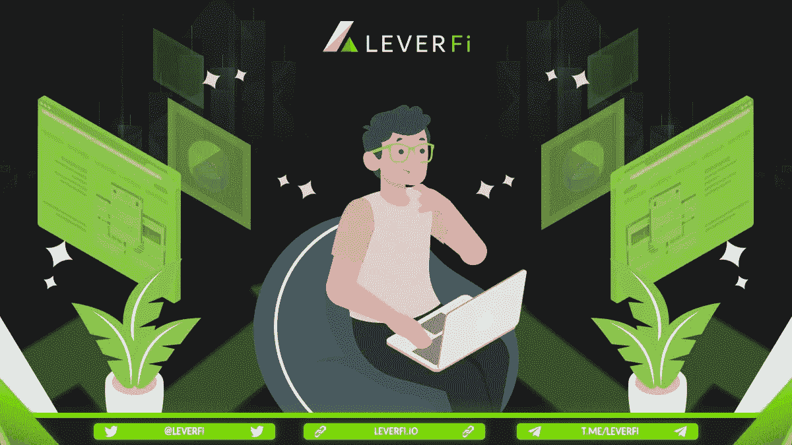
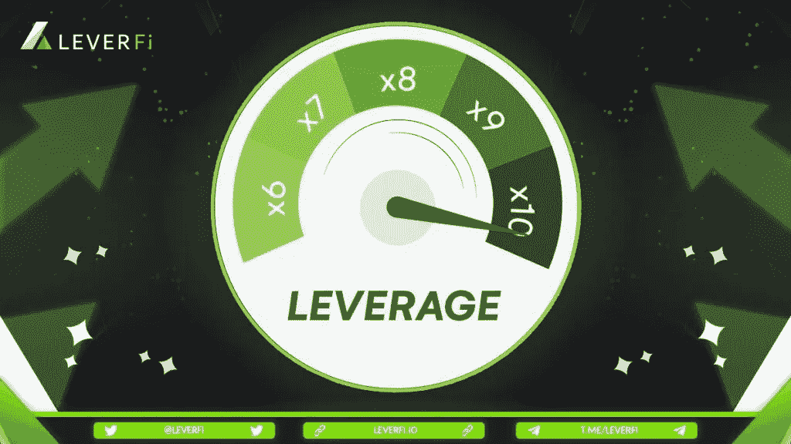
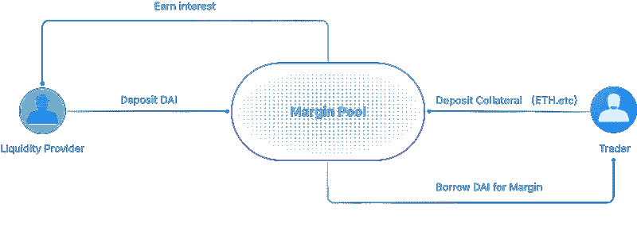
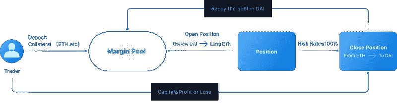

# 杠杆网络是什么

> 原文：<https://medium.com/coinmonks/leverfi-review-what-is-lever-network-lev-2e0b1c425dbf?source=collection_archive---------64----------------------->

自 2020 年爆发式增长以来，去中心化金融(或 DeFi)一直受到很多关注和欢迎，经常出现在主流媒体的头条新闻中。随着指数级增长，DeFi 记录的锁定总价值(TVL)为 412.9 亿美元，其中近 90%来自贷款和 DEX 产品。(通过除颤脉冲)

借贷和交易是当前 DeFi 领域中 TVL 量最高的两个主要业务。然而，它们实际上是相互隔离的，这导致资本效率极低。很少有贷款协议支持体育甚至保证金交易，而且大多数 dex 不提供贷款。此外，尽管用户在存入信用协议后收到了可转让和可交易的 CD，但有几个平台实际上使他们更容易在金融上使用它们。

因此， [**杠杆**](https://bit.ly/BinanceRegistation) 旨在弥合借贷和 DEX 协议之间的差距，提高 DeFi 中的资本效率。

**欢迎来到 LEVER**
LEVER 本质上是一个开源的保证金交易平台，你可以借出、借入和交易杠杆，购买多头/空头资产，但只能在一个地方进行。

对于贷款人/借款人，您可以将您未使用的加密资产(包括来自其他贷款协议的 CD)借出以赚取利息，或将其用作贷款的抵押品。

对于交易者来说，在保证金池中存入保证金后，你将能够以高达 3 倍的杠杆做多或做空受支持的资产。该平台使用 Uniswap 等外部资产管理工具向保证金交易者提供超额流动性，以开立任何规模的头寸。

利用杠杆，你可以方便地使用你的可用资本获得更大的利润。

**为什么是杠杆？**
控制杆的主要特性解释如下:

有效利用资产:杠杆用户可以将他们未使用的加密资产借给其他人，并获得更高的利率。

交易快捷方便:借贷交易全面融入杠杆。交易者只需一步就可以轻松做多或做空。在杠杆的未来版本中，还将支持市价单、限价单和止损单。

巨大的流动性:依靠 Uniswap、Sushiswap、Pancakeswap 和 1inch 等 AMMs，Lever 可以为你的交易提供高流动性。它还能够有效地减少开仓或平仓时的滑动。

更多的代币可以被卖空:除了 WBTC 和 ETH，更多的 DEFI 和 ERC20 资产，如 SNX、UNI 和 AAVE 可以被卖空。杠杆还提供了一个可视化的位置控制操作界面。

贷款的额外抵押品选择:除了 ETH、DAI 和等常见的本地令牌之外，Lever 还允许用户使用其他贷款协议的存款证进行借款，如 Aave 的 aTokens 和 Compound 的 cTokens。

**市场问题**
如上所述，根据我们的观察，DeFi 的问题主要在以下几个方面:

贷款产品和 dex 之间的差距。借款和资产交易活动通常发生在两个不同的地方。用户将不得不首先经历从贷款平台获得贷款，然后在他们喜欢的交易所交易的紧张过程。
用户托管资产的低效使用。通常，用户在借贷协议中存款后会收到令牌化的存单，如 AAVE 的 aTokens 和 Compound 的 cTokens。这些代币代表其基础资产的价值，但很少能被重新用于投资或交易。
稀有的 DeFi 产品支持保证金交易。保证金交易可以有效增加交易者的利润。它在传统金融市场很受欢迎，在 DeFi 领域也有巨大的需求。虽然有几个协议提供这种服务，但它们的流动性不够。

**解决方案及特点**
*快速便捷的交易*-借贷和交易完全集成到杠杆中。交易者可以在一个地方轻松借入和交易资产。杠杆还提供了一个可视化的位置控制操作界面。
*高资本效率*——除了自己的代币，出借人还可以存入 AAVE 阿托肯和 cToken 复合代币，赚取额外的杠杆利息。这使得利息翻倍成为可能，因为贷款人可以首先将其资产存入 AAVE/化合物，然后使用由此产生的 aTokens/cTokens 重新存入杠杆。此外，这些代币还可以用作贷款的抵押品。
保证金交易和巨大的流动性。凭借杠杆强大的保证金池，交易员可以轻松建立杠杆头寸，做多或做空某项资产。除了 WBTC 和瑞士联邦理工学院，许多 DEFI 和 ERC20 资产，如 SNX、UNI 和 AAVE，现在都可以进行短杠杆操作。此外，通过依赖 Uniswap 等 AMMs，Lever 可以提供充足的流动性，并减少任何规模头寸的滑点。

**融资融券交易的好处**

-利用杠杆买入或做空某些资产。

用户大多利用他们的资产或新的投资机会获得紧急贷款。

例如，如果您长期持有资产 A，并看好资产 B，在这种情况下，您可以将资产 A 存入杠杆作为抵押，并根据您的偏好借入一种稳定的货币，如或戴，带或不带杠杆，然后将其交换到资产 B。一旦这两种价格都上涨，您的利润将增加。

——获得更多的被动收入。

除了从存款中获得利息，您还可以通过杠杆流动性挖掘计划获得 LEV 代币。

**如何做融资融券交易？**

以下是保证金杠杆交易指南:

-存款:首先，你需要将任何受支持的资产存入杠杆。该平台支持各种可以用作抵押品的资产，这些资产可以在存款后开始赚取利息。

-盈利:存款后，只需进入保证金，点击你要交易的资产对的卖出(做空)/买入(买入)。

——开仓:根据可用存款设定所需金额，作为贷款的抵押。然后选择杠杆率，系统会自动换算可用于该笔交易的最大金额。

如何以及在哪里购买 LEV token？
[**点击此处，从最安全的地方获取 Lev 令牌**](https://bit.ly/BinanceRegistation)

> 交易新手？尝试[加密交易机器人](/coinmonks/crypto-trading-bot-c2ffce8acb2a)或[复制交易](/coinmonks/top-10-crypto-copy-trading-platforms-for-beginners-d0c37c7d698c)