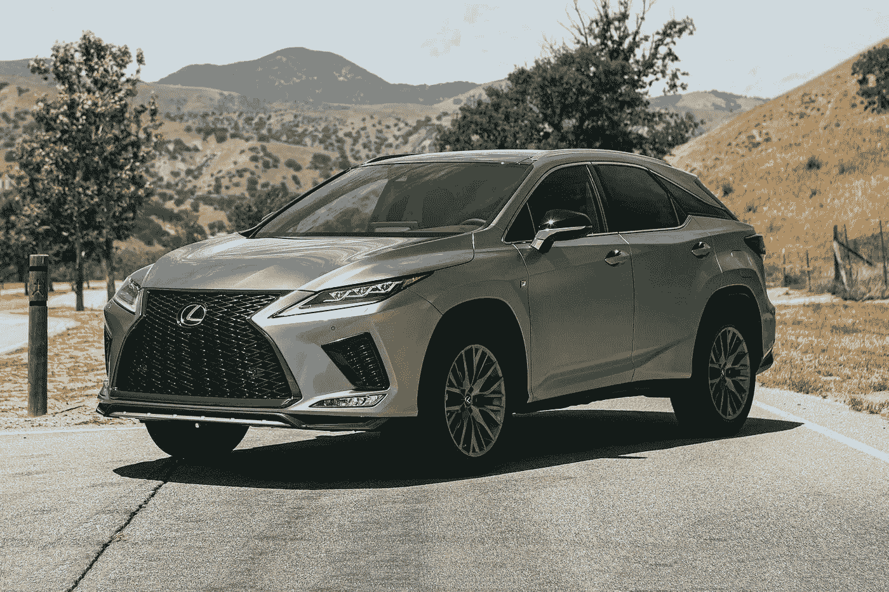

# 雷克萨斯 NFT 抵达多边形。MATIC 的另一项顶级交易

> 原文：<https://medium.com/coinmonks/lexus-nfts-arrive-on-polygon-another-top-deal-for-matic-4d79ba217d5e?source=collection_archive---------15----------------------->

雷克萨斯将向雷克萨斯性能驾驶学校(LPDS)的参与者发放 Polygon 上铸造的 NFT，作为他们赛道体验的纪念品。丰田的优质品牌在加利福尼亚州蒙特雷的传奇拉古纳塞卡赛道组织了快速驾驶课程。

在专业司机的指导下，参与者将学习在路边驾驶跑车的技术，进行一系列计时圈，并学习如何在临界条件下控制汽车。

他们的表现将被车载遥测系统记录下来，并通过 NFT 传送给车手。每位司机的车载视频短片也将随代币一同发布。

# 在区块链开了一天车

雷克萨斯性能驾驶学校是丰田优质品牌寻求的快速运动驾驶项目。在 Laguna Seca 路缘石和简报室度过的一天，学习赛道驾驶技术，然后将它们付诸实践，手中拿着秒表。前勒芒冠军、雷克萨斯品牌大使斯科特·普鲁特(Scott Pruett)将担任讲师。

参与者将参与计时挑战、受控打滑测试、快速圈速以及汽车爱好者能想象到的任何活动。这一切都发生在传奇的 WeatherTech Raceway Laguna Seca，这是印地方程式赛车和 MotoGp 赛车史诗般挑战的现场。作为当天的提醒，参与者将收到 NFTs，他们可以在其中追溯他们在赛道上的经历。

# 雷克萨斯，创新不断

雷克萨斯是丰田章男本人想要的丰田高级品牌。这位已故的实业家，世界第一汽车集团的前董事长，想要在世界各地的市场上与奥迪、奔驰和宝马竞争。为此，他需要豪华的高端汽车，但至少要和欧洲竞争对手一样快速可靠。

因此，有必要部署巨大的经济力量和丰田集团可支配的最具创新性的东西:生产工厂、技术以及最好的研发资源。这是一次成功的挑战，雷克萨斯汽车是迄今为止最畅销的高档汽车之一，这要归功于母公司自成立以来一直采用的极端技术研究。

在区块链时代，这一挑战自然体现在从该行业借来的技术所能提供的好处上。一个还远未发挥其全部潜力的生态系统，在汽车领域发现了不止一个令人高兴的用途。

雷克萨斯是一个令人愉快的举措，肯定会通过利用不可替代代币的普及来建立客户忠诚度，但它肯定不是行业中唯一的用例。例如，在奢侈品制造商中，我们发现兰博基尼及其 NFT 系列正准备推出下一款产品。

*原载于 2022 年 10 月 17 日*[*【https://bitnewsbot.com】*](https://bitnewsbot.com/lexus-nfts-arrive-on-polygon-another-top-deal-for-matic/)*。*

> 交易新手？尝试[加密交易机器人](/coinmonks/crypto-trading-bot-c2ffce8acb2a)或[复制交易](/coinmonks/top-10-crypto-copy-trading-platforms-for-beginners-d0c37c7d698c)