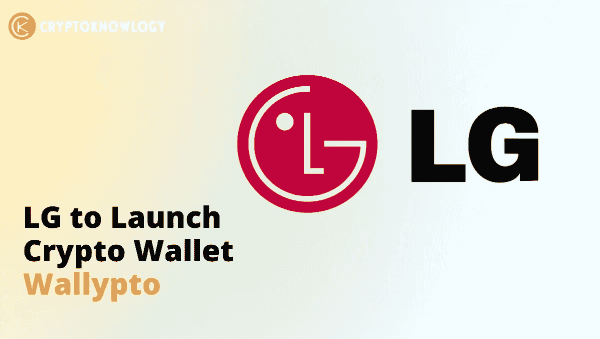
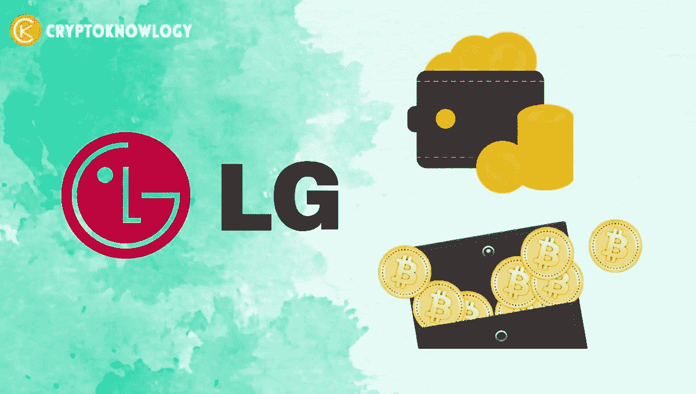
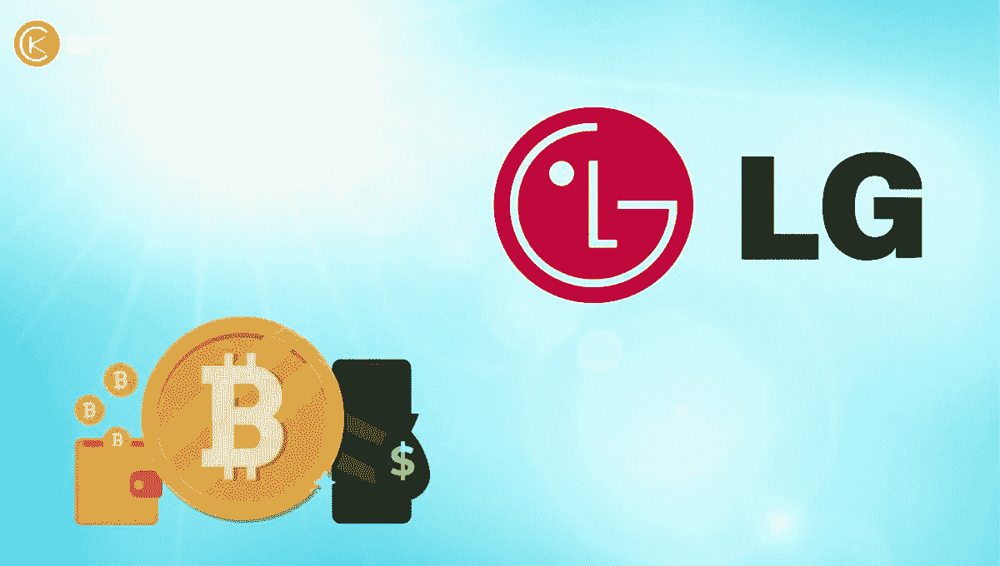

# LG 将推出加密钱包 Wallypto

> 原文：<https://medium.com/coinmonks/lg-to-launch-crypto-wallet-wallypto-dd1ce5532073?source=collection_archive---------31----------------------->

韩国电子巨头 [**LG**](https://www.lg.com/in) 正在开发一款[加密货币钱包](https://cryptoknowlogy.com/what-is-crypto-wallet/)应用 **Wallypto** ，并将于今年晚些时候发布。Wallypto 钱包是该组织新业务阶段的一部分，该组织最近将注意力从**移动设备**转向**软件解决方案**。首次亮相时，Wallypto 将只支持 **Hedera Hashgraph** 资产。

# 关于 Wallypto 加密钱包:

LG 的[加密货币](https://cryptoknowlogy.com/)钱包的首次亮相将是该公司业务组合现代化的第一步，该公司的业务组合历来侧重于**电子产品**。

自 8 月份以来，LG 电子一直在与开发者一起对该应用进行积极的测试，推出的道路并不平坦。然而，据当地媒体报道，beta 测试已经进入最后的验证阶段，该公司现在正期待着它的推出。

据报道，在通过最后的验证阶段以发现系统缺陷后，预计最早在第三季度或最迟在年内发布。

**海德拉哈希码** [区块链](https://cryptoknowlogy.com/what-is-blockchain-and-how-does-it-work/)支持 Wallypto [加密货币](https://cryptoknowlogy.com/how-to-protect-your-cryptocurrency-from-hackers/)钱包。当它正式发布时，有计划增加其支持的[加密货币](https://cryptoknowlogy.com/top-10-crypto-research-tools/)和令牌的数量，包括 **Hedera 的 HTS 令牌**。

根据 LG 电子的说法，[加密货币](https://cryptoknowlogy.com/why-cryptocurrency-is-so-volatile/)钱包应用的功能效用仍然不完全明显。

据报道，该公司的一名代表告诉当地新闻媒体 News1，LG 尚未决定钱包应用程序是否真的有用。然而，该公司仍在努力将即将到来的区块链技术用例纳入其公司章程。

# 出色的 Wallypto 功能:

LG 电子的加密货币钱包为世界各地的客户提供了难以置信的好处。例如，据当地媒体消息称， **Wallypto** 可能与 LG 的一些电子设备相连。它包括连接到使用该公司的 **LG ThinQ 物联网(IoT)** 平台创建的项目。

根据该报告，“还预计通过将区块链技术与目前的旗舰企业如家电和电气领域相结合，将产生协同效益。”

利用**区块链技术**,[钱包](https://cryptoknowlogy.com/best-hardware-wallet-2022/)将管理[加密货币交易所](https://cryptoknowlogy.com/best-cryptocurrency-exchanges-in-2022/)的库存管理，并处理和验证加密货币交易。

LG 将区块链技术融入其网络的想法并不新鲜。该公司在今年 2 月宣布，其智能电视系列将包括**不可替代令牌(NFT)** 平台特征。然而，LG 选择跟随竞争对手三星电子的脚步。

世界上最大的电子产品制造商之一采用区块链技术，可能会成为其他对追随这一热潮感兴趣的企业的跳板。

LG 电子以 27.11 万亿韩元(约合 200 亿美元)的惊人销售记录，成为去年全球最大的家电销售商。

虽然 LG 电子可能是第一家提供**加密钱包软件**的公司，但它不会是唯一一家。比你预期的更快，Wallypto 的发布将会导致其他电子企业更多地采用区块链技术。

# 股东支持 LG 加密经纪业务:

在该公司 3 月份的年度股东大会上，利益相关者批准了加密货币修改的经纪业务和进入 Web3 advancements。

它的主要对手三星已经宣布了支持 NFT 世界和 T21 世界的 Galaxy 10 系列，以及 Galaxy 系列智能手机的钱包功能和支持不可替换令牌的电视，以积极取代它成为电子产品市场的领导者。

*最后，如果你喜欢我们在* [***【密码学】***](https://cryptoknowlogy.com/) *这里所做的，请在你自己的对* [*加密货币*](https://cryptoknowlogy.com/why-cryptocurrency-is-so-volatile/) *感兴趣的奇妙人类社区中给我们大声喊出来。*

> 交易新手？尝试[加密交易机器人](/coinmonks/crypto-trading-bot-c2ffce8acb2a)或[复制交易](/coinmonks/top-10-crypto-copy-trading-platforms-for-beginners-d0c37c7d698c)