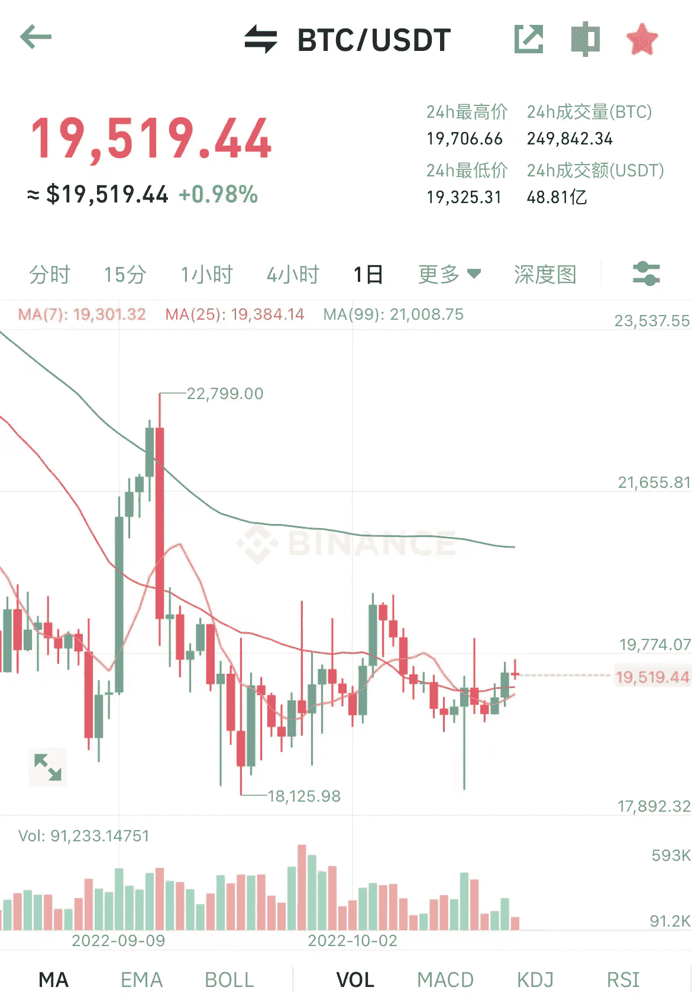

# 梁希的第一空间获得 10 万美元奖励

> 原文：<https://medium.com/coinmonks/liangxis-first-space-received-100k-us-dollar-reward-4b9db12ca16b?source=collection_archive---------21----------------------->

昨天，中国密码市场玩家梁希在 Twitter 上首次亮相。起初，他只是吹牛和朋友聊天，没有具体的主题。

大多数玩家都对这个 19 岁小伙子的个人经历很感兴趣。据说他去年在 519 上一天就赚了几千万。2021 年 519 加密市场大跌，大部分人被清盘。梁希逆势而上，赚到了自己的第一个 1000 万，一炮而红。

合同从 10 万到 1000 万，到几千万，再归零；后来有人赞助他继续开合同，然后归零；现在正处于重新积累的过程中。

除了众所周知的合同经历，他在微博上的个人生活记录也让人大开眼界。

The first show of LiangXi space has more than 8k listeners

这个空间本来只是一个很酷的单口喜剧。他愉快地分享他在这个神秘世界的所见所闻所感。没想到看的人越来越多，kol 们也在转发互动。观众迅速从 2k 上升到 5k，8k，越来越多。

后来火币环球和 OKex Exchange 都转发了，孙正义和杜军也来互动了。两位大老板还给了梁希每人 5 万美元作为合同的启动资金，祝他取得更大的成功。独唱变成了团体表演，宣传和吸引流量是一件很有趣的事。梁溪的首秀也尝到了流量的甜头，直接收获了近 60k 的关注者。

观众们也仿佛被梁溪的精神内耗治愈了，各取所需，各得其所。

LiangXi’s space recently ranked first

有媒体和玩家继续讨论梁希现象，说他打破了中国推圈的平静，是一股清流；

还有人给他职业规划建议，说他正面临人生的重要岔路口，是继续合同，还是流量变现，还是平台带货，伤透了他的心。还有其他各种交通摩擦，好热闹。

今天良喜发微博说已经拿到 10 万美元作为奖励，但是会放在不同的篮子里，同时会继续合同，争取突破 100 万美元。

真的是双赢的互动。平台打了广告，梁溪赚了赏金，玩家看得热闹。

Liang Xi’s 100,000 bounty has arrived

合同的利弊是无穷的，结局可能是一样的，但过程是激动人心的。

谁也说不准现在的梁溪是否处于人生的辉煌期。毕竟热闹过去了，热点过去了，或者亏损结束了，是否还有流量围观，还有资本青睐。

良喜是从承包圈出来的。他追求辉煌和刺激，但不是每个人都是梁溪。大部分都是在合同路上越走越远，越输越多，没有一个合同球员可以完全撤退。华丽只是转瞬即逝，沉默才是永恒。

Bitcoin’s current price is $19,500

除了合同，加密圈从来不缺流量，每个热点都猝不及防；在流量的入口，谁也不知道哪个小举动可能会产生巨大的影响。

比如最近很火的公链项目 APTOS，今天突然宣布将推出 mainnet。没有空投。几个大公司同时推出了项目令牌 APT。

据说场外 APT 早些时候已经炒到 60 usdt 了，私募价格才 0.28。不知道是暴涨还是暴跌，是王者还是神。

以前埋伏空投进行交互的人，这次是竹篮打水一场空，花费了时间和精力，最后却一无所获，只能靠 APTOS 公链生态中的具体项目。

The public chain project APTOS mainnet is online

熊市，在看热闹的同时也要看好自己的钱包；在这个不确定的市场中，机会和风险一样多。最重要的是多看少操作，不断学习，等待机会。

以上只是我个人观点，没有投资建议。我是楚小莲，我正在关注元宇宙和 web3。

> 交易新手？试试[加密交易机器人](/coinmonks/crypto-trading-bot-c2ffce8acb2a)或者[复制交易](/coinmonks/top-10-crypto-copy-trading-platforms-for-beginners-d0c37c7d698c)