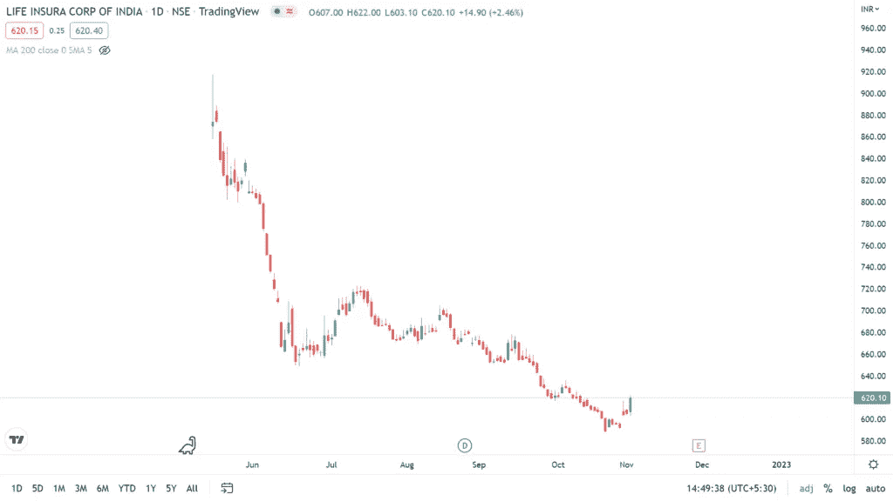

# LIC 股价目标为 2023 年、2024 年、2025 年和 2030 年

> 原文：<https://medium.com/coinmonks/lic-share-price-target-2023-2024-2025-and-2030-80727c12a31a?source=collection_archive---------3----------------------->

# LIC 公司详细信息

印度人寿保险公司是一家印度公共部门企业，总部位于印度马哈拉施特拉邦孟买。该公司于 1956 年 9 月由印度议会成立。通过的法案是印度人寿保险法案。大约 245 家保险公司和储蓄互助协会合并成立了印度人寿保险公司。

目前，LIC 拥有超过 2.9 亿投保人，2019 年产生的总寿险资金为 28.3 万亿卢比。在 2018-19 财年，超过 2600 万起索赔得到解决。2022 年，LIC 在《财富》世界 500 强中排名第 98 位。2022 年报告的收入为 775，283 亿卢比(970 亿美元)，净利润为 441.5 亿卢比(5.5 亿美元)。

LIC 的核心人物是 Kumar 先生，BC Patnaik，Smt。伊佩·米妮，西达尔特·莫汉蒂和拉杰库马尔。主要产品是人寿保险、健康保险、共同基金和投资管理。

另请阅读 [Bajaj 金融公司股价目标](https://updatedgeek.com/bajaj-finance-share-price-and-target/)

同时阅读 [Bajaj Finserv 股价目标](https://updatedgeek.com/bajaj-finserv-share-price-and-target/)

> 交易新手？在[最佳加密交易](/coinmonks/crypto-exchange-dd2f9d6f3769)上尝试[加密交易机器人](/coinmonks/crypto-trading-bot-c2ffce8acb2a)或[复制交易](/coinmonks/top-10-crypto-copy-trading-platforms-for-beginners-d0c37c7d698c)

# LIC 技术分析

当前 **LIC 股价**为 621 卢比。该股票于 2022 年 5 月在证券交易所上市。自成立以来，其价值一直在下跌，目前跌幅为 32%。该公司还于 2022 年 8 月宣布了 1.50 卢比的股息。

LIC share price movement

**LIC 股价**将在未来几年内缓慢蓄势上涨。该股票在 2022 年 6 月开始逐渐下跌，但是，价格维持在同一水平。随着 Sensex 的改善，股价很有可能会上涨。

LIC 是全国最大的保险公司，这也是股价未来会走强的原因。从一开始价值就下降的原因是世界经济的下滑趋势。在过去的 4 到 5 个月里，LIC 的股价一直在盘整。

另请参阅 [PFC 股价目标](https://updatedgeek.com/power-finance-corporation-share-price-target/)

另请参阅 [Manappuram 财务股价目标](https://updatedgeek.com/manappuram-finance-limited-share-price-target/)

# LIC 目标价

**LIC 股价**的目标是 2023 年 860 卢比，2024 年 1250 卢比，2025 年 1500 卢比，2030 年 2200 卢比。

支持 **LIC 股价**增长的一些因素是人们越来越意识到保险政策的优势，印度唯一的政府保险公司，2000 多个零售点和 1500 多个办事处分布在几乎 90%的印度地区，强大的分销网络和多样化的产品组合使他们成为市场的领导者。

[点击此处](https://link.upstox.com/DQT7YCUH7irWFzFM6)，在印度最好的经纪人处开立 demat 账户

# 常见问题

**1。什么是 LIC 股价预测？**

**LIC 股价**预测 2023 年是 860 卢比，2024 年是 1250 卢比，2025 年是 1500 卢比，2030 年是 2200 卢比。

**2。LIC 适合投资吗？**

是的，LIC 是投资的好地方，但在做出最终购买决定之前，你必须评估你的风险和资本。你必须向你的财务顾问咨询任何与投资有关的决定。

**3。未来 5 年内，LIC 的股价预期是多少？**

价格在 1500 到 2500 印度卢比之间

**4。LIC 股价会上涨吗？**

一旦市场复苏，人们对价格的预期就会增加。然而，根据过去的趋势，该公司可能会观察到更多的价格下跌。

**免责声明**:如果你想投资股市，在做出购买决定之前，你应该咨询你的理财顾问。你应该评估风险，研究公司细节。我们不对任何损失负责。

还看 [HDFC 股价目标链接](https://updatedgeek.com/hdfc-ltd-share-price-target/)

另请参阅[muthout finance 股价目标](https://updatedgeek.com/muthoot-finance-share-price-target/)

**相关搜索**

为什么 2022 年你不应该现在就在印度购买电动汽车？

为什么信用卡或借记卡会有有效期？

为什么美元对印度卢比的汇率在上升？

[在亚马逊和 Flipkart 上省钱](https://updatedgeek.com/save-money-amazon-and-flipkart/)

**关注更多更新**

*在 LinkedIn 上关注*[*Raveen Chawla*](https://www.linkedin.com/in/raveen-chawla-02b3017b)

**相关搜索，点击* [*文章*](https://updatedgeek.com/) *，点击* [*网络故事*](https://updatedgeek.com/web-story-sitemap.xml)*

> *加入 Coinmonks [电报频道](https://t.me/coincodecap)和 [Youtube 频道](https://www.youtube.com/c/coinmonks/videos)了解加密交易和投资*

# *另外，阅读*

*   *[瓦济里克斯 NFT 评论](https://coincodecap.com/wazirx-nft-review)|[Bitsgap vs Pionex](https://coincodecap.com/bitsgap-vs-pionex)|[坦吉姆评论](https://coincodecap.com/tangem-wallet-review)*
*   *[如何使用 Solidity 在以太坊上创建 DApp？](https://coincodecap.com/create-a-dapp-on-ethereum-using-solidity)*
*   *[加密交易机器人](/coinmonks/crypto-trading-bot-c2ffce8acb2a) | [OKEx vs 币安](https://coincodecap.com/okex-vs-binance)*
*   *[币安 vs FTX](https://coincodecap.com/binance-vs-ftx) | [最佳(索尔)索拉纳钱包](https://coincodecap.com/solana-wallets)*
*   *[如何在 Uniswap 上交换加密？](https://coincodecap.com/swap-crypto-on-uniswap) | [A-Ads 评论](https://coincodecap.com/a-ads-review)*