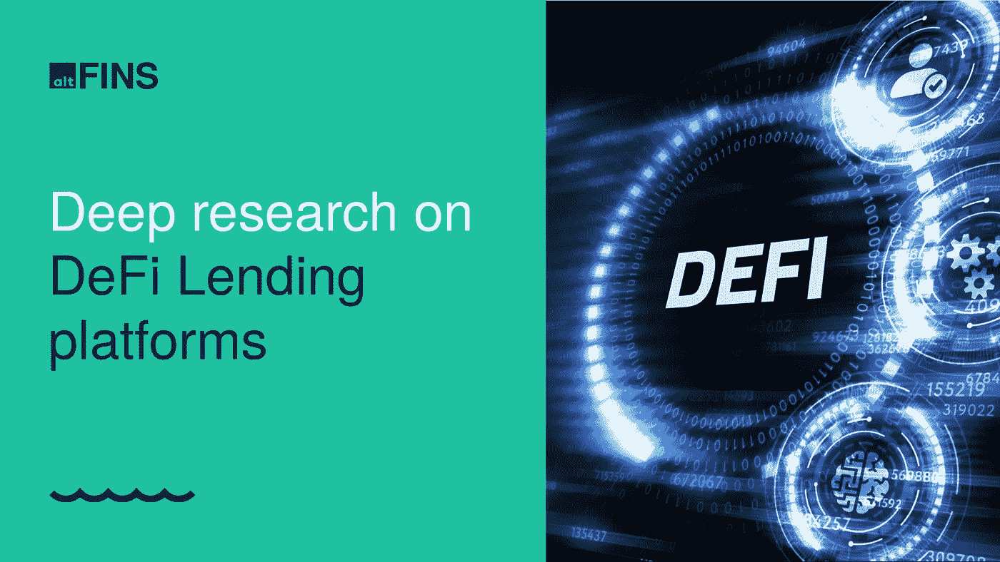

# 自从我们发布研究报告以来，利多已经上涨了 98%

> 原文：<https://medium.com/coinmonks/lido-is-up-by-98-since-we-published-the-research-report-4c5ab756447c?source=collection_archive---------38----------------------->

我们最近报道了三个有趣的加密项目——ETH Merge—以太坊从 PoW 到 PoS 的转变。我们调查了加密赌注服务提供商 **LIDO** ，我们也关注了内置社交和游戏元素的 Web3 生活应用 **STEPN** 。

如果你在过去的几个月里投资了其中的任何一个或者分散了你的资本，那么恭喜你！你已经从你的投资中获得了回报。我们准备了一份简短的总结，列出了我们认为硬币价格上涨的原因:

# 利多上涨 98%——自 2022 年 6 月 1 日起(报告发布日期)

*   与以太坊联系紧密，现在已经有了一个暂定的合并日期，这显然是推动 LDO 价格上涨的主要催化剂。
*   利多金融已经宣布计划在整个 L2 网络中提供其 ETH staking 服务，而不需要桥接资产。它计划先从 Arbitrum 和乐观开始，然后扩展到其他 L2。这将允许用户以更低的费用购买 ETH，同时还可以访问新的 DeFi 应用程序。
*   截至 2022 年 7 月 28 日，丽都通过其赌注合同在合并的官方存款合同 ETH 2.0 中积累了超过 400 万的 ETH。
*   道提出了一个双重治理的解决方案，将坐在 LDO 股东和联邦贸易局股东之间。该提案将引入一个争端和解决机制，以解决 LDO 持有者和 ETH 股东之间的不一致激励。该机制旨在防止对 ETH 网络的假想攻击。

# 自 2022 年 6 月 13 日(报告发布日期)以来，ETH 增长了 44%

*   ETH 开发者宣布了期待已久的合并到 ETH 2.0 的日期，这是一个成熟的区块链，计划于 2022 年 9 月 19 日

# **自 2022 年 6 月 29 日(报告发布日期)起增加 10%**

*   **通过推出 DOOAR(STEPN 自己的分散交易所(DEX ),通过交易费引入新的收入来源。**
*   **STEPN 宣布在 Q2 产生的利润(超过 1.225 亿美元)的 5%将用于 GMT 回购和刻录计划。不管 Q2 的加密抛售情况如何，利润还是产生了。**

****

**Source: altFINS**

# **DeFi 贷款平台**

**我们即将发布的关于 DeFi Lending 的报告确定了每个长期投资者应该在其投资组合中拥有的 3 个主要参与者，以及几个规模较小但正在崛起的挑战者，它们可能会获得 10 倍的收益。**

**随着超过 150 个借贷协议在加密领域运作，DeFi Lending 见证了 TVL 从 2017 年的零增长到 2021 年 11 月的 1100 亿美元。虽然 TVL 规模在 crypto winter 期间有所缩小，但主要参与者仍在继续扩大其服务，DeFi Lending 长期来看拥有巨大的市场机会。**

**该报告还将包括:**

*   **DeFi 贷款(TVL)部门的规模**
*   **TVL 和前 33 家 DeFi 贷款平台的收入**
*   **33 家 DeFi 借贷平台的估值比较**
*   **集中式和分散式借贷平台的比较**

# **我们的投资研究方法**

**在分析加密项目时，我们重点关注加密项目的价值主张、用户采用、令牌组学、竞争定位、总目标市场(TAM)、风险、管理团队和可比估值。我们也从整体上关注 DeFi 市场，让我们的用户更好地理解和了解加密市场。**

**我们的报告是来自 altFINS 团队的完全公正的分析，该团队由 altFINS 的投资研究总监 Marek Hric 和我们的首席执行官 T2 领导。**

**[**订阅或成为 AFINS HODL-er**](https://platform.altfins.com/subscriptions) **并访问我们的加密研究中心。**利用 altFINS 平台，了解最新的创新加密机会并跟踪您的投资组合。所有您需要为您的加密项目投资一个地方。**

> **交易新手？尝试[加密交易机器人](/coinmonks/crypto-trading-bot-c2ffce8acb2a)或[复制交易](/coinmonks/top-10-crypto-copy-trading-platforms-for-beginners-d0c37c7d698c)**