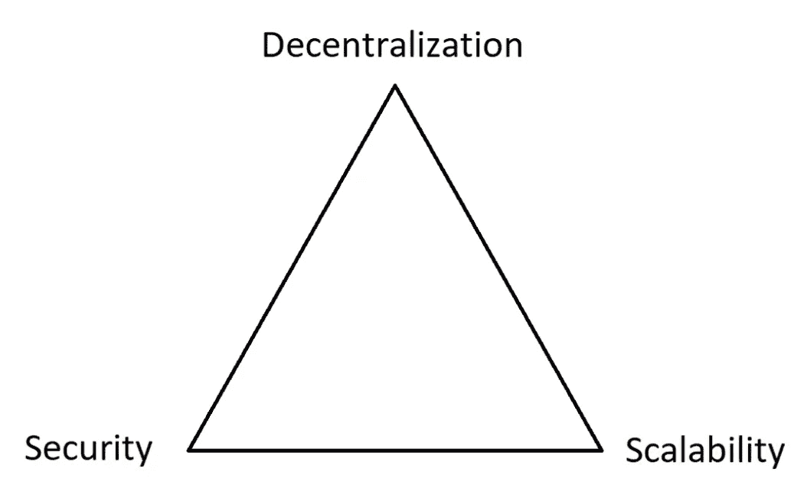
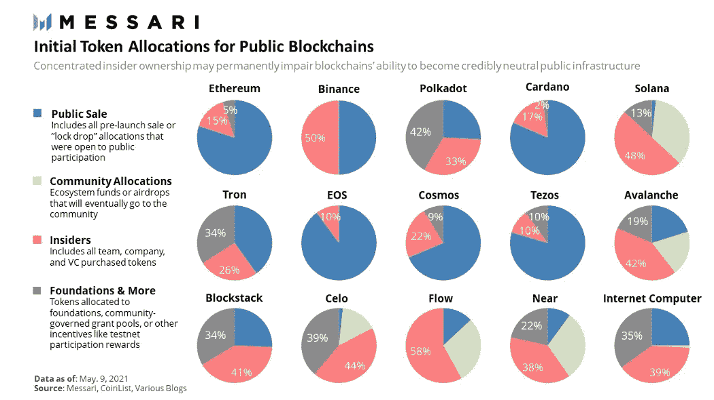
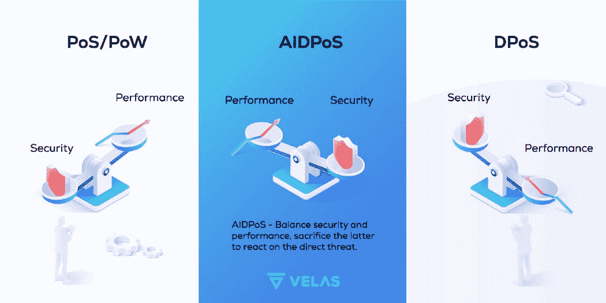

# 闪电般的快速区块链:比赛的隐藏成本。

> 原文：<https://medium.com/coinmonks/lightning-fast-blockchains-the-hidden-cost-of-the-race-efc389be3135?source=collection_archive---------38----------------------->

Speeding can lead to crashing.

你肯定知道加密货币的目标是最终成为传统金融的强大替代品，从而能够支持全球需求——数十亿人的数十亿次交易。

这需要可伸缩性，这是“区块链三难困境”的一部分，这是大多数区块链最终致力于解决的一个众所周知的挑战。

可伸缩性可以被看作是一种珍贵的商品，可以用来交换安全性、分散性或两者。

The Blockchain Trilemma

这篇文章的目标是看看今天的主要区块链，以及他们以牺牲速度为代价付出了多少。

## 以太坊:除了可伸缩性之外的一切

以太坊的爆炸性兴趣来自于他们引入了有效的智能合约部署，这导致了从 dApps 到 NFT 的一系列创新——这是比特币以前不可能实现的。

虽然以太坊已经成为生态系统中的一个明确参考，但它的协议一直让用户感到沮丧。为什么？

因为它的创始人将去中心化放在可伸缩性之上。立刻。

这种牺牲的不良后果是多方面的:

*   区块链每秒支持大约 15 个事务，阻塞时间为 13 秒，这使得网络容易堵塞——用户对此很熟悉。
*   在高强度网络使用期间缺乏适应性。
*   反映交易验证需求的非常高的交易费(天然气价格)。

[https://mobile.twitter.com/sadpixelsnft](https://mobile.twitter.com/sadpixelsnft)

虽然每个人都不耐烦地等待着向被称为“合并”的利害关系证明(PoS)共识的迁移，但它并不真的期望提高网络吞吐量，降低当前的高油价。

这一重大升级是由于另一个更新，我们还不能预见。

是的，侧链和第二层解决方案确实存在，以应对以太坊巨大的交易流，它几乎没有解决固有的区块链可伸缩性。

然而，他们确实实现了高度的安全性、分散化和大规模采用。这真是令人印象深刻。

## 币安智能连锁:集中化是交易。

自两年前推出以来，币安智能链(BSC)获得了迅速的采用，尤其是来自散户投资者。它被认为是最快的区块链之一，因为它拥有非常低的费用，大约 160 TPS 和 3 秒的阻塞时间。

它与以太坊 dApps 和主交叉链兼容。

非常不幸的是，BSC 使用了一种特定的共识机制:权威证明(PoSA):一种集中的替代方案。

这使得 BSC 最多有 21 个预选的验证器，并且只需要 11 个来危及区块链。

这与其中本系数相印证，中本系数是一种度量标准，代表妥协一个区块链所需的节点数。BSC 得分最低，为 7 分。作为比较，索拉纳的系数达到 19——数字越高，越分散。

换句话说，连锁企业能够通过去中心化来获得如此出色的业绩。

似乎 BSC 正在寻找以太坊的更廉价、更可扩展的替代品，但无论如何也不打算解决区块链三难问题。

## 索拉纳:超速行驶会导致撞车。

在它的 PoS 同行中，Solana 可能是所有主要区块链中速度最快的，大约有 65，000 TPS 的能力，而且完工时间非常短。

它通过引入 PoS 和 PoH 的组合来实现这样的性能，这是历史的证明。这意味着每一个验证者都可以在共同的分类帐上调整并同意条目的时间顺序，以支持验证过程。

它还通过利用 Neon 来实现这一点，Neon 是一个链上应用程序，它将与本地 EVM 的互操作性带到了 Solana，并有助于简化 dApp 集成。

索拉纳有着非凡的表现，但没有免费的午餐——以下是一些警告。

1.  该项目经历了多次中断:在过去的一年中至少有 6 次。事实上，它因无法抵御网络攻击而受到广泛批评，例如由淹没服务器的大量请求组成的 DDoS 攻击。
2.  有没有关注过索拉纳不公平的代币分配？嗯，它并不像它声称的那样分散。

Messari’s report on projects initial token allocation

48%的分配给了内部人员，只剩下面包屑公开出售。与以太坊相比，分配差距惊人。

上面提到的几点是索拉纳在网络上的信任度急剧下降的主要原因，也许也是它们不能解决区块链三难困境的原因。

## Velas:利用人工智能？

Velas 于 2019 年作为 Solana 的一个分支推出，拥有 50.000+的 TPS，约 0.00001 美元的低交易费和极快的完成时间。

Velas 一直在寻求结合两个世界的优势:Solana 的混合缩放系统和完全兼容 EVM 的网络，允许无缝 dApp 集成。

试图解决三难困境的突破？它内置的 AIDPoS 机制:一种结合了区块链和人工智能的尖端算法。

Velas AIDPoS system

人工智能具有套利能力，并寻求整个网络的最佳功能。它衡量在给定时间最需要的是性能，还是在受到攻击时的安全性。

这使得 VLX 网络对网络拥塞具有很强的适应性和弹性，并解决了上面讨论的可扩展性问题。现在你可能会问:

> “维拉斯有什么问题？”

嗯，在我看来，有几个障碍:

*   根据 Velas Validators 的说法，区块链上目前有 141 个验证器，这使得它相当集中。
*   Velas 的人工智能和整体基础设施还没有经受住时间的考验，因为它是一个相对较新的项目。

在区块链这个竞争激烈的地方，创新正以一种难以跟上的速度流动。

这些创新最终会把我们从传统金融及其不平等的规则中拯救出来。

为此，需要有合适的基础设施，能够承受和推动全球需求，而不会崩溃或过于集中。

在另一篇文章中，我将讨论加密领域即将到来的发展，这些发展可能会带来真正的改变，即:分片和 ZK 卷。

请不要忘记**鼓掌**和**关注**了解更多这方面的内容，这对我意义重大🙏

*随着合并即将发生，这里有一篇我写的关于* [*以太坊能耗分析*](/block-magnates/ethereum-carbon-emission-from-1-to-0-01-605fef3456f0) *的文章，你可能会喜欢。*

**最后一点:** 仅仅因为实现了高 TPS(每秒事务数)，可伸缩性常常被忽视。事实上，具有大吞吐量(例如 250.000 TPS)的区块链是不切实际的，因为它的事务需要几天时间才能得到验证。

区块链的可扩展性应该被认为是整个交易处理过程:从交易请求到交易结束，交易变得不可逆。

> 加入 Coinmonks [电报频道](https://t.me/coincodecap)和 [Youtube 频道](https://www.youtube.com/c/coinmonks/videos)了解加密交易和投资

# 另外，阅读

*   [加密复制交易平台](/coinmonks/top-10-crypto-copy-trading-platforms-for-beginners-d0c37c7d698c) | [五大 BlockFi 替代品](https://coincodecap.com/blockfi-alternatives)
*   [CoinLoan 点评](https://coincodecap.com/coinloan-review)|[Crypto.com 点评](/coinmonks/crypto-com-review-f143dca1f74c) | [火币保证金交易](/coinmonks/huobi-margin-trading-b3b06cdc1519)
*   [Bybit vs 币安](https://coincodecap.com/bybit-binance-moonxbt)|[stealth x 回顾](/coinmonks/stealthex-review-396c67309988) | [Probit 回顾](https://coincodecap.com/probit-review)
*   [顶级付费加密货币和区块链课程](https://coincodecap.com/blockchain-courses)
*   [密码交易机器人](/coinmonks/crypto-trading-bot-c2ffce8acb2a)|[P2E NFT 15 大游戏](https://coincodecap.com/p2e-nft-games)