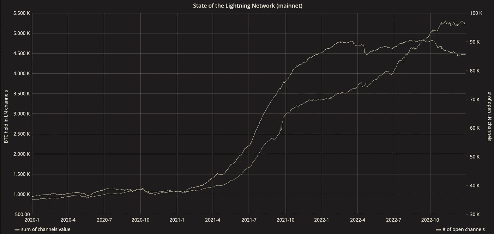

# 闪电网络常见问题

> 原文：<https://medium.com/coinmonks/lightning-network-faq-2874421ab723?source=collection_archive---------70----------------------->

# 什么是 HTLCs？

一种有条件的支付，其条件是“支付哈希的前像是已知的”。假设鲍勃想给爱丽丝寄些钱。Bob 将选择一个数字(R)，然后计算 hash (H=Hash(R))，并对所有费用支付和对 Alice 的原始支付设置一个条件。条件是它们应该有一个值 X，所以 Hash(X) = Hash(R)显然，如果我们有 X=R，这个条件就满足了。因此，随着支付链的进行，Alice 收到付款并将其发送到主区块链以获取资金，她知道值 R，因为 Bob 告诉了她，所以她使用该值来满足条件。现在这个值已经暴露了，所有参与这个支付路径的节点都可以访问值 R，并且可以得到他们的钱。这样，如果 Alice 没有收到钱，没有人会得到报酬，如果 Alice 收到了报酬，路径中的每个节点都会收到报酬。原子支付。

> 交易新手？在[最佳加密交易](/coinmonks/crypto-exchange-dd2f9d6f3769)上尝试[加密交易机器人](/coinmonks/crypto-trading-bot-c2ffce8acb2a)或[复制交易](/coinmonks/top-10-crypto-copy-trading-platforms-for-beginners-d0c37c7d698c)

# 闪电网络现在用了多少？

随着时间的推移，它在增长，而且比以前更多。图表呈 S 形的原因不是增长放缓，而是因为之前它有过非常急剧的突然增长，因为 Twitter 整合了它或萨尔瓦多使用了它。但是现在，它有了它应该有的有机增长。

[https://txstats.com/dashboard/db/lightning-network?orgId=1&from=now-2y%2Fy&to=now](https://txstats.com/dashboard/db/lightning-network?orgId=1&from=now-2y%2Fy&to=now)

# 如果一个节点在打开 HTLCs 的同时关闭了一个通道会怎样？

由于收款人仍有更新的交易，它可以挑战其他参与者并赢得所有的钱。