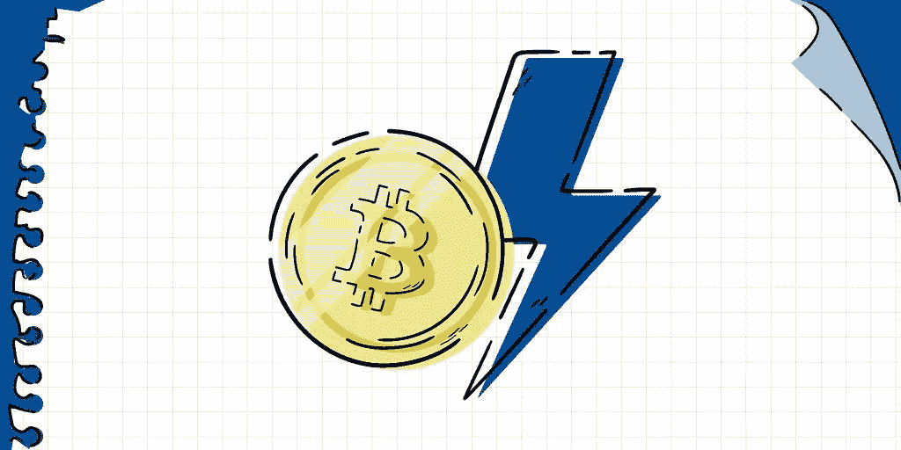

# 闪电网，未来的支付网络？

> 原文：<https://medium.com/coinmonks/lightning-network-the-payment-network-of-the-future-a4bec5749cde?source=collection_archive---------19----------------------->

好的加密读者，在这篇文章中，我们将讨论 Ligthning 网络，这是一个建立在主比特币网络之上的层，它能够以快速和廉价的方式进行小额支付，这在比特币网络中的当前佣金和取款时间变得非常困难。

> **原比特币论文**